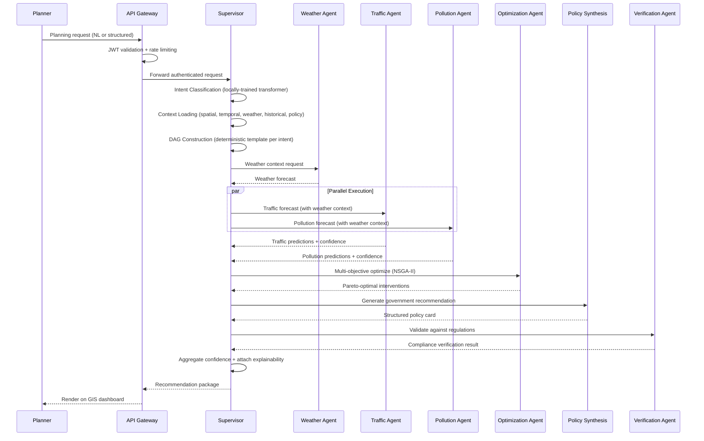

# Smart Urban Planning & AI Decision Support Platform

## Consolidated Enterprise Architecture Document

**Document ID:** SUPADSP-ARCH-V2-CONSOLIDATED  
**Version:** 2.0.0 | **Date:** August 2026  
**Classification:** Government Restricted — Internal Use Only  
**Prepared For:** Government of Telangana, GHMC, HMDA  

---

# Table of Contents

1. [Executive Summary](#1-executive-summary)
2. [Project Vision, Scope & Stakeholders](#2-project-vision-scope--stakeholders)
3. [Architecture Principles & High-Level Design](#3-architecture-principles--high-level-design)
4. [Supervisor AI Agent](#4-supervisor-ai-agent)
5. [Multi-Agent Hierarchy](#5-multi-agent-hierarchy)
6. [Enterprise Data Architecture](#6-enterprise-data-architecture)
7. [AI/ML Platform & MLOps](#7-aiml-platform--mlops)
8. [GIS Platform](#8-gis-platform)
9. [Security Architecture](#9-security-architecture)
10. [Infrastructure & Deployment](#10-infrastructure--deployment)
11. [Workflows & Government Approval](#11-workflows--government-approval)
12. [Dashboards, Reporting & Notifications](#12-dashboards-reporting--notifications)
13. [System Modules](#13-system-modules)
14. [Functional Requirements Summary](#14-functional-requirements-summary)
15. [Technology Stack](#15-technology-stack)
16. [Key Performance Indicators](#16-key-performance-indicators)
17. [Geographical Expansion Roadmap](#17-geographical-expansion-roadmap)
18. [Glossary](#18-glossary)

---

# 1. Executive Summary

## 1.1 Purpose

The **Smart Urban Planning & AI Decision Support Platform (SUPADSP)** is a production-grade, government-internal decision support system for municipal authorities in Hyderabad. It enables data-driven urban planning decisions across three core intelligence domains — **Traffic**, **Pollution**, and **Energy Consumption** — through predictive forecasting, multi-objective optimization, scenario simulation, and explainable AI-assisted policy recommendations.

The platform is **not** a citizen-facing application, complaint management system, IoT device manager, or emergency call center. It is an **internal enterprise tool** exclusively for government decision makers.

## 1.2 Why a Complete Redesign

The legacy architecture (21-page blueprint, Version 1.0) was assessed against enterprise standards and found to have **20 critical-to-medium weaknesses**:

| Severity | Count | Key Issues |
|---|---|---|
| 🔴 Critical | 4 | LLM-dependent orchestrator (violates core AI constraint), no Supervisor AI Agent, flat agent structure, no security |
| 🟠 High | 6 | Monolithic database, primitive GIS, no data governance, no MLOps, unoptimized container strategy, no multi-city strategy |
| 🟡 Medium | 10 | No simulation agent, limited optimization, no observability, citizen modules in scope, no memory architecture |

**What changed:**
- The orchestrator's external LLM dependency was replaced with a locally-trained intent classifier + deterministic DAG planner
- A full hierarchical multi-agent system replaced the flat agent structure
- Polyglot persistence replaced the single PostgreSQL database
- GIS-first architecture replaced "a map with a base layer"
- Zero-trust security, Docker Compose containerized deployment, and full MLOps were added from scratch

**What was preserved** (sound decisions from the legacy design):
- Domain model choices: GNN/LSTM for traffic, TFT/LSTM for pollution, XGBoost for energy
- Offline training → local serving pattern (fundamental to the no-external-API constraint)
- Cross-domain feature coupling (Traffic → Pollution, Energy → Pollution)
- NSGA-II multi-objective optimization core
- PostGIS, FastAPI, Keycloak, React + Leaflet (upgraded to MapLibre GL JS)

## 1.3 Core Constraint

> **The entire AI system relies on Machine Learning, Deep Learning, Graph Learning, Optimization, Simulation, Computer Vision, Time-Series Forecasting, Reinforcement Learning, Statistical Models, Physics-based Models, self-trained models, local model serving, and offline training. No external LLM APIs (OpenAI, Claude, Gemini, etc.) are used anywhere in the operational workflow.**

---

# 2. Project Vision, Scope & Stakeholders

## 2.1 Vision

Establish SUPADSP as the central intelligent planning platform for municipal corporations — enabling government officials to monitor city conditions, predict future events, optimize resources, evaluate planning scenarios, and make AI-assisted strategic decisions through a unified, explainable, and auditable enterprise system.

## 2.2 Scope

### In-Scope

| Category | Details |
|---|---|
| **Core Domains** | Traffic Intelligence (11 sub-agents), Pollution Intelligence (7 sub-agents), Energy Intelligence (6 sub-agents) |
| **Supporting Context** | Weather, rainfall/flood risk, heat waves, construction, public events, population density, land use, building density, government policies, historical trends, calendar/holidays |
| **Capabilities** | Monitoring, forecasting (short/medium/long-term), prediction, multi-objective optimization, scenario simulation, decision support, policy recommendation, strategic planning, resource optimization, GIS spatial intelligence, cross-domain impact analysis, government reporting, full auditability |

### Explicitly Out of Scope

Citizen complaint modules, public dashboards, social media monitoring, public chatbots, IoT device management, emergency call centers, customer support, citizen-facing portals of any kind.

## 2.3 Primary Users

| Role | Organization | Primary Use |
|---|---|---|
| Urban Planners | GHMC, HMDA | Long-term infrastructure and land-use planning |
| Municipal Corporation Officials | GHMC | City-wide operational and strategic decisions |
| Government Decision Makers | State Government | Policy-level decisions and approvals |
| Hyderabad Traffic Police | Traffic Police | Traffic management and signal optimization |
| TSPCB Officers | Telangana State Pollution Control Board | Environmental monitoring and enforcement |
| Energy Distribution Authorities | TGNPDCL, TGSPDCL | Grid management and demand planning |
| Disaster Management Officials | SDMA | Disaster preparedness and response planning |
| Smart City Administrators | Smart City Mission | Overall platform administration |

## 2.4 Key Stakeholders

| Stakeholder | Interest | Engagement |
|---|---|---|
| GHMC/HMDA Commissioners | Decision accuracy, auditability | Executive briefings, approval workflows |
| IT Department (GHMC) | Security, infrastructure | Architecture review, compliance |
| NIC | Standards compliance | Data sharing protocols |
| Smart City Mission | Program oversight | Funding, reporting |
| IMD, CPCB, ISRO/NRSC | Data provision | API integration, data agreements |

---

# 3. Architecture Principles & High-Level Design

## 3.1 Core Principles

| # | Principle | Rationale |
|---|---|---|
| 1 | **AI-Native** | AI is the foundational paradigm; the Supervisor is the system's central nervous system |
| 2 | **GIS-First** | Every data point has a spatial dimension; GIS is a first-class platform, not a visualization layer |
| 3 | **Domain-Driven Design** | Bounded contexts aligned to government departments; independent evolution |
| 4 | **Microservice Architecture** | Independent deployment, scaling, and fault isolation per domain |
| 5 | **Event-Driven** | Asynchronous processing for alerts, monitoring, retraining triggers via Kafka |
| 6 | **Cloud-Native** | Containerized via Docker & Docker Compose, infrastructure-as-code |
| 7 | **API-First** | Every capability exposed as a versioned, documented REST API |
| 8 | **Security by Design** | Zero-trust at every layer; not added as an afterthought |
| 9 | **Explainability by Design** | Every AI recommendation includes confidence, feature importance, and reasoning |
| 10 | **Government Compliance** | GIGW, data residency, audit trails, accessibility baked into every component |

## 3.2 Platform Architecture — Layered View

```
╔══════════════════════════════════════════════════════════════════════════╗
║  PRESENTATION        React 18 + MapLibre GL JS + Recharts/D3           ║
║  ─────────────       Dashboards: Executive, Traffic, Pollution,        ║
║                      Energy, GIS, AI, Analytics, Admin                 ║
╠══════════════════════════════════════════════════════════════════════════╣
║  API GATEWAY         Kong (OSS) — OAuth2/JWT validation, rate          ║
║  ─────────────       limiting, routing, WAF, API versioning            ║
╠══════════════════════════════════════════════════════════════════════════╣
║  SUPERVISOR AI       Intent Engine → Context Manager → Task Planner    ║
║  ─────────────       → Execution Engine → Result Processing            ║
║                      Agent Registry │ Capability Registry │ Memory     ║
╠══════════════════════════════════════════════════════════════════════════╣
║  SPECIALIST          Traffic │ Pollution │ Energy │ Weather │           ║
║  AGENTS              Simulation │ Optimization │ Policy │ Verification ║
╠══════════════════════════════════════════════════════════════════════════╣
║  ML INFERENCE        FastAPI / Triton — DCRNN, TFT, LSTM, XGBoost,    ║
║  ─────────────       YOLOv8, Gaussian Plume, Isolation Forest          ║
╠══════════════════════════════════════════════════════════════════════════╣
║  GIS PLATFORM        GeoServer (WMS/WFS/WMTS) + Martin (Vector Tiles)  ║
║  ─────────────       PostGIS + Layer Registry + Tile Cache             ║
╠══════════════════════════════════════════════════════════════════════════╣
║  EVENT BUS           Apache Kafka — domain events, alerts, retraining  ║
║  ─────────────       triggers, GIS updates, audit events               ║
╠══════════════════════════════════════════════════════════════════════════╣
║  DATA                PostgreSQL │ PostGIS │ TimescaleDB │ Redis │      ║
║  PERSISTENCE         MinIO │ Elasticsearch │ MLflow                    ║
╠══════════════════════════════════════════════════════════════════════════╣
║  PLATFORM            Keycloak │ Prometheus │ Grafana │ Loki │ Jaeger   ║
║  SERVICES            │ Apache Airflow │ Feast (Feature Store)          ║
╠══════════════════════════════════════════════════════════════════════════╣
║  INFRASTRUCTURE      Docker & Docker Compose + Container Orchestration ║
╚══════════════════════════════════════════════════════════════════════════╝
```

## 3.3 Core Data Flow — Request to Recommendation



---

# 4. Supervisor AI Agent

## 4.1 Design Philosophy

The Supervisor is the platform's **central nervous system** — a Chief Urban Planning Officer in software form. It is the single entry point for all planner requests and the sole coordinator of all AI operations.

**What it IS:** An intelligent workflow coordinator, a deterministic/auditable orchestration engine.  
**What it is NOT:** A chatbot, a prediction engine, an LLM, or a consumer of external AI APIs.

## 4.2 Internal Architecture

| Component | Purpose |
|---|---|
| **Intent Understanding Engine** | NL parser (SpaCy NER + custom Hyderabad gazetteer) → Request normalizer → Intent classifier (locally-trained DistilBERT-class transformer, 30 intent categories, ≥ 95% F1, < 50ms latency). Fallback to structured input form if confidence < 0.75. |
| **Context Manager** | Builds complete execution context before agent dispatch: spatial (PostGIS), temporal (calendar/events), weather (forecast/cache), historical (past recommendations), policy (regulations/budgets). Total context load: < 400ms. |
| **Task Planner** | Maps classified intent to a deterministic DAG template. Resolves dependencies, identifies parallel execution opportunities, schedules agents. Same intent + same parameters = same DAG (fully auditable). |
| **Execution Engine** | Dispatches tasks to agents via internal REST. Monitors execution with timeouts. Handles failures (retry, fallback, partial results). Transfers outputs between dependent agents. |
| **Result Processing** | Aggregates multi-agent outputs. Resolves conflicts (Pareto dominance → Optimization Agent → human escalation). Computes overall confidence via weighted harmonic mean. |
| **Memory Manager** | 4-tier memory: Short-term (Redis, session state), Long-term (PostgreSQL, historical recommendations), Knowledge (Elasticsearch, regulations/standards), Spatial (PostGIS, geographical context). |
| **Agent Registry Client** | Discovers available agents dynamically; checks health/availability before dispatch. |
| **Capability Registry Client** | Maps abstract capabilities to concrete agents. The Supervisor requests capabilities, NOT agents — enabling new agents to be added without code changes. |

## 4.3 Communication Rules

1. Users communicate **only** with the Supervisor (via API Gateway)
2. The Supervisor dispatches to Specialist Agents
3. Specialist Agents manage their own Sub-Agents internally
4. Sub-Agents **never** communicate directly with the Supervisor
5. Specialist Agents **never** communicate with each other — all cross-agent data flows through the Supervisor
6. Asynchronous alerts bypass the Supervisor via Kafka to the Notification Service

## 4.4 Intent Taxonomy (30 Categories)

| ID | Category | Required Agents |
|---|---|---|
| INT-001 | TRAFFIC_FORECAST | Weather, Traffic |
| INT-002 | TRAFFIC_OPTIMIZATION | Weather, Traffic, Optimization |
| INT-004 | POLLUTION_PREDICTION | Weather, Pollution |
| INT-005 | POLLUTION_MITIGATION | Weather, Traffic, Pollution, Optimization |
| INT-007 | ENERGY_FORECAST | Weather, Energy |
| INT-010 | TRAFFIC_POLLUTION_OPTIMIZATION | Weather, Traffic, Pollution, Optimization |
| INT-012 | MULTI_DOMAIN_OPTIMIZATION | Weather, Traffic, Pollution, Energy, Optimization |
| INT-013 | MULTI_DOMAIN_PLANNING | All agents |
| INT-016 | SCENARIO_SIMULATION | Weather, Simulation, relevant domain agents |
| INT-020 | ROAD_CLOSURE_SIMULATION | Weather, Traffic, Pollution, Simulation |
| INT-022 | BUDGET_OPTIMIZATION | Optimization |
| INT-023 | POLICY_RECOMMENDATION | All relevant + Policy Synthesis |
| INT-028 | FESTIVAL_IMPACT | Weather, Traffic, Pollution, Simulation |
| INT-029 | FLOOD_RISK_ANALYSIS | Weather, Simulation |
| INT-030 | HEAT_WAVE_ANALYSIS | Weather, Energy |

*(Plus 15 additional categories for historical analysis, trend analysis, reporting, infrastructure planning, emergency planning, etc.)*

---

# 5. Multi-Agent Hierarchy

## 5.1 Agent Tree

```
SUPERVISOR AI AGENT
│
├── TRAFFIC INTELLIGENCE AGENT (11 sub-agents)
│   ├── Traffic Forecast (DCRNN/GAT+GRU) — spatio-temporal graph forecasting
│   ├── Congestion Prediction (XGBoost classifier)
│   ├── Accident Detection (YOLOv8 + speed anomaly)
│   ├── Traffic Density (volume from speed-flow + GNN)
│   ├── Road Blockage (rule-based + anomaly detection)
│   ├── Signal Optimization (RL PPO/DQN or Webster's)
│   ├── Emergency Routing (A*/Dijkstra on predicted graph)
│   ├── Parking Prediction (GBM/LSTM per zone)
│   ├── Travel Time Prediction (segment aggregation)
│   ├── Traffic Simulation (SUMO or scenario-perturbed forecast)
│   └── Explainability Engine (SHAP, attention visualization)
│
├── POLLUTION INTELLIGENCE AGENT (7 sub-agents)
│   ├── AQI Prediction (Temporal Fusion Transformer)
│   ├── Pollutant Prediction (PM2.5, PM10, NO₂, SO₂, CO, O₃)
│   ├── Hotspot Detection (DBSCAN spatial clustering)
│   ├── Source Attribution (wind back-tracking + registry)
│   ├── Dispersion Modeling (Gaussian Plume + street-canyon corrections)
│   ├── Industrial Emission Analysis (change-point + trend)
│   └── Explainability Engine (TFT attention, variable importance)
│
├── ENERGY INTELLIGENCE AGENT (6 sub-agents)
│   ├── Load Forecast (XGBoost/LSTM)
│   ├── Peak Demand Prediction (classifier + regressor)
│   ├── Building Consumption Analysis (per-building baseline)
│   ├── Street Light Optimization (Isolation Forest + RL dimming)
│   ├── Renewable Analysis (physical irradiance + regression)
│   └── Explainability Engine (SHAP, cost-benefit templates)
│
├── WEATHER INTELLIGENCE AGENT — Contextual (3 sub-agents)
│   ├── Weather Forecast (LSTM/TFT)
│   ├── Severe Weather Alert (XGBoost classifier)
│   └── Weather Impact Analysis (gradient-boosted regressor)
│
├── SIMULATION AGENT (5 sub-agents)
│   ├── Traffic Simulation — road closure, festival, construction
│   ├── Infrastructure Simulation — new road, flyover, metro
│   ├── Disaster Simulation — flood, heatwave, industrial accident
│   ├── Policy Impact Simulation — odd-even, industrial shutdown
│   └── Scenario Comparison Engine — side-by-side ranking
│
├── OPTIMIZATION AGENT (4 sub-agents)
│   ├── Multi-Objective Optimization (NSGA-II/III via pymoo)
│   ├── Constraint Optimization (MILP via scipy/PuLP)
│   ├── Budget Optimization (knapsack + NSGA-II)
│   └── Trade-off Analysis Engine (Pareto visualization)
│
├── POLICY SYNTHESIS AGENT (monolithic)
│   └── Generates structured policy cards from templated generation
│
└── VERIFICATION AGENT (5 sub-agents)
    ├── Government Rule Validation (GHMC regs, IRC standards)
    ├── Environmental Compliance (TSPCB/CPCB standards)
    ├── Budget Validation (department budget limits)
    ├── Infrastructure Feasibility (PostGIS spatial validation)
    └── Safety Validation (pedestrian, emergency access)
```

## 5.2 Cross-Domain Coupling

| Coupling | Description |
|---|---|
| Traffic → Pollution | Traffic volume feeds as emission input to pollution prediction |
| Energy → Pollution | Backup generator usage feeds as emission source |
| Weather → All Domains | Temperature, rainfall, wind affect traffic patterns, pollutant dispersion, energy demand |

## 5.3 Agent Registry & Capability Registry

**Agent Registry:** Centralized service maintaining the state (health, availability, load, version, capabilities, endpoint) of all agents. Supports `register`, `deregister`, `discover`, `health_check`, `get_status` operations.

**Capability Registry:** Maps abstract capabilities (e.g., `traffic_forecast`, `aqi_forecast`, `multi_objective_opt`) to providing agents. The Supervisor requests capabilities, not agents — enabling new domains to be added by registering new agents without modifying the Supervisor.

## 5.4 Standard Agent API

Every specialist agent exposes: `/health` (GET), `/predict` (POST), `/simulate` (POST, where applicable), `/explain` (POST), `/metrics` (GET, Prometheus), `/info` (GET).

---

# 6. Enterprise Data Architecture

## 6.1 Data Sources (30 Sources)

| Category | Key Sources | Frequency |
|---|---|---|
| Weather | IMD station data (hourly), ERA5 reanalysis (bulk) | Hourly / Bulk |
| Pollution | CPCB AQI stations (hourly), CPCB industrial monitoring (daily) | Hourly / Daily |
| Traffic | SUMO simulation / GPS probes (5-15 min), METR-LA/PeMS benchmarks | 5-15 min / Bulk |
| Energy | TGNPDCL/TGSPDCL consumption (hourly), ASHRAE benchmarks | Hourly / Bulk |
| Geospatial | OpenStreetMap (quarterly), ISRO Bhuvan/Sentinel (seasonal), GHMC/HMDA (as updated) | Varied |
| Reference | Census, construction permits (weekly), event calendar (monthly), infrastructure registries | Varied |

## 6.2 Data Ingestion & ETL

**Ingestion Layer** (Apache Airflow): Batch, scheduled, and manual upload connectors. Pipeline: Schema Validation → Duplicate Detection → Data Profiling → Quality Gate → Store Raw (MinIO, immutable).

**ETL Pipeline** (Apache Airflow): Extract (MinIO) → Validate (Great Expectations) → Normalize (units, timezones, coordinates) → Clean (imputation, outlier handling) → Transform (resample to consistent bins: traffic 5-15 min, pollution/energy/weather 1 hour) → Feature Engineering (calendar, spatial, cross-domain, lagged features) → Quality Check → Store to target databases + Feature Store.

## 6.3 Polyglot Database Architecture

| Database | Purpose | Key Data |
|---|---|---|
| **PostgreSQL 16** | Relational core | Users, roles, recommendations, approvals, audit logs, AI model metadata, configs, notifications |
| **PostGIS 3.4+** | Spatial data | Road network, 150 GHMC wards, 5 HMDA zones, buildings, hospitals, schools, police/fire stations, metro/bus routes, power substations, AQI stations, lakes, industrial zones, construction zones, drainage |
| **TimescaleDB 2.x** | Time-series | Traffic speeds/volumes (5-min), AQI/pollutant readings (hourly), energy load (hourly), weather observations, prediction logs, model metrics. Hypertables with auto-partitioning, continuous aggregates, compression. |
| **Redis 7** | Cache | Session tokens, JWT cache, last predictions (15 min TTL), precomputed tiles (1 hr), weather context (1 hr), API rate limiting, dashboard widget data, Pareto fronts |
| **MinIO** | Object storage | Raw ingested files, versioned training datasets (DVC), model artifacts (.pt, .pkl, .onnx), satellite imagery, reports (PDF/Excel), precomputed raster heatmaps |
| **Elasticsearch 8** | Search & knowledge | Government policies, regulations, historical recommendations, audit logs, knowledge base, report metadata |
| **MLflow** | ML registry | Experiment tracking, model versioning, stage management (Staging → Production → Archived) |

## 6.4 Key Database Schema

### Core Tables (PostgreSQL)

- **users** — user_id, username, email, department_id, role_id, keycloak_id, is_active
- **roles** — role_id, role_name, role_code; **permissions** — permission_id, module, action
- **departments** — department_id, name, organization (GHMC/HMDA/Traffic Police/TSPCB)
- **planning_requests** — request_id, user_id, raw_request, parsed_intent, intent_confidence, execution_dag, execution_status
- **recommendations** — recommendation_id, request_id, status (GENERATED→UNDER_REVIEW→APPROVED→REJECTED→IMPLEMENTED→VERIFIED), executive_summary, cost, timeline, benefits, risks, alternatives, confidence_score, explainability, compliance_status
- **recommendation_approvals** — approval_id, recommendation_id, stage, approver_id, status (PENDING→APPROVED→REJECTED→REVISION_REQUESTED)
- **ai_models** — model_id, model_name, version, domain, algorithm, mlflow_run_id, approval_status, deployment_status, drift_status
- **audit_logs** — log_id, user_id, action, resource_type, resource_id, before_state, after_state, ip_address (append-only, 7-year retention)

### Spatial Tables (PostGIS)

- **road_segments** — segment_id, osm_id, name, road_type, lanes, speed_limit, capacity, ward_id, geom (LINESTRING 4326)
- **wards** — ward_id, ward_number (1-150), ward_name, zone_id, area_sq_km, population, geom (MULTIPOLYGON)
- **intersections**, **traffic_signals**, **buildings**, **hospitals**, **police_stations**, **fire_stations**, **schools**, **power_substations**, **metro_stations**, **transit_routes**, **water_bodies**, **industrial_zones**, **aqi_stations**, **construction_zones** — all with GEOMETRY columns and GiST spatial indexes

### Time-Series Tables (TimescaleDB)

- **traffic_observations** — time, segment_id, speed_kmh, volume, occupancy (hypertable, 5-min bins, continuous aggregate to hourly)
- **pollution_observations** — time, station_id, aqi, pm25, pm10, no2, so2, co, o3 (hypertable, hourly)
- **energy_observations** — time, zone_id, substation_id, load_mw, demand_mw (hypertable, hourly)
- **weather_observations** — time, station_id, temperature_c, humidity_pct, rainfall_mm, wind_speed_kmh, wind_direction_deg
- **prediction_log** — time, model_id, predicted_value, actual_value, prediction_error (for drift detection)

**Retention:** Raw traffic 90 days, raw pollution/energy 1 year, aggregates indefinite. Compression for data older than 30 days (10x+ reduction).

## 6.5 Feature Store (Feast)

Online store (Redis) for real-time inference; offline store (Parquet on MinIO) for batch training.

**Feature groups:** Traffic features (segment speeds, volumes, congestion index, road type, lanes, peak hour flags), Pollution features (station AQI, pollutants, nearby traffic volume, wind, industrial proximity), Energy features (zone load, temperature, CDD, building count), Weather features (temperature, humidity, rainfall, wind), Calendar features (hour, day, holiday, festival). All version-controlled in Git.

## 6.6 Data Governance

- **Data Ownership:** Each domain has a designated owner (department head), steward (analyst), and custodian (engineering)
- **Data Quality:** Great Expectations validation at every ETL stage; quality dashboards per dataset
- **Data Lineage:** Full traceability from raw source → ETL → database → feature store → training dataset → model → prediction → recommendation
- **Dataset Versioning:** DVC for training datasets; MLflow for model-to-dataset linkage
- **Immutable Raw Data:** Raw ingested data never modified; transformations produce new datasets

---

# 7. AI/ML Platform & MLOps

## 7.1 ML Lifecycle

```
Data (Feature Store) → Training (PyTorch/XGBoost + Optuna HPO) → Evaluation
→ MLflow (experiment tracking) → Model Registry (Staging) → ML Engineer Approval
→ Production (rolling update) → Canary Period (24h) → Monitoring (Evidently AI)
→ Drift Detection → Automatic Retraining Trigger → Loop
```

## 7.2 Model Recommendations by Domain

### Traffic Models

| Task | Primary Model | Accuracy Target |
|---|---|---|
| Traffic Forecasting | DCRNN (Diffusion Convolutional RNN) on road graph | MAPE 8-12% |
| Congestion Prediction | XGBoost classifier on forecast outputs | Accuracy > 85% |
| Accident Detection | YOLOv8 (CV) + Isolation Forest (time-series) | Task-dependent |
| Signal Optimization | PPO (Reinforcement Learning) trained in SUMO | 10-20% delay reduction |
| Route Optimization | A*/Dijkstra on predicted travel-time graph | ETA error < 15% |

### Pollution Models

| Task | Primary Model | Notes |
|---|---|---|
| AQI Forecasting | Temporal Fusion Transformer (TFT) | Multi-horizon quantile predictions |
| Pollutant Prediction | TFT (multi-output) or per-pollutant LSTM | PM2.5, PM10, NO₂, SO₂, CO, O₃ |
| Dispersion Modeling | Gaussian Plume + street-canyon corrections | Physics-based, not ML |
| Hotspot Detection | DBSCAN spatial clustering | On predicted pollution surface |

### Energy Models

| Task | Primary Model | Accuracy Target |
|---|---|---|
| Load Forecasting | XGBoost | MAPE 5-10% |
| Peak Demand Prediction | XGBoost classifier + regressor | F1 > 80% |
| Building Consumption | Per-building regression on weather + occupancy | MAPE < 15% |
| Street Light Faults | Isolation Forest / Autoencoder | Precision > 85% |

### Weather Models

| Task | Primary Model |
|---|---|
| Temperature/Humidity/Wind | LSTM / TFT |
| Rainfall | TFT with quantile outputs |
| Storm/Flood/Heatwave Alerts | XGBoost classifier (Recall > 90%) |

### Optimization

| Task | Algorithm |
|---|---|
| Multi-Objective | NSGA-II / NSGA-III (pymoo) |
| Constraint | MILP (PuLP/scipy) |
| Budget Allocation | Knapsack + NSGA-II |

## 7.3 Model Registry (MLflow)

Stages: **None** → **Staging** (after evaluation passes) → **Production** (after ML engineer approval) → **Archived** (when replaced).

Each model record: ID, version, domain, algorithm, framework, training dataset reference, evaluation metrics, hyperparameters, owner, approval status, deployment status, drift status, artifact path (MinIO), inference endpoint.

## 7.4 Model Monitoring & Retraining

**Monitored metrics:** Prediction MAE/MAPE, inference latency, failure rate, data drift (KS statistic via Evidently AI), concept drift (error trend), feature drift.

**Retraining triggers:** Scheduled (weekly for traffic/pollution, monthly for energy), drift-triggered (live error exceeds threshold), manual (after new dataset ingestion).

**Retraining workflow:** Trigger → fetch latest data from Feature Store → train → evaluate → compare against production model → if improved: register as Staging → ML engineer review → if approved: rolling update → 24-hour canary → if degraded: automatic rollback.

## 7.5 Explainable AI Framework

Every recommendation includes:
- **Confidence score** (calibrated, 0-1) with breakdown by contributing agent
- **Feature importance** (SHAP for XGBoost, attention weights for TFT/DCRNN)
- **Reasoning summary** (templated generation from feature contributions — NOT LLM free-text)
- **Alternative recommendations** with reasons for lower ranking
- **Limitations** (known model limitations, data quality flags)
- **Risk assessment** (rule-based scoring)

---

# 8. GIS Platform

## 8.1 Architecture

| Component | Technology | Purpose |
|---|---|---|
| **Map Rendering** | MapLibre GL JS | GPU-accelerated vector tile rendering in the browser |
| **Vector Tiles** | Martin (Rust-based) | PostGIS → Mapbox Vector Tiles (MVT) at high performance |
| **OGC Services** | GeoServer | WMS, WFS, WMTS, WCS — OGC-compliant services |
| **Spatial Engine** | PostGIS + pgRouting | Spatial queries, analysis, routing |
| **Prediction Cache** | Redis + MinIO | Precomputed heatmaps and raster surfaces |

## 8.2 Layer Registry (30 Layers)

| Category | Layers |
|---|---|
| **Base** | Hyderabad base map, satellite view |
| **Administrative** | GHMC ward boundaries (150), HMDA zone boundaries (5) |
| **Infrastructure** | Road network, metro routes/stations, bus routes, buildings, government buildings, drainage |
| **Points of Interest** | Hospitals, police stations, fire stations, schools, power substations |
| **Environment** | Lakes/water bodies, industrial zones, AQI monitoring stations |
| **Operational** | Construction zones, traffic signals, live alerts (WebSocket) |
| **AI Prediction** | Traffic congestion heatmap (15-min refresh), AQI heatmap (hourly), pollution dispersion surface (hourly), energy demand heatmap (hourly), flood risk surface, heat island surface, weather overlay |

All AI prediction layers are **precomputed** and cached (Redis/MinIO) on schedule — never generated per request.

## 8.3 Spatial Analysis Capabilities

Point-in-polygon (ST_Contains), buffer analysis (ST_DWithin), proximity/nearest (ST_Distance), shortest path routing (pgr_dijkstra), area calculation (ST_Area), spatial joins (ST_Intersects), isochrone analysis (pgr_drivingDistance + ST_ConcaveHull), heatmap generation.

## 8.4 Dashboard Map Controls

Layer toggle panel with legend, time slider for temporal prediction layers, basemap switcher (street/satellite/terrain/dark), drawing tools (polygon/circle for area selection), measurement tools, geocoding search, zoom to ward/zone, export (PDF/PNG with legend), feature info popups, coordinate display, comparison mode (split-screen for scenarios).

---

# 9. Security Architecture

## 9.1 Zero-Trust Model

Every request verified; every service-to-service call uses mTLS; network micro-segmented; comprehensive audit logging; lateral movement minimized.

## 9.2 Security Layers

| Layer | Implementation |
|---|---|
| **Perimeter** | WAF (OWASP Top-10), DDoS protection, IP allowlisting, TLS 1.3 |
| **API** | OAuth2/OIDC (Keycloak), JWT validation, rate limiting, CORS, input validation (Pydantic) |
| **Application** | CSRF protection, CSP headers, secure headers, dependency scanning (Snyk/Trivy) |
| **Service** | mTLS between all services (cert-manager, Istio/Linkerd), K8s network policies |
| **Data** | AES-256 encryption at rest, TLS 1.3 in transit, row-level security, column-level encryption for sensitive fields |
| **Infrastructure** | K8s RBAC, Pod Security Standards, secrets in HashiCorp Vault, container image scanning |
| **Monitoring** | Audit logging (7-year retention), SIEM, intrusion detection, incident response |

## 9.3 Identity & Access Management (Keycloak)

- **Authentication:** Username/Password → MFA (TOTP) for privileged roles → JWT issuance
- **Token Configuration:** Access token TTL 15 min; refresh token TTL 8 hours
- **Password Policy:** Min 12 chars, mixed case + numbers + symbols; 90-day rotation for privileged roles
- **Brute Force:** Account lockout after 5 failed attempts for 30 minutes
- **Session Management:** Max 3 concurrent sessions; admin can force-terminate

## 9.4 RBAC — Role Hierarchy & Permissions

```
SUPER_ADMIN
├── SYSTEM_ADMIN, SECURITY_ADMIN
├── CITY_COMMISSIONER
│   ├── MUNICIPAL_COMMISSIONER → ZONAL_COMMISSIONER → WARD_OFFICER
│   ├── TRAFFIC_COMMISSIONER → TRAFFIC_PLANNING_OFFICER, TRAFFIC_ENGINEER, TRAFFIC_CONTROL_OPERATOR
│   ├── ENVIRONMENTAL_COMMISSIONER → TSPCB_OFFICER, ENVIRONMENTAL_OFFICER
│   └── ENERGY_COMMISSIONER → ENERGY_PLANNING_ENGINEER, ENERGY_ANALYST
├── CHIEF_URBAN_PLANNER → SENIOR_URBAN_PLANNER → URBAN_PLANNER
├── DISASTER_MANAGEMENT_OFFICER
├── ML_ENGINEER → DATA_ANALYST
├── GIS_ANALYST
├── SMART_CITY_ADMINISTRATOR
├── REPORT_VIEWER
└── AUDITOR
```

**Key permission scoping:**
- Traffic/Pollution/Energy officers see only their domain data (row-level security)
- Ward officers see only their assigned wards
- Commissioners and urban planners see all domains
- Only ML Engineers can deploy models; only Commissioners can approve recommendations
- Audit logs accessible only to Auditors and Super Admins

## 9.5 Data Security

- **Classification:** PUBLIC (OSM, CPCB published) → INTERNAL (predictions, recommendations) → CONFIDENTIAL (budgets, infrastructure vulnerability) → RESTRICTED (admin credentials, encryption keys)
- **Data Residency:** All data stored within India on government-approved infrastructure. No data leaves government network. No cloud SaaS dependencies.

## 9.6 AI/ML Security

Model poisoning mitigated via data quality validation and provenance tracking. Adversarial inputs mitigated via range checks and anomaly detection. Model artifacts encrypted in MinIO with access restricted to ML engineers. No training data exposed in responses. Regular bias audits per ward.

## 9.7 Government Compliance

GIGW 3.0 (website guidelines), IT Act 2000, DPDP Act 2023 (data protection), NIC guidelines, MeghRaj (government cloud), CERT-In (security), IS/ISO 27001, WCAG 2.1 AA (accessibility). Annual security audit by CERT-In empaneled auditor; bi-annual penetration testing.

## 9.8 Threat Model (Top Threats)

| Threat | Mitigation |
|---|---|
| Unauthorized access | Keycloak + MFA + brute-force protection |
| Privilege escalation | Strict RBAC + RLS + regular access reviews |
| SQL injection | Parameterized queries (SQLAlchemy ORM) + Pydantic validation |
| API abuse / DDoS | Rate limiting + WAF + auto-scaling |
| Data exfiltration | RLS + audit logging + data classification |
| Model manipulation | Data validation + model signing + access control |
| Insider threat | Least privilege + audit trails + session monitoring |

---

# 10. Infrastructure & Deployment

## 10.1 Container Architecture & Orchestration

| Service Cluster | Purpose | Container Stack | Resource Limits |
|---|---|---|---|
| **Core Infrastructure** | Relational, spatial & time-series persistence | PostgreSQL 16 + PostGIS + TimescaleDB | 4 CPU, 16 GB |
| **Caching & Bus** | High-speed cache & event streaming | Redis 7 + Apache Kafka & Zookeeper | 2 CPU, 8 GB |
| **Object & Vector Search** | Model artifacts & spatial search | MinIO S3 + Elasticsearch 8 | 4 CPU, 16 GB |
| **Spatial & GIS Services** | Map tile server & OGC services | GeoServer + Martin Vector Tiles | 2 CPU, 8 GB |
| **MLOps & Monitoring** | Model registry & metrics dashboard | MLflow + Prometheus + Grafana | 2 CPU, 8 GB |
| **Multi-Agent Engine** | Central Orchestrator & Domain Agents | FastAPI + Python 3.11 Runtime | 4 CPU, 16 GB |

## 10.2 Service Isolation Strategy

Container isolation with Docker network bridges: `supadsp-frontend-net`, `supadsp-backend-net`, `supadsp-data-net`, `supadsp-monitoring-net`. Each container has specific CPU and RAM limits configured in `docker-compose.yml`.

## 10.3 Deployment Strategy

- **Packaging:** Docker images built via automated multirepo Dockerfiles.
- **Orchestration:** `docker compose up -d` for single-command start of all system services.
- **Updates:** Zero-downtime container replacement with standard healthcheck dependencies.
- **IaC:** Terraform for cluster provisioning, networking, storage, DNS
- **Container Security:** All pods run as non-root; Pod Security Standards enforced; images from private registry with Trivy scanning

## 10.4 CI/CD Pipeline (14 Stages)

Lint → Unit Tests (coverage ≥ 80%) → SAST (Semgrep/Bandit) → Docker Build → Container Scan (Trivy) → Integration Tests → Dependency Scan → Push to Registry → ArgoCD Staging Deploy → Automated Smoke Tests → Manual Approval Gate → ArgoCD Production Deploy (rolling update) → Post-Deploy Validation → Auto-Rollback if unhealthy.

**Branch strategy:** `main` (production), `develop` (staging auto-deploy), `feature/*` (CI only), `hotfix/*` (fast-track).

## 10.5 Observability Stack

| Tool | Purpose |
|---|---|
| **Prometheus** | Metrics collection (pull-based, K8s-native) |
| **Grafana** | Visualization dashboards (Platform, Supervisor, agents, GIS, Kafka, DB, K8s, ML models) |
| **Loki** | Log aggregation (Promtail DaemonSet, structured JSON logs, LogQL) |
| **Jaeger** | Distributed tracing (OpenTelemetry SDK, W3C TraceContext propagation) |
| **Alertmanager** | Alert routing (email, SMS for P1/P2, PagerDuty integration) |

**Key alerts:** Service down (P1, 5 min), high error rate >10% (P1), high latency p95 >5s (P2), model drift (P2), DB connection exhaustion (P2), disk >85% (P2), Kafka consumer lag (P3), pod restart loop (P3), certificate expiry <14 days (P3).

## 10.6 Auto-Scaling

HPA on all stateless services (CPU target 70%): API Gateway 2-8, Supervisor 2-6, Traffic Agent 2-8, Pollution Agent 2-6, Energy Agent 2-4, GIS API 2-6, Martin 2-8, Model Serving 2-8. Cluster Autoscaler on application node pool (4-8 nodes).

## 10.7 Disaster Recovery

| Tier | Components | RPO | RTO |
|---|---|---|---|
| Critical | PostgreSQL, PostGIS, recommendations, audit | 1 hour | 4 hours |
| Important | TimescaleDB, Redis, Elasticsearch | 4 hours | 8 hours |
| Standard | MinIO, model artifacts | 24 hours | 24 hours |
| Reconstructable | Kafka, monitoring data | Best effort | Rebuild from IaC |

**Backup:** PostgreSQL WAL archiving + hourly snapshots; daily full backups for all databases; cross-site MinIO replication; all configuration in Git. DR site: cold/warm standby K8s cluster at government-approved DR facility; failover in 1-4 hours.

---

# 11. Workflows & Government Approval

## 11.1 Recommendation Approval Workflow (4 Stages)

```
AI Recommendation Generated
  → Stage 1: Department Technical Review (2 business days SLA)
  → Stage 2: Senior Officer Review (3 business days)
  → Stage 3: Policy Review (3 business days, if policy-level)
  → Stage 4: Commissioner Approval (5 business days)
  → APPROVED → Implementation → Post-Implementation Verification (30/60/90 days)
```

**Decision options at each stage:** Approve (advance), Reject (archived with justification), Request Revision (Supervisor re-generates with constraints, returns to same stage), Escalate, Defer.

**Fast-track paths:** Low-cost operational (<₹1 lakh): 2 stages only. Emergency: single-stage by highest available authority. Routine forecasts/reports: no approval needed.

**Post-implementation verification:** System automatically compares predicted vs. actual outcomes at 30/60/90 days; results fed back to improve models.

## 11.2 Planning Request Workflow

Normal flow: Planner types request → Intent classification → Context loading → DAG construction → Agent dispatch → Result aggregation → Optimization → Policy synthesis → Verification → Recommendation displayed on dashboard → Planner reviews → Submit for approval or request modification.

**Exception handling:** Supervisor timeout (>120s) → partial results with warning. Agent crash → retry once, then partial results excluding failed agent. Data source unavailable → use last available data with staleness warning. Confidence < 0.5 → explicit low-confidence flag, suggest manual analysis. Database connection failure → circuit breaker + exponential backoff retry.

## 11.3 Simulation Workflow

Planner defines scenario (road closure, construction, festival, weather emergency, policy change, infrastructure addition) → baseline prediction (without scenario) → scenario prediction (with modifications) → comparison engine → optional additional scenarios → multi-scenario ranking → optimization → recommended strategy → submit for approval.

## 11.4 Model Deployment Workflow

Training trigger → data preparation (Feature Store) → training (PyTorch/XGBoost + Optuna) → evaluation vs. current production → if improved: register in MLflow (Staging) → deploy to staging → automated validation tests → ML engineer review → if approved: promote to Production (rolling update) → 24-hour canary → if degraded: automatic rollback → if stable: full deployment, archive previous version.

## 11.5 Alert Workflow

Domain agent detects anomaly → Kafka event → Notification Service classifies (severity, domain, area) → routes to channels (in-app via WebSocket, email, SMS for critical) → GIS alert layer updated → officer acknowledges → resolution actions → alert resolved → post-alert analysis. **Escalation:** L1 (0 min), L2 (+15 min re-alert to senior), L3 (+30 min to dept head), L4 (+60 min to commissioner).

---

# 12. Dashboards, Reporting & Notifications

## 12.1 Dashboard Suite

| Dashboard | Key Panels | Primary Users |
|---|---|---|
| **Executive** | KPI cards (traffic index, AQI, energy demand, active alerts, pending approvals), 24h trend sparklines, GIS overview map, recent recommendations, active alerts | Commissioners |
| **Traffic** | Live congestion map (15-min refresh), 24h forecast, peak hour forecast, top-10 congested roads, active incidents, historical comparison, signal status, ward ranking | Traffic officers |
| **Pollution** | AQI ward choropleth, per-station gauges, pollutant multi-line chart, 48h forecast with confidence bands, hotspot map, source attribution, wind rose, industrial compliance | Environmental officers |
| **Energy** | Zone demand heatmap, current load KPIs, 24h forecast, peak analysis, zone comparison, building efficiency, street light status, renewable potential, carbon estimates | Energy officers |
| **GIS** | Full-screen interactive map, 30-layer toggle panel, time slider, search, drawing/measurement tools, feature info popups, export, comparison mode | All planners |
| **AI** | Model registry table, accuracy trends, drift indicators, retraining timeline, prediction vs. actual, feature importance, intent distribution, confidence histogram, data quality | ML engineers |
| **Analytics** | Cross-domain correlation views, trend analysis, custom query builder | Data analysts |
| **Admin** | User management, role editor, configuration panel, feature flags, system health | System admins |

## 12.2 Reporting Framework

23 report types across 5 frequencies:

| Frequency | Reports |
|---|---|
| **Daily** | Traffic summary, pollution summary, energy summary, alert summary |
| **Weekly** | Traffic report, pollution report, energy report, AI performance |
| **Monthly** | Executive report, traffic/pollution/energy analysis, recommendation report, department reports, data quality |
| **Quarterly** | Strategic report, model performance, compliance audit, security audit |
| **Annual** | Comprehensive impact report |
| **On-demand** | Ward-level, zone-level, ad-hoc analysis |

**Generation:** FastAPI + Jinja2 templates → data from TimescaleDB/PostgreSQL/PostGIS → charts (Matplotlib/Plotly) → GIS map snapshots → HTML render → PDF (WeasyPrint) or Excel (openpyxl) → store in MinIO → deliver via notification.

**Export formats:** PDF, Excel, CSV.

## 12.3 Notification Framework

| Channel | Technology | Latency |
|---|---|---|
| In-App | WebSocket (Kafka bridge) | < 2 seconds |
| Email | SMTP (government server) | < 5 minutes |
| SMS | SMS Gateway API | < 2 minutes |
| Push | Web Push Notifications | < 5 seconds |

**Routing:** Traffic anomalies → in-app + email. Pollution threshold → in-app + email + SMS (TSPCB). Severe weather → all channels. Recommendation → email + in-app. Approval request → email + SMS + in-app. Model drift → email (ML team). System alert → email + SMS (critical only).

**User preferences:** Configurable per alert type, channel, quiet hours, digest mode, and ward/zone scope.

---

# 13. System Modules

## 13.1 Complete Module Registry (30 Modules)

| # | Module | Technology | Port | Purpose |
|---|---|---|---|---|
| 01 | API Gateway | Kong (OSS) 3.x | 8000 | Request routing, JWT validation, rate limiting, WAF |
| 02 | Identity & Access | Keycloak 24+ | 8080 | OAuth2/OIDC, RBAC, MFA |
| 03 | Supervisor AI | FastAPI | 8100 | Intent understanding, task planning, agent orchestration |
| 04 | Agent Registry | FastAPI | 8101 | Agent registration, discovery, health monitoring |
| 05 | Capability Registry | FastAPI | 8102 | Capability mapping, agent resolution |
| 06 | Context Manager | FastAPI | 8103 | Context loading, enrichment, caching |
| 07 | Traffic Agent | FastAPI + PyTorch | 8200 | Traffic intelligence (11 sub-agents) |
| 08 | Pollution Agent | FastAPI + PyTorch | 8201 | Pollution intelligence (7 sub-agents) |
| 09 | Energy Agent | FastAPI + XGBoost | 8202 | Energy intelligence (6 sub-agents) |
| 10 | Weather Agent | FastAPI + LSTM | 8203 | Weather forecasting, contextual intelligence |
| 11 | Simulation Agent | FastAPI + SUMO | 8204 | Scenario simulation, what-if analysis |
| 12 | Optimization Agent | FastAPI + pymoo | 8205 | Multi-objective optimization, budget allocation |
| 13 | Policy Synthesis | FastAPI | 8206 | Government recommendation generation |
| 14 | Verification Agent | FastAPI | 8207 | Government rule validation, compliance |
| 15 | GIS API | FastAPI | 8300 | Spatial data serving, layer management, analysis |
| 16 | Vector Tile Server | Martin (Rust) | 3000 | PostGIS → MVT tile serving |
| 17 | OGC Server | GeoServer | 8081 | WMS/WFS/WMTS services |
| 18 | Data Ingestion | FastAPI + Airflow | 8400 | Data source connectors, schema validation |
| 19 | ETL Pipeline | Apache Airflow | 8401 | Data transformation, feature engineering |
| 20 | Feature Store | Feast | 8402 | Online/offline feature serving |
| 21 | ML Training | Airflow + PyTorch | 8403 | Model training, experiment tracking |
| 22 | Model Serving | FastAPI / Triton | 8500-8509 | ML model inference endpoints |
| 23 | Model Registry | MLflow | 5000 | Model versioning, stage management |
| 24 | Model Monitoring | FastAPI + Evidently | 8600 | Drift detection, performance monitoring |
| 25 | Notification | FastAPI + Kafka | 8601 | Multi-channel alert delivery |
| 26 | Reporting | FastAPI + Jinja2 | 8602 | Report generation (PDF, Excel) |
| 27 | Frontend | React 18 + Nginx | 3000 | Web dashboards, GIS UI |
| 28 | Audit | FastAPI + ES | 8603 | Audit log collection, storage, query |
| 29 | Admin | FastAPI | 8604 | User management, configuration |
| 30 | Event Bus | Apache Kafka | 9092 | Event messaging, pub/sub |

## 13.2 Kafka Event Topics

| Topic | Publisher | Subscribers |
|---|---|---|
| `platform.traffic.alerts` | Traffic Agent | Notification, Supervisor |
| `platform.pollution.alerts` | Pollution Agent | Notification, Supervisor |
| `platform.energy.alerts` | Energy Agent | Notification, Supervisor |
| `platform.weather.alerts` | Weather Agent | All agents, Notification |
| `platform.model.drift` | Monitoring Service | Retraining Pipeline |
| `platform.gis.layer.update` | GIS Service | Dashboard (WebSocket) |
| `platform.audit.events` | All services | Audit Log Service |
| `platform.recommendations` | Policy Synthesis | Dashboard, Notification |

---

# 14. Functional Requirements Summary

210 functional requirements organized across 16 categories:

| Category | Req IDs | Count | Key Requirements |
|---|---|---|---|
| Authentication & Authorization | FR-001 to FR-010 | 10 | Keycloak auth, RBAC (20+ roles), MFA, RLS, SSO |
| Supervisor AI | FR-011 to FR-025 | 15 | NL processing, intent classification, DAG execution, context loading, confidence aggregation |
| Traffic Intelligence | FR-026 to FR-049 | 24 | Speed/volume forecast, congestion prediction, signal optimization, simulation, heatmaps |
| Pollution Intelligence | FR-050 to FR-070 | 21 | AQI/pollutant forecasting, hotspot detection, dispersion modeling, source attribution |
| Energy Intelligence | FR-071 to FR-085 | 15 | Load forecast, peak prediction, building analysis, street light optimization, solar potential |
| Weather Support | FR-086 to FR-098 | 13 | 24-48h forecasts, storm/flood/heatwave alerts, weather impact analysis |
| Simulation | FR-099 to FR-108 | 10 | Road closure, construction, festival, weather, policy, disaster simulation + comparison |
| Optimization | FR-109 to FR-117 | 9 | Multi-objective (NSGA-II), budget optimization, cross-domain, constraint satisfaction |
| Policy & Verification | FR-118 to FR-131 | 14 | Government recommendation generation, compliance checking, budget/safety validation |
| GIS | FR-132 to FR-157 | 26 | Base map, 30 layers, spatial analysis, heatmaps, time slider, drawing tools, export |
| Dashboards | FR-158 to FR-167 | 10 | Executive, traffic, pollution, energy, GIS, AI, analytics, recommendation dashboards |
| Reporting | FR-168 to FR-177 | 10 | Daily/weekly/monthly/quarterly/annual reports, PDF/Excel/CSV export |
| Alerts & Notifications | FR-178 to FR-187 | 10 | Domain alerts, model drift alerts, email/SMS/in-app/push delivery |
| Administration | FR-188 to FR-194 | 7 | User/role/department management, configuration, feature flags, audit viewer |
| Data Management | FR-195 to FR-200 | 6 | Dataset registration/validation/versioning, quality dashboard, lineage, retention |
| Model Management | FR-201 to FR-210 | 10 | Model registration/versioning/approval/deployment/rollback/comparison/monitoring/retraining |

Each requirement specifies: ID, name, description, priority (Critical/High/Medium), actor, dependencies, and acceptance criteria.

---

# 15. Technology Stack

## 15.1 Complete Stack

| Layer | Technology | Justification |
|---|---|---|
| **Frontend** | React 18, MapLibre GL JS, Recharts + D3.js | Component-based UI + GPU-accelerated vector maps + custom viz |
| **API Gateway** | Kong (OSS) 3.x | Open-source, JWT/OAuth plugin, government adoption |
| **Backend** | FastAPI (Python) | Async, auto-OpenAPI, ML ecosystem native |
| **Deep Learning** | PyTorch 2.x | Dynamic graphs, research flexibility, ONNX export |
| **Tabular ML** | XGBoost, LightGBM | Industry-standard, fast, interpretable |
| **Optimization** | pymoo (NSGA-II/III) | Purpose-built multi-objective, Pareto analysis |
| **Model Serving** | FastAPI → Triton (at scale) | Consistent stack; GPU batching for production |
| **Experiment Tracking** | MLflow 2.x | Self-hosted, model registry, open-source |
| **Feature Store** | Feast 0.35+ | Self-hosted, online/offline, Python-native |
| **GIS Server** | GeoServer 2.24+ | OGC-compliant, government-grade |
| **Vector Tiles** | Martin 0.13+ | Rust-based, fastest PostGIS→MVT server |
| **Spatial DB** | PostGIS 3.4+ | Gold standard for spatial data |
| **Relational DB** | PostgreSQL 16 | Enterprise-grade, extensible, open-source |
| **Time-Series DB** | TimescaleDB 2.x | PostgreSQL extension, hypertables, compression |
| **Cache** | Redis 7 | Sub-millisecond, versatile data structures |
| **Object Storage** | MinIO | S3-compatible, self-hosted |
| **Search** | Elasticsearch 8 | Distributed full-text search |
| **Message Broker** | Apache Kafka 3.x | High-throughput event streaming |
| **Identity** | Keycloak 24+ | Self-hosted OAuth2/OIDC, government-compatible |
| **Orchestration** | Docker & Docker Compose | Containerization & service management |
| **Deployment** | Docker Compose Engine | Declarative container configuration |
| **IaC** | Terraform 1.7+ | Cloud-agnostic infrastructure provisioning |
| **CI/CD** | GitHub Actions / GitLab CI | Integrated with source control |
| **Monitoring** | Prometheus 2.x + Grafana 10+ | Metrics + visualization |
| **Logging** | Loki 2.x | Prometheus-like labels, cost-efficient |
| **Tracing** | Jaeger | OpenTelemetry-compatible distributed tracing |
| **Data Quality** | Great Expectations 0.18+ | Python-native validation framework |
| **Workflow** | Apache Airflow 2.8+ | ETL/ML pipeline orchestration |
| **Drift Detection** | Evidently AI | Data/concept/feature drift monitoring |
| **HP Optimization** | Optuna | Bayesian hyperparameter tuning |
| **Simulation** | SUMO | Traffic microsimulation |

## 15.2 Explicitly Excluded Technologies

| Technology | Reason |
|---|---|
| OpenAI / Claude / Gemini APIs | Core constraint — no external LLM APIs |
| Cloud-managed services (RDS, BigQuery) | Must be deployable inside government environment |
| MongoDB | Not optimal for spatial or time-series workloads |
| GraphQL | REST + OpenAPI is more auditable and government-contractor-friendly |
| Snowflake / Databricks | Cloud-only, vendor-locked |

---

# 16. Key Performance Indicators

## 16.1 AI Performance

| KPI | Target |
|---|---|
| Traffic Prediction MAPE | ≤ 12% |
| AQI Prediction RMSE | Within CPCB station-class tolerance |
| Energy Forecast MAPE | ≤ 10% |
| Intent Classification F1 | ≥ 95% |
| Recommendation Confidence | ≥ 0.80 average |
| Model Drift Detection Time | ≤ 24 hours |
| Explainability Coverage | 100% of recommendations |

## 16.2 Platform Performance

| KPI | Target |
|---|---|
| API Response Time (p95) | ≤ 200ms |
| Dashboard Page Load | ≤ 2 seconds |
| GIS Tile Rendering | ≤ 100ms per tile |
| Recommendation Generation | ≤ 30s (simple), ≤ 120s (complex) |
| System Availability | ≥ 99.9% |
| Concurrent Users | ≥ 200 simultaneous |

## 16.3 Business KPIs

| KPI | Target |
|---|---|
| Policy Acceptance Rate | ≥ 70% of AI recommendations accepted |
| Post-Implementation Match | ≥ 75% predictions validated |
| Decision Audit Coverage | 100% traceability |
| Report Automation | ≥ 80% routine reports auto-generated |

---

# 17. Geographical Expansion Roadmap

## 17.1 Three-Phase Strategy

| Phase | Scope | Timeline | Key Activities |
|---|---|---|---|
| **Phase 1** | **Hyderabad** | Months 1-18 | Infrastructure setup, core agent development, GIS loading, dashboard delivery, UAT, production go-live |
| **Phase 2** | **Telangana** | Months 19-30 | Multi-tenant activation, additional cities (Warangal, Karimnagar, etc.), state-level dashboards |
| **Phase 3** | **India** | Months 31-48 | National deployment on NIC cloud, 100 Smart City Mission deployments, national dashboards |

## 17.2 Phase 1 Quarterly Breakdown

| Quarter | Deliverables |
|---|---|
| Q1 (M1-3) | K8s + databases + monitoring; Keycloak + Kong + Kafka; PostGIS data loading (OSM, wards) |
| Q2 (M4-6) | Supervisor v1.0; Weather Agent; Traffic Agent (DCRNN on SUMO data); GIS platform |
| Q3 (M7-9) | Pollution Agent (TFT on CPCB); Energy Agent (XGBoost); Optimization; Frontend dashboards |
| Q4 (M10-12) | Policy Synthesis; Verification; Simulation; Approval workflow; Executive dashboard; Reporting |
| Q5 (M13-15) | MLOps (MLflow, Feast, drift monitoring); Full CI/CD; Security hardening; UAT |
| Q6 (M16-18) | Production deployment; User training; Go-live; Post-deployment stabilization |

## 17.3 Architecture Decisions Supporting Expansion

- **Agent Registry Pattern:** New city deployments register local agents; no code changes to Supervisor
- **Tenant-Aware Data Partitioning:** Schema-per-tenant in PostgreSQL; namespace-per-tenant in K8s
- **Configurable Geography:** City/ward/zone boundaries loaded from PostGIS, not hardcoded
- **Model-per-Region Training:** Each city trains its own domain models on local data
- **GeoServer Workspace per City:** Isolated layer management per deployment

## 17.4 Hyderabad-Specific Configuration

150 GHMC wards, 5 HMDA zones. Key corridors: IT Corridor, Financial District, HITEC City, Gachibowli, Madhapur. Traffic nodes: major junctions, metro stations (Hyderabad Metro), TSRTC bus depots. Industrial clusters: Jeedimetla, Patancheru, Cherlapally. Key infrastructure: Musi River, Hussain Sagar, ORR, PVNR Expressway.

---

# 18. Glossary

| Term | Definition |
|---|---|
| AQI | Air Quality Index |
| CPCB | Central Pollution Control Board |
| DAG | Directed Acyclic Graph — execution plan for task dependencies |
| DCRNN | Diffusion Convolutional Recurrent Neural Network |
| DEM | Digital Elevation Model |
| GHMC | Greater Hyderabad Municipal Corporation |
| GIGW | Guidelines for Indian Government Websites |
| GNN | Graph Neural Network |
| HMDA | Hyderabad Metropolitan Development Authority |
| HPA | Horizontal Pod Autoscaler |
| IMD | India Meteorological Department |
| IRC | Indian Roads Congress |
| MAPE | Mean Absolute Percentage Error |
| MLOps | Machine Learning Operations |
| mTLS | Mutual TLS — two-way certificate authentication |
| NIC | National Informatics Centre |
| NSGA-II | Non-dominated Sorting Genetic Algorithm II |
| OGC | Open Geospatial Consortium |
| RBAC | Role-Based Access Control |
| RLS | Row-Level Security |
| RMSE | Root Mean Squared Error |
| RPO/RTO | Recovery Point/Time Objective |
| SHAP | SHapley Additive exPlanations |
| SUMO | Simulation of Urban Mobility |
| TFT | Temporal Fusion Transformer |
| TGNPDCL/TGSPDCL | Telangana Northern/Southern Power Distribution Companies |
| TSPCB | Telangana State Pollution Control Board |
| WAF | Web Application Firewall |
| WMS/WFS/WMTS | OGC Web Map/Feature/Tile Services |

---

*End of Consolidated Architecture Document — SUPADSP v2.0.0*
