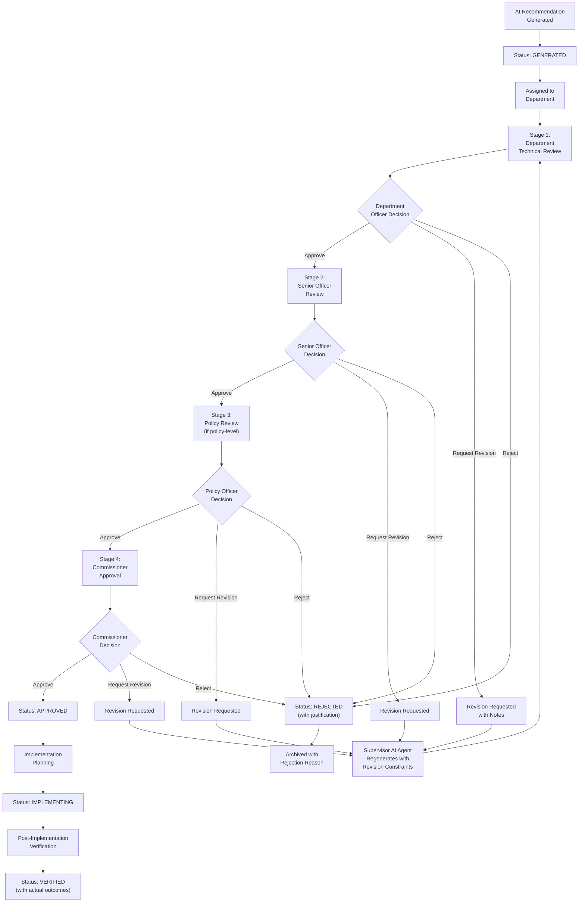
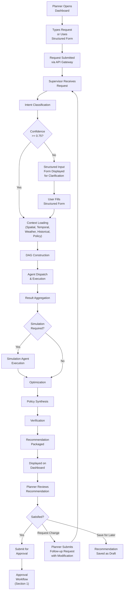
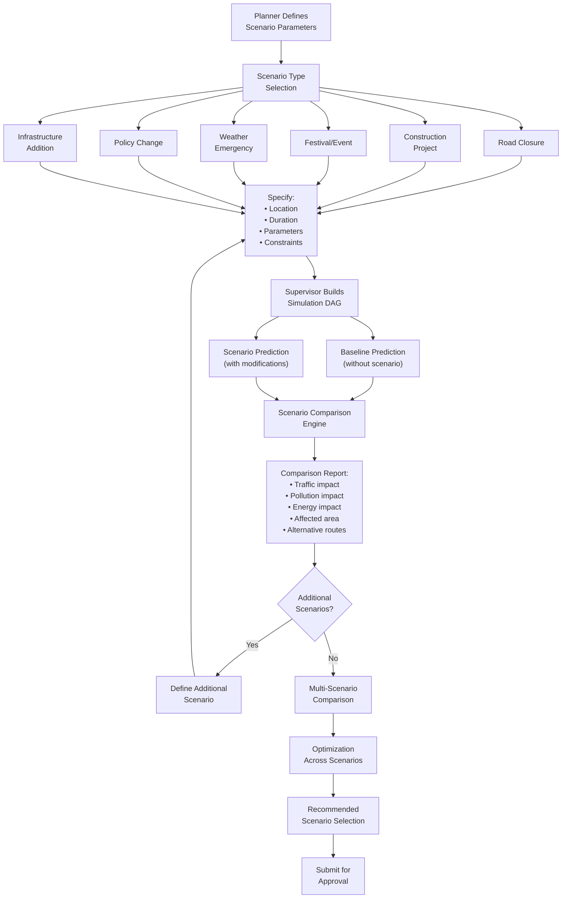
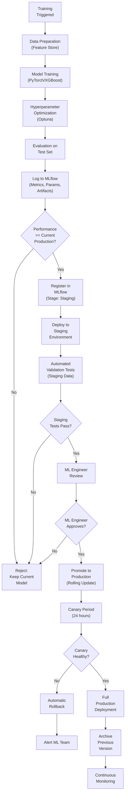
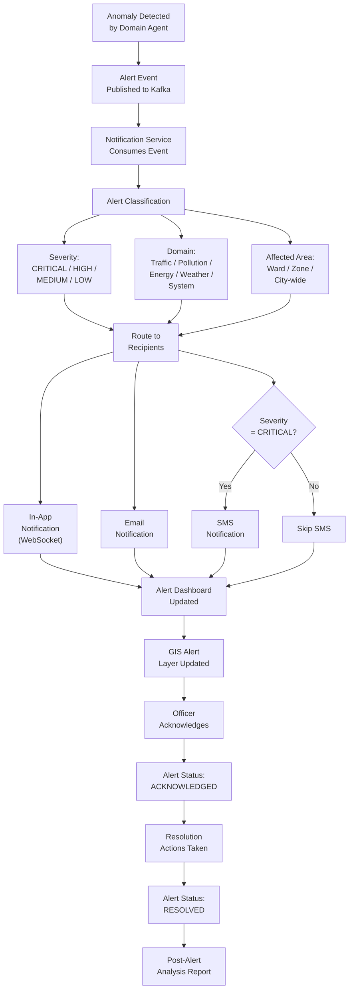
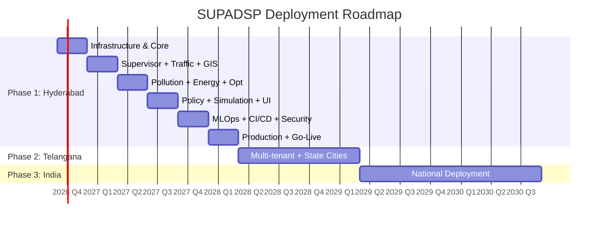

# VOLUME 10: WORKFLOWS, REPORTING & GOVERNMENT APPROVAL

## Smart Urban Planning & AI Decision Support Platform

**Document ID:** SUPADSP-ARCH-V2-VOL10 | **Version:** 2.0.0 | **Classification:** Government Restricted

---

## Table of Contents — Volume 10

1. [Government Approval Workflow](#1-government-approval-workflow)
2. [Planning Request Workflow](#2-planning-request-workflow)
3. [Simulation Workflow](#3-simulation-workflow)
4. [Model Deployment Workflow](#4-model-deployment-workflow)
5. [Alert Workflow](#5-alert-workflow)
6. [Reporting Framework](#6-reporting-framework)
7. [Dashboard Specifications](#7-dashboard-specifications)
8. [Notification Framework](#8-notification-framework)
9. [Exception & Recovery Workflows](#9-exception--recovery-workflows)
10. [Phased Deployment Roadmap](#10-phased-deployment-roadmap)

---

## 1. Government Approval Workflow

### 1.1 Recommendation Approval Flow

Every AI-generated recommendation must pass through a multi-stage government approval workflow before it is considered an official government decision. Recommendations are NOT automatically implemented — they are decision support outputs that enter a formal review process.



### 1.2 Approval Stages

| Stage | Approver Role | Purpose | SLA |
|---|---|---|---|
| **Stage 1: Department Technical Review** | Department Officer (e.g., Traffic Planning Officer) | Validate technical accuracy, review domain-specific aspects, check feasibility | 2 business days |
| **Stage 2: Senior Officer Review** | Senior Officer (e.g., Zonal Commissioner) | Review impact, resource requirements, cross-department implications | 3 business days |
| **Stage 3: Policy Review** | Policy Officer | Review policy compliance, precedent alignment, regulatory impact | 3 business days |
| **Stage 4: Commissioner Approval** | Commissioner (GHMC/HMDA) | Final approval authority for implementation | 5 business days |

### 1.3 Approval Decision Options

| Decision | Description | System Action |
|---|---|---|
| **Approve** | Recommendation accepted; advance to next stage | Status updated; notification sent to next approver |
| **Reject** | Recommendation rejected with justification | Status set to REJECTED; logged with reason; recommendation archived |
| **Request Revision** | Recommendation needs modification | Supervisor AI re-generates with revision constraints; returns to current stage |
| **Escalate** | Decision requires higher authority | Forwarded to next-level authority with context |
| **Defer** | Decision postponed (needs more information) | Status set to DEFERRED; reminder notification scheduled |

### 1.4 Fast-Track Approval

| Condition | Fast-Track Path |
|---|---|
| **Low-cost operational** (< ₹1 lakh, no policy change) | Department Officer → Senior Officer (skip policy/commissioner) |
| **Emergency** (severe weather, accident, emergency) | Single-stage emergency approval by highest available authority |
| **Routine** (scheduled report, standard forecast) | No approval needed; auto-delivered to dashboard |

### 1.5 Revision Workflow

When a reviewer requests a revision:

| Step | Action |
|---|---|
| 1 | Reviewer specifies revision notes (what needs to change, constraints) |
| 2 | Revision notes attached to the recommendation record |
| 3 | Supervisor AI re-invokes relevant agents with additional constraints from revision notes |
| 4 | New recommendation version generated (version counter incremented) |
| 5 | New version linked to original request and previous versions |
| 6 | Recommendation returned to the same review stage for re-evaluation |
| 7 | All versions maintained in history for audit trail |

### 1.6 Post-Implementation Verification

After a recommendation is approved and implemented:

| Step | Action | Timeline |
|---|---|---|
| 1 | Implementation monitoring begins | Day 1 of implementation |
| 2 | Domain agents automatically collect actual outcome data | Ongoing |
| 3 | System compares predicted outcomes with actual outcomes | 30/60/90 days post-implementation |
| 4 | Verification report generated with match/deviation analysis | Automated |
| 5 | Verification results fed back to improve future models | Continuous |
| 6 | Post-implementation report delivered to approvers | Automated |

---

## 2. Planning Request Workflow

### 2.1 Normal Flow



### 2.2 Alternative Flows

| Scenario | Alternative Flow |
|---|---|
| **Multiple intent matches** | Supervisor presents top-3 intents for user selection; user confirms correct intent |
| **Agent unavailable** | Supervisor detects via Agent Registry; uses fallback agent or returns degraded result with warning |
| **Low confidence prediction** | Recommendation includes explicit low-confidence warning; suggests additional data collection |
| **Cross-department request** | Supervisor identifies multiple departments; recommendation tagged for multi-department review |
| **Budget exceeds limit** | Verification Agent flags budget violation; recommendation includes alternative within budget |
| **Conflicting regulations** | Verification Agent lists all applicable regulations; conflicts escalated to policy reviewer |

### 2.3 Exception Flows

| Exception | Detection | Response |
|---|---|---|
| Supervisor timeout | DAG execution exceeds max timeout (120s) | Return partial results with timeout warning |
| Agent crash during execution | Agent health check fails mid-execution | Retry once; if still fails, return partial results excluding failed agent |
| Data source unavailable | ETL pipeline or cache miss | Use last available data with staleness warning |
| All predictions below confidence threshold | Aggregated confidence < 0.5 | Recommendation generated with explicit low-confidence flag; suggest manual analysis |
| Database connection failure | Connection pool exhausted | Circuit breaker activated; retry with exponential backoff; alert to ops team |
| Feature Store unavailable | Feast service unhealthy | Fallback to direct database queries for features |

---

## 3. Simulation Workflow

### 3.1 Scenario Planning Workflow



### 3.2 Scenario Parameter Templates

| Scenario Type | Required Parameters | Optional Parameters |
|---|---|---|
| **Road Closure** | Road segment(s), start date, end date, closure type (full/partial) | Alternative routes suggested, diversion plan |
| **Construction** | Location, type (metro/road/building), start date, expected duration | Phase plan, temporary traffic management |
| **Festival/Event** | Event name, location, date, expected attendance | Traffic management plan, parking plan |
| **Weather Emergency** | Weather type (flood/storm/heatwave), affected area, severity | Evacuation routes, resource staging locations |
| **Policy Change** | Policy type, effective date, affected area, rules | Compliance timeline, exemptions |
| **Infrastructure Addition** | Type (road/flyover/metro/signal), location, specifications | Phase plan, construction timeline |

---

## 4. Model Deployment Workflow

### 4.1 Model Lifecycle Workflow



---

## 5. Alert Workflow

### 5.1 Alert Processing Pipeline



### 5.2 Alert Severity Matrix

| Domain | Low | Medium | High | Critical |
|---|---|---|---|---|
| **Traffic** | Unusual volume pattern | Moderate congestion above baseline | Severe congestion on major corridor | Complete road blockage, multi-point failure |
| **Pollution** | AQI approaching threshold | AQI exceeds moderate threshold | AQI exceeds poor threshold | AQI exceeds severe/hazardous |
| **Energy** | Unusual consumption pattern | Demand approaching capacity | Demand exceeds 90% capacity | Demand exceeds capacity; outage risk imminent |
| **Weather** | Weather change advisory | Heavy rain forecast | Severe storm warning | Cyclone/flood warning, extreme conditions |
| **System** | Non-critical service degradation | Service latency spike | Service partial outage | Critical service down, data at risk |

### 5.3 Alert Escalation

| Level | Time Without Acknowledgment | Escalation Action |
|---|---|---|
| L1 | 0 min | Alert delivered to assigned officer(s) |
| L2 | 15 min | Re-alert + escalate to senior officer |
| L3 | 30 min | Escalate to department head |
| L4 | 60 min | Escalate to commissioner |

---

## 6. Reporting Framework

### 6.1 Report Types

| Report ID | Report Name | Frequency | Scope | Audience | Format |
|---|---|---|---|---|---|
| RPT-001 | Daily Traffic Summary | Daily (6:00 AM) | City-wide | Traffic Officers | PDF + Dashboard |
| RPT-002 | Daily Pollution Summary | Daily (6:00 AM) | City-wide | Environmental Officers | PDF + Dashboard |
| RPT-003 | Daily Energy Summary | Daily (6:00 AM) | City-wide | Energy Officers | PDF + Dashboard |
| RPT-004 | Daily Alert Summary | Daily (6:00 AM) | City-wide | All Officers | PDF + Dashboard |
| RPT-005 | Weekly Traffic Report | Weekly (Monday AM) | City-wide | Traffic Planning | PDF |
| RPT-006 | Weekly Pollution Report | Weekly (Monday AM) | City-wide | TSPCB Officers | PDF |
| RPT-007 | Weekly Energy Report | Weekly (Monday AM) | City-wide | Energy Planning | PDF |
| RPT-008 | Weekly AI Performance | Weekly (Monday AM) | Platform | ML Engineers | Dashboard |
| RPT-009 | Monthly Executive Report | Monthly (1st) | City-wide | Commissioner | PDF |
| RPT-010 | Monthly Traffic Analysis | Monthly (1st) | City-wide | Traffic Planning | PDF + Excel |
| RPT-011 | Monthly Pollution Analysis | Monthly (1st) | City-wide | TSPCB | PDF + Excel |
| RPT-012 | Monthly Energy Analysis | Monthly (1st) | City-wide | Energy Planning | PDF + Excel |
| RPT-013 | Monthly Recommendation Report | Monthly (1st) | City-wide | Commissioner | PDF |
| RPT-014 | Quarterly Strategic Report | Quarterly | City-wide | State Government | PDF |
| RPT-015 | Quarterly Model Performance | Quarterly | Platform | ML Engineers | PDF + Dashboard |
| RPT-016 | Annual Comprehensive Report | Annual | City-wide | State Government, Smart City Mission | PDF |
| RPT-017 | Ward-Level Report | On-demand | Per Ward | Ward Officers | PDF |
| RPT-018 | Zone-Level Report | On-demand | Per Zone | Zonal Commissioners | PDF |
| RPT-019 | Department Report | Monthly | Per Department | Department Heads | PDF |
| RPT-020 | Compliance Audit Report | Quarterly | Platform | Auditors | PDF |
| RPT-021 | Security Audit Report | Quarterly | Platform | Security Team | PDF |
| RPT-022 | Data Quality Report | Monthly | Data Layer | Data Stewards | PDF + Dashboard |
| RPT-023 | Ad-Hoc Analysis Report | On-demand | Custom | Planners | PDF + Excel |

### 6.2 Report Generation Architecture

```
Report Request (Scheduled or On-Demand)
           │
           ▼
┌─────────────────────┐
│  REPORT ENGINE       │
│  (FastAPI + Jinja2)  │
│                      │
│  1. Query data from  │
│     TimescaleDB,     │
│     PostgreSQL,      │
│     PostGIS          │
│                      │
│  2. Generate charts  │
│     (Matplotlib /    │
│      Plotly)         │
│                      │
│  3. Generate GIS     │
│     map snapshots    │
│     (GIS API)        │
│                      │
│  4. Render HTML      │
│     template         │
│     (Jinja2)         │
│                      │
│  5. Convert to PDF   │
│     (WeasyPrint)     │
│     or Excel         │
│     (openpyxl)       │
│                      │
│  6. Store in MinIO   │
│                      │
│  7. Deliver via      │
│     notification     │
└─────────────────────┘
```

### 6.3 Report Content Specification

#### RPT-009: Monthly Executive Report

| Section | Content |
|---|---|
| Executive Summary | High-level KPI summary, key events, notable trends |
| Traffic Overview | Monthly congestion trends, peak analysis, incident summary, improvement metrics |
| Pollution Overview | Monthly AQI trends, hotspot analysis, compliance status, mitigation outcomes |
| Energy Overview | Monthly demand trends, peak analysis, efficiency metrics, savings achieved |
| AI Platform Performance | Model accuracy trends, recommendation statistics, drift events |
| Recommendations Summary | Generated vs. approved vs. implemented; acceptance rate; confidence trends |
| Cross-Domain Insights | Correlations across traffic-pollution-energy; integrated recommendations |
| Alerts Summary | Alert volume by type/severity; response times; resolution rates |
| GIS Maps | Monthly composite maps: congestion heatmap, AQI heatmap, energy demand map |
| Next Month Forecast | Predicted trends for the coming month based on historical patterns |
| Appendix | Data quality summary; system uptime; data source availability |

---

## 7. Dashboard Specifications

### 7.1 Executive Dashboard

```
┌──────────────────────────────────────────────────────────────────────┐
│  EXECUTIVE DASHBOARD — Smart Urban Planning & AI Decision Support   │
├──────────────────────────────────────────────────────────────────────┤
│                                                                      │
│  ┌──────────┐ ┌──────────┐ ┌──────────┐ ┌──────────┐ ┌──────────┐ │
│  │ Traffic  │ │ AQI      │ │ Energy   │ │ Active   │ │ Pending  │ │
│  │ Index    │ │ Average  │ │ Demand   │ │ Alerts   │ │ Approvals│ │
│  │ ▲ 0.72   │ │ ▼ 125    │ │ ► 42 MW  │ │ 3       │ │ 5       │ │
│  │ Moderate │ │ Moderate │ │ Normal   │ │ ⚠️      │ │ 📋      │ │
│  └──────────┘ └──────────┘ └──────────┘ └──────────┘ └──────────┘ │
│                                                                      │
│  ┌─────────────────────────────┐ ┌─────────────────────────────────┐│
│  │ 24H TREND: TRAFFIC          │ │ 24H TREND: POLLUTION           ││
│  │ ──────────                  │ │ ────────────                    ││
│  │  ╱╲    ╱╲                   │ │     ╱╲                          ││
│  │ ╱  ╲  ╱  ╲                  │ │    ╱  ╲                         ││
│  │╱    ╲╱    ╲──               │ │ ──╱    ╲──                      ││
│  │ 6AM  9AM  12PM  3PM  6PM   │ │ 6AM  9AM  12PM  3PM  6PM       ││
│  └─────────────────────────────┘ └─────────────────────────────────┘│
│                                                                      │
│  ┌─────────────────────────────────────────────────────────────────┐│
│  │ GIS MAP (MapLibre GL JS)                                       ││
│  │ ┌─────────────────────────────────────────────────────────────┐││
│  │ │                                                             │││
│  │ │              [Hyderabad Map View]                            │││
│  │ │              with active alert markers                      │││
│  │ │              and congestion overlay                         │││
│  │ │                                                             │││
│  │ └─────────────────────────────────────────────────────────────┘││
│  └─────────────────────────────────────────────────────────────────┘│
│                                                                      │
│  ┌──────────────────────────────┐ ┌────────────────────────────────┐│
│  │ RECENT RECOMMENDATIONS       │ │ ACTIVE ALERTS                  ││
│  │ • Signal opt. HITEC City [✓] │ │ • ⚠️ AQI 180 at Madhapur      ││
│  │ • Energy audit Zone-5 [⏳]  │ │ • ⚠️ Congestion ORR-North      ││
│  │ • Road closure sim [📋]     │ │ • ℹ️ Construction Cyber Towers  ││
│  └──────────────────────────────┘ └────────────────────────────────┘│
└──────────────────────────────────────────────────────────────────────┘
```

### 7.2 Traffic Dashboard

| Panel | Content | Data Source | Update |
|---|---|---|---|
| **Congestion Map** | GIS map with color-coded road segments (green/yellow/orange/red) | Traffic Agent → Redis | 15 min |
| **Current Conditions** | KPI cards: Avg speed, total volume, congestion index, incident count | TimescaleDB | 15 min |
| **24H Forecast** | Time-series chart of predicted congestion for next 24 hours | Traffic Agent | 1 hour |
| **Peak Hour Forecast** | Predicted peak hours and severity for today | Traffic Agent | Daily |
| **Top Congested Roads** | Table of top-10 most congested segments with speed/capacity | TimescaleDB | 15 min |
| **Active Incidents** | Map markers for detected incidents/blockages | Kafka alerts | Real-time |
| **Historical Comparison** | Today vs. last week vs. last month overlay | TimescaleDB | 1 hour |
| **Signal Status** | List of signals with current timing and optimization recommendations | Traffic Agent | On-demand |
| **Ward Ranking** | Wards ranked by congestion severity | Computed | Daily |
| **Trend Analysis** | Weekly/monthly congestion trends with seasonality | TimescaleDB continuous aggregates | Daily |

### 7.3 Pollution Dashboard

| Panel | Content | Data Source | Update |
|---|---|---|---|
| **AQI Map** | Ward-level choropleth colored by predicted AQI (Good→Severe) | Pollution Agent → Redis | 1 hour |
| **AQI Gauges** | Per-station AQI gauge with category color | CPCB stations | 1 hour |
| **Pollutant Details** | Multi-line chart: PM2.5, PM10, NO₂, SO₂, CO, O₃ per station | TimescaleDB | 1 hour |
| **48H Forecast** | Time-series AQI prediction with confidence bands | Pollution Agent | 1 hour |
| **Hotspot Map** | Identified pollution hotspot polygons on GIS | Pollution Agent | 1 hour |
| **Source Attribution** | Pie chart of estimated emission source contributions | Pollution Agent | Daily |
| **Wind Rose** | Wind direction/speed visualization | Weather Agent | 1 hour |
| **Historical Comparison** | AQI today vs. last week vs. same date last year | TimescaleDB | Daily |
| **Industrial Compliance** | List of facilities with compliance status (green/yellow/red) | CPCB data | Daily |
| **CPCB Threshold Alerts** | Active threshold exceedance alerts | Kafka | Real-time |

### 7.4 Energy Dashboard

| Panel | Content | Data Source | Update |
|---|---|---|---|
| **Demand Map** | Zone-level energy demand heatmap on GIS | Energy Agent → Redis | 1 hour |
| **Current Load** | KPI cards: Current demand, capacity, utilization %, peak status | TimescaleDB | 1 hour |
| **24H Forecast** | Time-series demand forecast with peak indicators | Energy Agent | 1 hour |
| **Peak Analysis** | Predicted peak time, magnitude, probability | Energy Agent | Daily |
| **Zone Comparison** | Bar chart comparing zones by demand, efficiency, cost | TimescaleDB | Daily |
| **Building Efficiency** | Government building efficiency ranking | Energy Agent | Weekly |
| **Street Light Status** | Map showing street light fault indicators | Energy Agent | Daily |
| **Renewable Potential** | Solar potential overlay on building footprints | Energy Agent | Monthly |
| **Historical Trends** | Daily/weekly/monthly consumption trends | TimescaleDB continuous aggregates | Daily |
| **Carbon Dashboard** | Carbon emission estimates by zone | Energy Agent | Monthly |

### 7.5 AI Dashboard (ML Engineer View)

| Panel | Content | Data Source | Update |
|---|---|---|---|
| **Model Registry** | Table: all models with version, stage, accuracy, drift status | MLflow | Real-time |
| **Accuracy Trends** | Time-series chart of MAPE/RMSE per model over time | model_metrics (TimescaleDB) | Daily |
| **Drift Indicators** | Gauge/traffic-light for each model's drift score | Evidently AI | Daily |
| **Retraining History** | Timeline of retraining events with before/after metrics | MLflow | On event |
| **Prediction vs. Actual** | Scatter plot / time-series overlay of predicted vs. actual values | prediction_log (TimescaleDB) | Daily |
| **Feature Importance** | SHAP summary plot for top features per model | Model serving | On-demand |
| **Intent Distribution** | Pie chart of intent categories received this week | PostgreSQL | Daily |
| **Confidence Distribution** | Histogram of recommendation confidence scores | PostgreSQL | Daily |
| **Data Quality** | Data quality metrics per data source | Great Expectations | Daily |
| **Training Resource Usage** | GPU/CPU usage during training jobs | Prometheus | Real-time |

### 7.6 GIS Dashboard

| Component | Description |
|---|---|
| **Map Canvas** | Full-screen interactive map (MapLibre GL JS with vector tiles from Martin) |
| **Layer Panel** | Toggleable list of 30 layers grouped by category (Base, Infrastructure, Transport, AI Prediction, Alerts) |
| **Legend** | Dynamic legend showing active layer symbology |
| **Time Slider** | For temporal prediction layers (congestion at different hours) |
| **Search Bar** | Geocoding search for locations, wards, roads, landmarks in Hyderabad |
| **Drawing Tools** | Draw polygon/circle to select area of interest |
| **Measurement** | Measure distance and area on map |
| **Feature Info** | Click any feature for detailed popup with attributes |
| **Coordinate Display** | Current cursor coordinates (lat/long) |
| **Zoom Controls** | Zoom in/out, zoom to extent, zoom to ward/zone |
| **Basemap Switcher** | Toggle: Street Map, Satellite, Terrain, Dark Mode |
| **Export** | Export current view as PNG, PDF with legend |
| **Spatial Filter** | Filter dashboard data by visible map extent or drawn area |
| **Comparison Mode** | Split-screen for before/after or scenario comparison |

---

## 8. Notification Framework

### 8.1 Notification Channels

| Channel | Technology | Use Case | Latency |
|---|---|---|---|
| **In-App** | WebSocket (via Kafka bridge) | Real-time alerts, recommendation updates | < 2 seconds |
| **Email** | SMTP (government email server) | Reports, non-urgent alerts, approval requests | < 5 minutes |
| **SMS** | SMS Gateway API | Critical alerts (severe weather, system failure) | < 2 minutes |
| **Push** | Web Push Notifications | Mobile/desktop browser notifications | < 5 seconds |

### 8.2 User Notification Preferences

Users can configure:
- Which alert types they want to receive
- Which channels for each alert type (email, SMS, in-app, push)
- Quiet hours (no non-critical notifications between configured hours)
- Daily digest option (consolidate low-priority alerts into daily summary)
- Ward/zone scope (only receive alerts for their area of responsibility)

### 8.3 Notification Templates

| Template | Subject | Body Pattern |
|---|---|---|
| **Traffic Alert** | `[TRAFFIC ALERT] {severity}: {location}` | `Traffic anomaly detected at {location}. {description}. Current congestion index: {index}. Recommended action: {action}.` |
| **Pollution Alert** | `[POLLUTION ALERT] AQI {level}: {station}` | `AQI level {aqi} ({category}) detected at {station} ({location}). Pollutant: {pollutant} = {value}. Threshold: {threshold}.` |
| **Energy Alert** | `[ENERGY ALERT] {severity}: {zone}` | `Energy demand spike detected in {zone}. Current load: {load_mw} MW ({utilization}% capacity). Peak predicted at {peak_time}.` |
| **Weather Alert** | `[WEATHER] {severity}: {event}` | `{event} alert for Hyderabad. {description}. Impact: {impact}. Duration: {duration}.` |
| **Recommendation** | `[RECOMMENDATION] {title}` | `New AI recommendation generated for {location}. Action: {action}. Confidence: {confidence}. Please review in the dashboard.` |
| **Approval Request** | `[APPROVAL REQUIRED] {title}` | `Recommendation {id} requires your approval. Department: {dept}. Priority: {priority}. Deadline: {deadline}.` |
| **Model Drift** | `[ML ALERT] Model drift: {model}` | `Performance drift detected in {model}. Current MAPE: {mape} (baseline: {baseline}). Retraining recommended.` |
| **System Alert** | `[SYSTEM] {severity}: {service}` | `Service {service} is {status}. Impact: {impact}. Duration: {duration}. Action taken: {action}.` |

---

## 9. Exception & Recovery Workflows

### 9.1 System Exception Handling

| Exception | Detection | Immediate Action | Recovery | Notification |
|---|---|---|---|---|
| **Agent service crash** | K8s pod health check failure | K8s auto-restart pod; circuit breaker activated | Pod restarts with health check; circuit breaker resets after 3 consecutive healthy checks | P2 alert to platform team |
| **Database connection failure** | Connection pool timeout | Connection pool retry with exponential backoff | Pool reconnects; pending queries retried | P2 alert to DBA team |
| **Kafka broker failure** | Producer/consumer error | Kafka cluster HA (3+ brokers); automatic partition reassignment | Broker recovers; partitions rebalanced | P2 alert to platform team |
| **Redis unavailable** | Connection timeout | Services degrade gracefully (skip cache, use direct DB) | Redis pod restarts; cache warms gradually | P3 alert to platform team |
| **GeoServer crash** | Health check failure | K8s restarts pod | GeoServer restarts with persisted configuration | P3 alert to GIS team |
| **Model serving failure** | Inference endpoint unresponsive | Fallback to backup model; circuit breaker on primary | Pod restart; model reloaded from registry | P2 alert to ML team |
| **Disk space exhaustion** | Prometheus disk alert | Automated data cleanup (retention policies) | Old data purged; logs rotated; operator intervention | P2 alert to infra team |
| **Certificate expiry** | cert-manager alert (14 days before) | Automatic renewal by cert-manager | Certificate renewed; services pick up new cert | P3 alert to security team |
| **Memory pressure** | K8s OOM events | Pod evicted and rescheduled | Pod restarted on node with available memory | P2 alert to platform team |
| **Training job failure** | Airflow task failure | Airflow retry (up to 3 times with backoff) | Job retried; if persistent, manual investigation | P3 alert to ML team |

### 9.2 Data Recovery Procedures

| Scenario | Procedure | RTO |
|---|---|---|
| **Accidental data deletion** | Point-in-time recovery from WAL archive | 1-2 hours |
| **Database corruption** | Restore from latest backup + replay WAL | 2-4 hours |
| **MinIO object loss** | Restore from cross-site replica | 1-2 hours |
| **Kafka topic data loss** | Replay from producer logs or source systems | 4-8 hours |
| **Configuration loss** | Restore from Git repository (GitOps) | 30 minutes |
| **Secret loss** | Restore from Vault backup | 30 minutes |
| **Complete site failure** | Activate DR site (Section 12 of Vol 9) | 1-4 hours |

---

## 10. Phased Deployment Roadmap

### 10.1 Phase 1: Hyderabad (Months 1-18)

| Quarter | Deliverables |
|---|---|
| **Q1 (M1-3)** | Infrastructure setup (K8s, databases, monitoring); Core platform services (Keycloak, Kong, Kafka); PostGIS data loading (OSM, wards, infrastructure) |
| **Q2 (M4-6)** | Supervisor AI Agent v1.0 (intent classification, DAG execution); Weather Agent; Traffic Agent (DCRNN training on SUMO data); GIS platform (GeoServer, Martin) |
| **Q3 (M7-9)** | Pollution Agent (TFT training on CPCB data); Energy Agent (XGBoost training); Optimization Agent (NSGA-II); Frontend dashboards (Traffic, Pollution, Energy) |
| **Q4 (M10-12)** | Policy Synthesis Agent; Verification Agent; Simulation Agent; Approval workflow; Executive dashboard; Reporting module |
| **Q5 (M13-15)** | MLOps platform (MLflow, Feast, drift monitoring); Full CI/CD pipeline; Security hardening; Performance optimization; UAT with government users |
| **Q6 (M16-18)** | Production deployment on government cloud; Training for government users; Go-live with phased user rollout; Post-deployment monitoring and stabilization |

### 10.2 Phase 2: Telangana (Months 19-30)

| Deliverables |
|---|
| Multi-tenant architecture activation (schema-per-city) |
| Data ingestion for additional cities (Warangal, Karimnagar, Khammam, Nizamabad) |
| City-specific model training for each new deployment |
| Kubernetes namespace isolation per city |
| GeoServer workspace per city |
| State-level aggregation dashboards |
| Water and Waste domains (optional new agents) |

### 10.3 Phase 3: India (Months 31-48)

| Deliverables |
|---|
| National deployment framework on NIC cloud |
| 100 Smart City Mission city deployments |
| National aggregation dashboards |
| Cross-city comparison and benchmarking |
| Hindi + regional language support |
| National model registry with federated learning |
| Integration with National Smart Cities platform |

### 10.4 Roadmap Timeline



---

## Appendix A: Glossary

| Term | Definition |
|---|---|
| **AQI** | Air Quality Index — standardized measure of air pollution level |
| **CPCB** | Central Pollution Control Board — national pollution monitoring body |
| **DAG** | Directed Acyclic Graph — execution plan for task dependencies |
| **DCRNN** | Diffusion Convolutional Recurrent Neural Network — GNN model for traffic forecasting |
| **DEM** | Digital Elevation Model — terrain height data |
| **DPDP** | Digital Personal Data Protection (Act 2023) |
| **GAT** | Graph Attention Network — graph neural network with attention |
| **GHMC** | Greater Hyderabad Municipal Corporation |
| **GIGW** | Guidelines for Indian Government Websites |
| **GNN** | Graph Neural Network — neural network operating on graph-structured data |
| **GRU** | Gated Recurrent Unit — recurrent neural network variant |
| **HMDA** | Hyderabad Metropolitan Development Authority |
| **HPA** | Horizontal Pod Autoscaler — Kubernetes auto-scaling |
| **IaC** | Infrastructure as Code |
| **IMD** | India Meteorological Department |
| **IRC** | Indian Roads Congress — national road design standards body |
| **LSTM** | Long Short-Term Memory — recurrent neural network type |
| **MAPE** | Mean Absolute Percentage Error — prediction accuracy metric |
| **MLOps** | Machine Learning Operations — practices for ML lifecycle management |
| **mTLS** | Mutual TLS — two-way certificate authentication |
| **MVT** | Mapbox Vector Tiles — vector tile format for web maps |
| **NIC** | National Informatics Centre — government IT infrastructure |
| **NSGA-II** | Non-dominated Sorting Genetic Algorithm II — multi-objective optimization |
| **OGC** | Open Geospatial Consortium — GIS standards body |
| **OIDC** | OpenID Connect — authentication protocol |
| **PDB** | Pod Disruption Budget — Kubernetes availability guarantee |
| **RBAC** | Role-Based Access Control |
| **RLS** | Row-Level Security — database-level access restriction |
| **RMSE** | Root Mean Squared Error — prediction accuracy metric |
| **RPO** | Recovery Point Objective — maximum data loss tolerance |
| **RTO** | Recovery Time Objective — maximum downtime tolerance |
| **SHAP** | SHapley Additive exPlanations — model explainability method |
| **SLA** | Service Level Agreement |
| **SLI** | Service Level Indicator |
| **SLO** | Service Level Objective |
| **SUMO** | Simulation of Urban Mobility — traffic microsimulation tool |
| **TFT** | Temporal Fusion Transformer — multi-horizon forecasting model |
| **TGNPDCL** | Telangana State Northern Power Distribution Company |
| **TGSPDCL** | Telangana State Southern Power Distribution Company |
| **TSPCB** | Telangana State Pollution Control Board |
| **TSRTC** | Telangana State Road Transport Corporation |
| **WAF** | Web Application Firewall |
| **WFS** | Web Feature Service — OGC vector data protocol |
| **WMS** | Web Map Service — OGC map image protocol |
| **WMTS** | Web Map Tile Service — OGC tiled map protocol |

---

## Appendix B: Document Cross-Reference

| Volume | Document | Pages (Approx.) |
|---|---|---|
| Vol 1 | Executive Summary & Architecture Overview | 50 |
| Vol 2 | Supervisor AI Agent & Multi-Agent Architecture | 100 |
| Vol 3 | Enterprise Data Architecture | 80 |
| Vol 4 | AI/ML Platform & MLOps | 60 |
| Vol 5 | GIS Architecture | 40 |
| Vol 6 | Functional Requirements Specification (FR-001 to FR-210) | 100 |
| Vol 7 | System Modules Specification (30 modules) | 80 |
| Vol 8 | Security Architecture | 50 |
| Vol 9 | Infrastructure & Deployment Architecture | 50 |
| Vol 10 | Workflows, Reporting & Government Approval | 50 |
| **Total** | **Complete Architecture Document Suite** | **~660** |

---

*End of Volume 10 — Workflows, Reporting & Government Approval*

*End of SUPADSP Enterprise Architecture Document Suite — Version 2.0.0*
