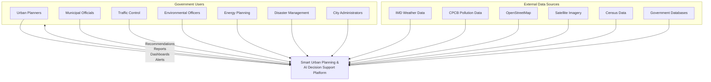
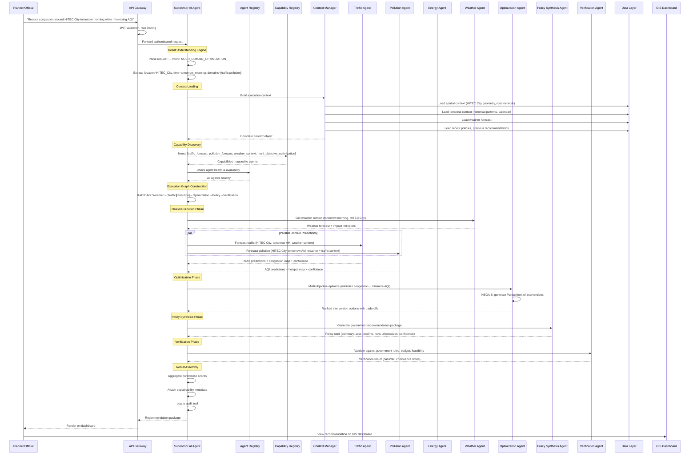
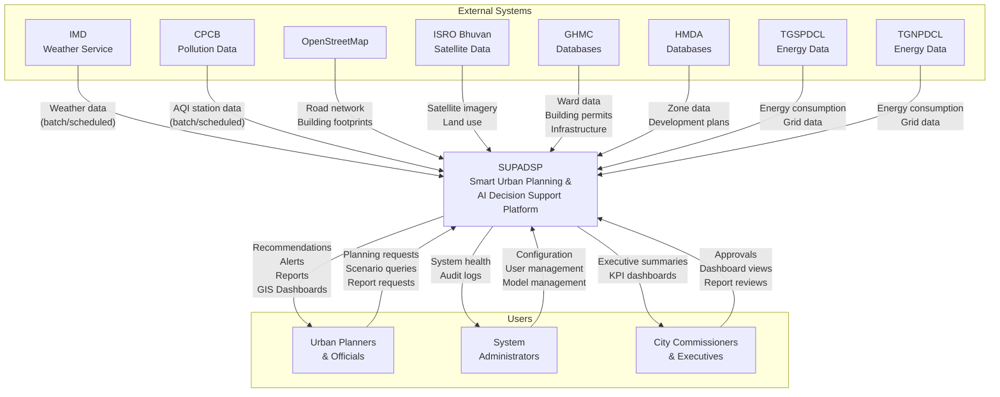
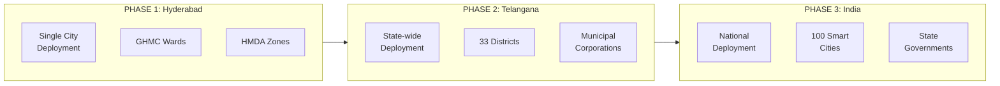

# VOLUME 1: EXECUTIVE SUMMARY & ARCHITECTURE OVERVIEW

## Smart Urban Planning & AI Decision Support Platform

### Enterprise Architecture Document

**Document Classification:** Government Restricted — Internal Use Only  
**Version:** 2.0.0  
**Date:** August 2026  
**Prepared For:** Government of Telangana, Greater Hyderabad Municipal Corporation (GHMC), Hyderabad Metropolitan Development Authority (HMDA)  
**Prepared By:** Enterprise Architecture Consulting Team  

---

## Document Control

| Field | Value |
|---|---|
| Document ID | SUPADSP-ARCH-V2-VOL1 |
| Version | 2.0.0 |
| Status | Final Draft |
| Classification | Government Restricted |
| Review Cycle | Quarterly |
| Next Review | November 2026 |

### Revision History

| Version | Date | Author | Description |
|---|---|---|---|
| 1.0.0 | 2026-Q1 | Legacy Team | Initial architecture (21-page blueprint) |
| 2.0.0 | 2026-Q3 | Enterprise Architecture Consulting Team | Complete redesign — all 10 volumes |

---

## Table of Contents — Volume 1

1. [Executive Summary](#1-executive-summary)
2. [Project Vision & Mission](#2-project-vision--mission)
3. [Project Scope & Boundaries](#3-project-scope--boundaries)
4. [Stakeholder Analysis](#4-stakeholder-analysis)
5. [Legacy Architecture Assessment](#5-legacy-architecture-assessment)
6. [Architecture Principles & Philosophy](#6-architecture-principles--philosophy)
7. [High-Level Architecture](#7-high-level-architecture)
8. [Technology Decisions Matrix](#8-technology-decisions-matrix)
9. [Architecture Viewpoints (C4 Model)](#9-architecture-viewpoints-c4-model)
10. [Key Performance Indicators](#10-key-performance-indicators)
11. [Geographical Expansion Strategy](#11-geographical-expansion-strategy)
12. [Enterprise Architecture Governance](#12-enterprise-architecture-governance)
13. [Cross-Reference Index](#13-cross-reference-index)

---

## 1. Executive Summary

### 1.1 Purpose

This document presents the complete enterprise architecture for the **Smart Urban Planning & AI Decision Support Platform (SUPADSP)** — a production-grade, government-internal decision support system designed to enable municipal authorities in Hyderabad to make intelligent, data-driven, evidence-based urban planning decisions across three core intelligence domains: **Traffic**, **Pollution**, and **Energy Consumption**.

The platform is **not** a citizen-facing application, complaint management system, public dashboard, IoT management platform, or emergency call center. It is an **internal enterprise decision-support platform** exclusively designed for government authorities to perform:

- Predictive forecasting across traffic, pollution, and energy domains
- Multi-objective optimization and scenario simulation
- AI-assisted policy recommendation with explainable reasoning
- GIS-driven spatial intelligence and planning
- Cross-domain impact analysis and resource optimization
- Government-compliant decision workflows with full auditability

### 1.2 Why a Complete Redesign

The legacy architecture (Version 1.0, 21-page blueprint) was assessed against enterprise standards expected for government Smart City implementations delivered by firms such as Accenture, Deloitte, TCS, Infosys, IBM Consulting, Microsoft Consulting, AWS Professional Services, and Capgemini. The assessment identified **20 critical-to-medium architectural weaknesses** necessitating a complete redesign:

| Severity | Count | Key Issues |
|---|---|---|
| 🔴 Critical | 4 | LLM-dependent orchestrator, no Supervisor AI Agent, flat agent structure, no security architecture |
| 🟠 High | 6 | No multi-tenant strategy, monolithic database, primitive GIS, no data governance, no MLOps, no Kubernetes |
| 🟡 Medium | 10 | No simulation agent, limited optimization, no observability, no event schema, citizen modules in scope |

**Key architectural decisions that differ from the legacy design:**

1. **Supervisor AI Agent** replaces the simple orchestrator — a full enterprise workflow coordinator with intent understanding, execution graph building, memory architecture, and dynamic agent scheduling
2. **Hierarchical multi-agent system** replaces flat agent layout — specialist agents contain sub-agents, all discoverable via Agent and Capability registries
3. **Enterprise polyglot data architecture** replaces single-database design — PostgreSQL, PostGIS, TimescaleDB, Redis, MinIO, Elasticsearch, each purpose-optimized
4. **GIS-first architecture** replaces map-as-afterthought — GeoServer, OGC-compliant services, vector tile server, enterprise layer management
5. **Full MLOps platform** replaces manual model management — MLflow, centralized Feature Store, automated drift detection and retraining
6. **Zero-trust security architecture** replaces absent security — Keycloak, mTLS, network segmentation, row-level security, comprehensive audit
7. **Kubernetes-native deployment** replaces Docker Compose — Helm charts, GitOps, infrastructure-as-code, auto-scaling
8. **Apache Kafka event backbone** replaces synchronous-only REST — proper event schemas, CQRS for read-heavy analytics, async processing
9. **Government approval workflows** replace direct output — multi-stage review, approval chains, revision history, audit trails
10. **No external LLM APIs anywhere** — the Supervisor uses trained intent classifiers, rule engines, and deterministic planners

### 1.3 Document Suite

This architecture is delivered as a **10-volume enterprise architecture document suite**:

| Volume | Title | Focus |
|---|---|---|
| **Vol 1** | Executive Summary & Architecture Overview | This document — vision, principles, high-level architecture |
| **Vol 2** | Supervisor AI Agent & Multi-Agent Architecture | The AI brain — supervisor, agents, sub-agents, registries, memory |
| **Vol 3** | Enterprise Data Architecture | Data sources, ingestion, ETL, databases, governance, schemas |
| **Vol 4** | AI/ML Platform & MLOps | ML platform, model registry, training pipelines, feature store |
| **Vol 5** | GIS Architecture | Spatial platform, GeoServer, layers, tile serving, spatial analysis |
| **Vol 6** | Functional Requirements Specification | 200+ functional requirements in full SRS format |
| **Vol 7** | System Modules Specification | All 21+ modules with complete specifications |
| **Vol 8** | Security Architecture | Zero-trust, RBAC, encryption, compliance, audit |
| **Vol 9** | Infrastructure & Deployment Architecture | Kubernetes, CI/CD, GitOps, monitoring, DR |
| **Vol 10** | Workflows, Reporting & Government Approval | Approval workflows, dashboards, reports, alerts |

---

## 2. Project Vision & Mission

### 2.1 Vision Statement

> *To establish the Smart Urban Planning & AI Decision Support Platform as the central intelligent planning platform for municipal corporations — enabling government officials to monitor city conditions, predict future events, optimize resources, evaluate planning scenarios, and make AI-assisted strategic decisions through a unified, explainable, and auditable enterprise system.*

### 2.2 Mission Statement

> *Deliver a production-grade, government-deployable, AI-native decision support platform that combines multi-domain intelligence (Traffic, Pollution, Energy), GIS-driven spatial analysis, multi-objective optimization, and simulation-based scenario planning to provide evidence-based, explainable policy recommendations to urban planners and government decision makers — without dependence on any external AI service.*

### 2.3 Strategic Objectives

| # | Strategic Objective | Measurable Target |
|---|---|---|
| SO-01 | Reduce urban traffic congestion through predictive intelligence | 15-25% reduction in average congestion index within monitored corridors |
| SO-02 | Improve air quality through proactive pollution management | 10-20% reduction in AQI exceedance days in priority zones |
| SO-03 | Optimize energy consumption across government infrastructure | 10-15% reduction in government building energy consumption |
| SO-04 | Accelerate government decision-making with AI assistance | 60% reduction in average decision support turnaround time |
| SO-05 | Enable evidence-based policy recommendations | 90%+ recommendation confidence scores with full explainability |
| SO-06 | Provide cross-domain impact analysis | All recommendations include multi-domain impact assessment |
| SO-07 | Ensure government compliance and auditability | 100% decision traceability and audit trail coverage |
| SO-08 | Support geographical expansion without redesign | Architecture supports multi-city deployment through configuration |

### 2.4 Business Goals

| # | Business Goal | Success Metric |
|---|---|---|
| BG-01 | Reduction in Traffic Congestion | Average travel time reduction on monitored corridors |
| BG-02 | Reduction in Pollution | Fewer AQI threshold exceedance events |
| BG-03 | Improved Energy Utilization | kWh savings in government buildings and street lighting |
| BG-04 | Improved Infrastructure Planning | Percentage of infrastructure decisions with AI support |
| BG-05 | Better Government Decision Making | Decision support request volume and adoption rate |
| BG-06 | Reduced Planning Time | Average time from request to recommendation delivery |
| BG-07 | Improved Policy Accuracy | Post-implementation verification match rate |
| BG-08 | Improved Cross-Department Coordination | Number of cross-domain recommendations generated |
| BG-09 | Improved Resource Allocation | Budget utilization efficiency across wards |
| BG-10 | Reduced Operational Cost | Cost per recommendation and cost per prediction |
| BG-11 | Improved Emergency Preparedness | Simulation scenario coverage and response plan quality |
| BG-12 | Evidence-Based Decision Making | Percentage of decisions backed by AI recommendation |
| BG-13 | Explainable AI Recommendations | Explainability score per recommendation |

---

## 3. Project Scope & Boundaries

### 3.1 In-Scope

#### Core Intelligence Domains (Primary)

| Domain | Description | Agents |
|---|---|---|
| **Traffic Intelligence** | Forecasting, congestion prediction, signal optimization, route planning, simulation | Traffic Agent + 11 sub-agents |
| **Pollution Intelligence** | AQI/pollutant prediction, hotspot detection, dispersion modeling, mitigation planning | Pollution Agent + 7 sub-agents |
| **Energy Consumption Intelligence** | Load forecasting, peak demand, building analysis, street light optimization, renewable planning | Energy Agent + 6 sub-agents |

#### Contextual Intelligence (Supporting)

| Context | Purpose | Data Sources |
|---|---|---|
| Weather | Enrich all domain predictions | IMD, ERA5, weather stations |
| Rainfall & Flood Risk | Impact analysis for traffic/infrastructure | IMD, drainage network, DEM |
| Heat Waves | Energy demand and health impact | Satellite thermal bands, weather |
| Construction Activities | Traffic and pollution impact | GHMC permits, road closure data |
| Public Events & Festivals | Traffic pattern disruption | Calendar, event registry |
| Population Density | Resource allocation and impact scaling | Census, ward-level data |
| Land Use | Spatial context for all domains | HMDA zoning, satellite imagery |
| Building Density | Energy and pollution modeling | Building footprints, OSM |
| Government Policies | Compliance and recommendation context | Policy database, regulations |
| Historical Trends | Baseline for all predictions | TimescaleDB historical data |
| Calendar & Holidays | Temporal pattern recognition | Holiday/event calendar |

#### Platform Capabilities

| Capability | Description |
|---|---|
| Monitoring | Real-time and near-real-time domain monitoring with anomaly detection |
| Forecasting | Short-term (hours), medium-term (days), and long-term (weeks/months) predictions |
| Prediction | Point predictions with calibrated confidence intervals |
| Optimization | Multi-objective optimization (NSGA-II, constraint optimization, budget optimization) |
| Simulation | What-if scenario analysis, road closure simulation, disaster simulation |
| Decision Support | AI-assisted recommendations with explainable reasoning |
| Policy Recommendation | Government-ready policy cards with cost/benefit/risk analysis |
| Scenario Planning | Compare multiple intervention strategies with trade-off analysis |
| Strategic Planning | Long-term infrastructure and resource planning |
| Resource Optimization | Budget allocation, personnel deployment, infrastructure prioritization |
| GIS Intelligence | Spatial analysis, heatmaps, layer management, proximity analysis |
| Cross-domain Intelligence | Multi-domain impact analysis (e.g., traffic impact on pollution) |
| Government Reporting | Automated report generation (daily, weekly, monthly, quarterly, annual) |
| Auditability | Complete decision traceability and approval history |

### 3.2 Explicitly Out of Scope

| Excluded Item | Reason |
|---|---|
| Citizen Complaint Module | Not a citizen-facing platform |
| Complaint Management | Not a CRM or ticket system |
| Public Complaint Dashboard | No public-facing components |
| Citizen Feedback Portal | Excluded users |
| Public Service Request Portal | Not a service delivery platform |
| Customer Support | No customer-facing operations |
| Social Media Integration | Not a social media monitoring platform |
| Twitter/Facebook/WhatsApp Monitoring | Explicitly excluded |
| Public Chatbot / Public AI Assistant | No public AI interfaces |
| Citizen Ticket Management | Not a ticket system |
| Citizen Reporting | Citizens are excluded users |
| IoT Device Management | Not an IoT management platform (data ingestion from IoT is in-scope) |
| Emergency Call Center | Not a 112/emergency dispatch system |

### 3.3 Primary Users

| User Role | Organization | Primary Use |
|---|---|---|
| Urban Planners | GHMC, HMDA | Long-term infrastructure and land-use planning |
| Municipal Corporation Officials | GHMC | City-wide operational and strategic decisions |
| Government Decision Makers | State Government | Policy-level decisions and approvals |
| GHMC Officials | GHMC | Ward-level monitoring and planning |
| HMDA Officials | HMDA | Metropolitan zone-level development planning |
| Hyderabad Traffic Police | Traffic Police | Traffic management and incident response planning |
| Traffic Control Center | Traffic Police | Real-time traffic monitoring and signal optimization |
| Traffic Engineers | GHMC/Traffic Police | Road infrastructure and signal design |
| Road Infrastructure Engineers | GHMC | Road maintenance and construction planning |
| TSPCB Officers | Telangana State Pollution Control Board | Environmental monitoring and enforcement |
| Environmental Officers | TSPCB | Pollution assessment and mitigation planning |
| Energy Distribution Authorities | TGNPDCL, TGSPDCL | Grid management and demand planning |
| Electricity Planning Engineers | TGNPDCL, TGSPDCL | Load forecasting and infrastructure planning |
| Government Building Authorities | GHMC | Building energy optimization |
| Disaster Management Officials | SDMA | Disaster preparedness and response planning |
| Smart City Administrators | Smart City Mission | Overall platform administration |
| City Commissioners | GHMC | Executive oversight and approval |
| Municipal Commissioners | GHMC | Policy approval and governance |
| Policy Makers | State Government | Policy formulation based on AI recommendations |
| Planning Committees | GHMC/HMDA | Committee-level review and approval |

### 3.4 Excluded Users

Citizens, public users, businesses, commercial customers, customer support staff, citizen complaint operators, customer care, public feedback teams, social media teams, public service teams.

---

## 4. Stakeholder Analysis

### 4.1 Stakeholder Registry

| Stakeholder | Type | Interest | Influence | Engagement Strategy |
|---|---|---|---|---|
| GHMC Commissioner | Decision Maker | High | High | Executive briefings, approval workflows |
| HMDA Commissioner | Decision Maker | High | High | Executive briefings, zone-level dashboards |
| Urban Planning Department | Primary User | High | Medium | Training, daily dashboard access, feedback loops |
| Hyderabad Traffic Police | Primary User | High | Medium | Traffic intelligence dashboards, alert integration |
| TSPCB | Primary User | High | Medium | Pollution monitoring dashboards, compliance reports |
| TGNPDCL/TGSPDCL | Primary User | Medium | Medium | Energy dashboards, demand forecasts |
| IT Department (GHMC) | Technical Stakeholder | High | High | Infrastructure provisioning, security compliance |
| State Government IT | Governance | Medium | High | Architecture review, compliance approval |
| NIC (National Informatics Centre) | Standards Body | Medium | High | Standards compliance, data sharing protocols |
| Smart City Mission | Program Owner | High | High | Program oversight, funding, reporting |
| UIDAI/Data Protection Authority | Regulatory | Low | High | Data privacy compliance |
| IMD Hyderabad | Data Provider | Medium | Low | Weather data provisioning, API integration |
| ISRO/NRSC | Data Provider | Medium | Low | Satellite imagery, Bhuvan integration |

### 4.2 Stakeholder Concerns Matrix

| Concern | Stakeholders | How Addressed |
|---|---|---|
| Decision accuracy | Commissioners, Planning Committees | Calibrated confidence intervals, explainable AI, verification agent |
| Data security | IT Department, State Government | Zero-trust architecture, encryption, audit trails (Vol 8) |
| System reliability | All users | HA architecture, disaster recovery, 99.9% SLA target (Vol 9) |
| Ease of use | Urban Planners, Officers | Intuitive GIS dashboards, natural language requests to Supervisor |
| Auditability | Commissioners, Auditors | Complete decision lineage, approval history, immutable audit logs |
| Expandability | Smart City Mission | Multi-tenant architecture, agent registry pattern (Vol 2) |
| Government compliance | NIC, State Government | GIGW compliance, data residency, government cloud deployment |
| Cost control | GHMC Finance | No external API costs, open-source stack, resource optimization |

---

## 5. Legacy Architecture Assessment

### 5.1 Assessment Summary

The legacy architecture (Version 1.0) was a 21-page document describing a single-orchestrator, multi-specialist-agent system with the following characteristics:

```
┌──────────────────────────────────────────────────────┐
│                    LEGACY ARCHITECTURE                │
│                                                       │
│  Orchestrator (LLM-dependent)                        │
│       ├── Traffic Agent (GNN/LSTM)                   │
│       ├── Pollution Agent (LSTM/TFT + Gaussian)      │
│       ├── Energy Agent (XGBoost/LSTM)                │
│       ├── Arbitration Agent (NSGA-II)                │
│       ├── Policy Synthesis Agent                     │
│       └── Verification Agent                         │
│                                                       │
│  Data: Single PostgreSQL + ChromaDB                  │
│  Frontend: React + Leaflet                           │
│  Deployment: Docker Compose                          │
│  Security: None described                            │
│  GIS: "A map with a base layer"                      │
│  MLOps: Manual model version log                     │
│  Events: Synchronous REST only                       │
└──────────────────────────────────────────────────────┘
```

### 5.2 Detailed Weakness Analysis

#### 5.2.1 Critical Weaknesses (Must Fix — Production Blockers)

**W-01: LLM-Dependent Orchestrator**
- **Finding:** The orchestrator's reasoning layer was specified as "Claude/GPT with function-calling"
- **Impact:** Directly violates the core constraint that no AI capability should depend on external LLM APIs; creates data residency risk for government deployment
- **Redesign:** Replace with trained intent classifier + rule engine + deterministic task planner. The Supervisor AI Agent uses locally-trained transformer-based intent classification, a graph-based execution planner, and deterministic DAG construction — no external API calls
- **Justification:** Government data (ward-level infrastructure queries) must never leave the controlled environment. A self-trained orchestrator is also more reliable (no API downtime), more auditable (deterministic plans), and more cost-effective

**W-02: No True Supervisor AI Agent**
- **Finding:** The orchestrator was a thin dispatcher — classify intent, call agents, return results
- **Impact:** Cannot handle complex multi-step planning, context management, dependency resolution, memory, or government workflow coordination
- **Redesign:** Full Supervisor AI Agent with Intent Understanding Engine, Task Planner, Execution Graph Builder, Context Manager, Memory Architecture (4-tier), Agent Registry, Capability Registry, Confidence Aggregation, and Government Workflow Coordination
- **Justification:** A Chief Urban Planning Officer doesn't just dispatch work — they understand context, resolve dependencies, manage priorities, coordinate across departments, and ensure compliance. The Supervisor must mirror this behavior

**W-03: Flat Agent Structure**
- **Finding:** All agents at same level; Traffic/Pollution/Energy agents are thin wrappers around model endpoints
- **Impact:** Cannot support the required 30+ sub-capabilities (congestion prediction, signal optimization, hotspot detection, etc.) within each domain
- **Redesign:** Hierarchical agent architecture: Supervisor → Specialist Agents → Sub-Agents → Prediction Models → Inference Services. Each specialist agent manages its own internal sub-agents. Agent Registry enables dynamic discovery
- **Justification:** Enterprise systems require separation of concerns at every level. A Traffic Agent that does forecasting, congestion prediction, accident detection, signal optimization, and parking prediction in one model is unmaintainable and untestable

**W-04: No Security Architecture**
- **Finding:** "None are described in the source document" — no authentication, no authorization, no RBAC, no encryption, no audit trails, no network segmentation
- **Impact:** Completely undeployable in any government environment; violates every government IT security standard
- **Redesign:** Zero-trust security architecture with Keycloak (OAuth2/OIDC), comprehensive RBAC with 20+ roles, mTLS between services, encryption at rest and in transit, row-level security, network segmentation, WAF, comprehensive audit logging
- **Justification:** Government Smart City platforms handle sensitive infrastructure data. The Indian IT Act, government security guidelines (GIGW), and institutional requirements mandate comprehensive security

#### 5.2.2 High Severity Weaknesses

**W-05: No Multi-Tenant / Multi-City Strategy**
- **Finding:** Architecture assumes single city, single deployment with no partitioning strategy
- **Redesign:** Tenant-aware data partitioning (schema-per-tenant for Phase 2/3), configurable geographical scope, Kubernetes namespace isolation per deployment unit

**W-06: Monolithic Database**
- **Finding:** Single PostgreSQL instance for datasets, policy history, geodata, model logs, and everything else
- **Redesign:** Enterprise polyglot persistence — PostgreSQL (relational), PostGIS (spatial), TimescaleDB (time-series), Redis (cache), MinIO (objects), Elasticsearch (search)

**W-07: Primitive GIS**
- **Finding:** PostGIS used only as storage, Leaflet as a basic map — no layer system, no overlay management, no heatmap rendering pipeline, no OGC compliance
- **Redesign:** GIS-first architecture with GeoServer (WMS/WFS/WMTS), Martin vector tile server, enterprise layer registry, precomputed raster surfaces, OGC-compliant services

**W-08: No Data Governance**
- **Finding:** No data lineage, no data quality framework, no dataset versioning, no metadata management, no data stewardship
- **Redesign:** Enterprise data governance with Apache Atlas (metadata/lineage), Great Expectations (data quality), DVC (dataset versioning), data stewardship model, retention policies

**W-09: No MLOps Platform**
- **Finding:** "Model versioning is a manual log entry, not a registry with rollback." No feature store, no experiment tracking, no automated retraining, no model approval workflow
- **Redesign:** MLflow (experiment tracking, model registry), centralized Feature Store (Feast), automated drift detection (Evidently AI), approval-gated model deployment, A/B testing framework

**W-10: Docker Compose Only**
- **Finding:** No Kubernetes, no Helm charts, no infrastructure-as-code, no auto-scaling, no GitOps
- **Redesign:** Kubernetes-native deployment with Helm charts, ArgoCD (GitOps), Terraform (IaC), horizontal pod autoscaling, pod disruption budgets, rolling updates

#### 5.2.3 Medium Severity Weaknesses

**W-11:** No dedicated Simulation Agent — scenarios reuse domain models ad-hoc  
**W-12:** NSGA-II only — no constraint optimization, budget optimization, or advanced multi-objective framework  
**W-13:** Observability stack mentioned but not architectured  
**W-14:** Event bus mentioned without event schema design  
**W-15:** ChromaDB/RAG scope undefined  
**W-16:** Contains Citizen Complaint Triage module that violates scope  
**W-17:** No memory architecture (short-term, long-term, spatial, knowledge)  
**W-18:** No government approval workflow  
**W-19:** No enterprise reporting framework  
**W-20:** No frontend design system, accessibility, or responsive design spec  

### 5.3 What Was Preserved

| Component | Status | Rationale |
|---|---|---|
| GNN/LSTM for Traffic | ✅ Kept | State-of-the-art for spatio-temporal traffic forecasting (DCRNN/GAT+GRU) |
| LSTM/TFT for Pollution | ✅ Kept | Temporal Fusion Transformer excellent for multi-horizon pollutant forecasting |
| XGBoost for Energy | ✅ Kept | Industry standard for tabular energy forecasting with strong baselines |
| Gaussian plume dispersion | ✅ Kept (enhanced) | Sound physics model; enhanced with street-canyon correction factors |
| NSGA-II arbitration core | ✅ Kept (expanded) | pymoo-based multi-objective optimization is robust; expanded with additional algorithms |
| Offline training → local serving | ✅ Kept | Fundamental to the "no external API" constraint |
| Cross-domain feature coupling | ✅ Kept | Traffic→Pollution and Energy→Pollution coupling is scientifically sound |
| PostGIS for spatial data | ✅ Kept (expanded) | Core spatial capability; expanded with GeoServer and tile serving |
| FastAPI for backend | ✅ Kept | Excellent Python async framework for microservices |
| Keycloak for identity | ✅ Kept | Self-hosted, government-compatible identity management |
| React + Leaflet frontend | ✅ Kept (enhanced) | Enhanced with design system, MapLibre GL JS for vector tiles |

---

## 6. Architecture Principles & Philosophy

### 6.1 Core Architecture Principles

| # | Principle | Description | Rationale |
|---|---|---|---|
| AP-01 | **AI-Native Architecture** | AI is not bolted on — it is the foundational design paradigm. The Supervisor AI Agent is the system's central nervous system | Government decision support requires AI at the core, not as a feature |
| AP-02 | **GIS-First Architecture** | Every data point has a spatial dimension. GIS is not a visualization layer — it is a first-class data and analysis platform | Urban planning is inherently spatial; decisions are always location-aware |
| AP-03 | **Domain-Driven Design** | Bounded contexts aligned to government departments. Each domain (Traffic, Pollution, Energy) has clear boundaries and well-defined interfaces | Prevents cross-domain coupling, enables independent evolution, maps to organizational structure |
| AP-04 | **Microservice Architecture** | Each domain agent, each platform service is independently deployable, scalable, and maintainable | Government systems require independent team ownership, independent scaling, and fault isolation |
| AP-05 | **Event-Driven Architecture** | Asynchronous event processing for alerts, monitoring, retraining triggers, and cross-domain notifications | Decouples real-time monitoring from synchronous request/response workflows |
| AP-06 | **Cloud-Native Architecture** | Containerized, orchestrated, horizontally scalable, infrastructure-as-code | Must run on government cloud (NIC/MeghRaj) or sovereign cloud infrastructure |
| AP-07 | **API-First Architecture** | Every capability exposed as a versioned, documented API. Internal services communicate via APIs | Enables integration with existing government systems, future extensibility |
| AP-08 | **Security by Design** | Security is embedded at every layer — network, application, data, identity — not added as an afterthought | Government systems handle sensitive infrastructure data; compliance is mandatory |
| AP-09 | **Scalability by Design** | Architecture supports horizontal scaling from single-ward to national deployment | Phase 1 (Hyderabad) → Phase 2 (Telangana) → Phase 3 (India) expansion |
| AP-10 | **Observability by Design** | Metrics, logs, traces, and alerts are first-class citizens in every service | Production government systems require real-time health monitoring and SLA tracking |
| AP-11 | **Explainability by Design** | Every AI recommendation includes confidence scores, feature importance, reasoning, and alternatives | Government officials must understand and justify decisions to auditors and the public |
| AP-12 | **Resilience by Design** | Circuit breakers, retries, fallbacks, graceful degradation at every service boundary | Government platforms must maintain availability during infrastructure disruptions |
| AP-13 | **Government Compliance by Design** | GIGW guidelines, data residency, audit trails, accessibility standards baked into every component | Non-negotiable for government deployment |
| AP-14 | **Maintainability by Design** | Clean code, comprehensive documentation, automated testing, CI/CD pipelines | Long-term government contracts require maintainability beyond the initial implementation team |
| AP-15 | **Future Expandability by Design** | Agent Registry pattern enables adding new domains without architectural changes | Phase 2/3 will require Water, Waste, Health, and other domains |

### 6.2 Enterprise Design Philosophy

```
┌─────────────────────────────────────────────────────────────┐
│                    DESIGN PHILOSOPHY PYRAMID                 │
│                                                              │
│                        ┌──────────┐                         │
│                        │Government│                         │
│                        │Compliance│                         │
│                        └────┬─────┘                         │
│                    ┌────────┴────────┐                      │
│                    │   Security &    │                      │
│                    │   Auditability  │                      │
│                    └────────┬────────┘                      │
│               ┌─────────────┴─────────────┐                │
│               │   Explainable AI &        │                │
│               │   Human-in-the-Loop       │                │
│               └─────────────┬─────────────┘                │
│          ┌──────────────────┴──────────────────┐           │
│          │   AI-Native & GIS-First             │           │
│          │   Architecture                      │           │
│          └──────────────────┬──────────────────┘           │
│     ┌───────────────────────┴───────────────────────┐      │
│     │   Cloud-Native, Event-Driven,                 │      │
│     │   Microservice, API-First                     │      │
│     └───────────────────────┬───────────────────────┘      │
│┌────────────────────────────┴────────────────────────────┐  │
││   Domain-Driven Design with Enterprise Integration      │  │
│└─────────────────────────────────────────────────────────┘  │
└─────────────────────────────────────────────────────────────┘
```

### 6.3 SOLID Principles Application

| Principle | Application in This Architecture |
|---|---|
| **Single Responsibility** | Each agent, each sub-agent, each service has exactly one responsibility. The Supervisor orchestrates but never predicts. The Traffic Agent forecasts but never optimizes. |
| **Open/Closed** | Agent Registry + Capability Registry enable adding new domains (Water, Waste, Health) without modifying existing agents or the Supervisor |
| **Liskov Substitution** | All specialist agents implement the same `AgentInterface`. The Supervisor can dispatch to any agent that satisfies a capability contract |
| **Interface Segregation** | Sub-agents expose only the interfaces their parent agent needs. Prediction models expose only `/predict` and `/health`, not training internals |
| **Dependency Inversion** | The Supervisor depends on abstract capability contracts, not concrete agent implementations. Agent discovery is via registry, not hardcoding |

---

## 7. High-Level Architecture

### 7.1 System Context Diagram



### 7.2 Platform Architecture — Layered View

```
╔══════════════════════════════════════════════════════════════════════════════╗
║                           PRESENTATION LAYER                                ║
║  ┌────────────┐ ┌────────────┐ ┌────────────┐ ┌────────────┐              ║
║  │ Executive  │ │  Traffic   │ │ Pollution  │ │  Energy    │              ║
║  │ Dashboard  │ │ Dashboard  │ │ Dashboard  │ │ Dashboard  │              ║
║  └────────────┘ └────────────┘ └────────────┘ └────────────┘              ║
║  ┌────────────┐ ┌────────────┐ ┌────────────┐ ┌────────────┐              ║
║  │    GIS     │ │    AI      │ │ Analytics  │ │  Admin     │              ║
║  │ Dashboard  │ │ Dashboard  │ │ Dashboard  │ │  Portal    │              ║
║  └────────────┘ └────────────┘ └────────────┘ └────────────┘              ║
║  React 18 + MapLibre GL JS + Recharts/D3 + Design System                  ║
╠══════════════════════════════════════════════════════════════════════════════╣
║                           API GATEWAY LAYER                                 ║
║  ┌──────────────────────────────────────────────────────────────────────┐   ║
║  │  Kong / APISIX API Gateway                                          │   ║
║  │  • OAuth2/JWT validation (Keycloak) • Rate limiting • Request       │   ║
║  │  • routing • Load balancing • WAF • API versioning • CORS           │   ║
║  └──────────────────────────────────────────────────────────────────────┘   ║
╠══════════════════════════════════════════════════════════════════════════════╣
║                        SUPERVISOR AI LAYER                                  ║
║  ┌──────────────────────────────────────────────────────────────────────┐   ║
║  │                    SUPERVISOR AI AGENT                               │   ║
║  │  ┌──────────┐ ┌──────────┐ ┌──────────┐ ┌──────────┐              │   ║
║  │  │ Intent   │ │  Task    │ │ Context  │ │Execution │              │   ║
║  │  │ Engine   │ │ Planner  │ │ Manager  │ │Graph Bldr│              │   ║
║  │  └──────────┘ └──────────┘ └──────────┘ └──────────┘              │   ║
║  │  ┌──────────┐ ┌──────────┐ ┌──────────┐ ┌──────────┐              │   ║
║  │  │ Agent    │ │Capability│ │ Memory   │ │Confidence│              │   ║
║  │  │ Registry │ │ Registry │ │ Manager  │ │Aggregator│              │   ║
║  │  └──────────┘ └──────────┘ └──────────┘ └──────────┘              │   ║
║  └──────────────────────────────────────────────────────────────────────┘   ║
╠══════════════════════════════════════════════════════════════════════════════╣
║                      SPECIALIST AGENT LAYER                                 ║
║  ┌──────────┐ ┌──────────┐ ┌──────────┐ ┌──────────┐ ┌──────────┐       ║
║  │ Traffic  │ │Pollution │ │ Energy   │ │ Weather  │ │Simulation│       ║
║  │  Agent   │ │  Agent   │ │  Agent   │ │  Agent   │ │  Agent   │       ║
║  │(11 subs) │ │ (7 subs) │ │ (6 subs) │ │ (3 subs) │ │ (5 subs) │       ║
║  └──────────┘ └──────────┘ └──────────┘ └──────────┘ └──────────┘       ║
║  ┌──────────┐ ┌──────────┐ ┌──────────┐                                  ║
║  │Optimiz.  │ │ Policy   │ │Verificat.│                                  ║
║  │  Agent   │ │ Synth.   │ │  Agent   │                                  ║
║  │ (4 subs) │ │  Agent   │ │ (5 subs) │                                  ║
║  └──────────┘ └──────────┘ └──────────┘                                  ║
╠══════════════════════════════════════════════════════════════════════════════╣
║                      ML/AI INFERENCE LAYER                                  ║
║  ┌──────────────────────────────────────────────────────────────────────┐   ║
║  │  Model Serving (FastAPI / Triton Inference Server)                   │   ║
║  │  • DCRNN/GAT+GRU (Traffic) • TFT/LSTM (Pollution) • XGBoost        │   ║
║  │  • LSTM/TFT (Weather) • YOLO (CV) • Isolation Forest (Anomaly)      │   ║
║  │  • Gaussian Plume (Dispersion) • NSGA-II (Optimization)             │   ║
║  └──────────────────────────────────────────────────────────────────────┘   ║
╠══════════════════════════════════════════════════════════════════════════════╣
║                         GIS PLATFORM LAYER                                  ║
║  ┌──────────────────────────────────────────────────────────────────────┐   ║
║  │  GeoServer (WMS/WFS/WMTS) + Martin (Vector Tiles) + PostGIS         │   ║
║  │  • Layer Registry • Tile Cache • Spatial Analysis • OGC Services    │   ║
║  └──────────────────────────────────────────────────────────────────────┘   ║
╠══════════════════════════════════════════════════════════════════════════════╣
║                       EVENT & MESSAGING LAYER                               ║
║  ┌──────────────────────────────────────────────────────────────────────┐   ║
║  │  Apache Kafka                                                        │   ║
║  │  • Domain Events • Alert Events • Retraining Triggers • GIS         │   ║
║  │  • Layer Updates • Audit Events • Notification Events               │   ║
║  └──────────────────────────────────────────────────────────────────────┘   ║
╠══════════════════════════════════════════════════════════════════════════════╣
║                      DATA PERSISTENCE LAYER                                 ║
║  ┌──────────┐ ┌──────────┐ ┌──────────┐ ┌──────────┐ ┌──────────┐       ║
║  │PostgreSQL│ │ PostGIS  │ │Timescale │ │  Redis   │ │  MinIO   │       ║
║  │(Relation)│ │(Spatial) │ │   DB     │ │ (Cache)  │ │(Objects) │       ║
║  └──────────┘ └──────────┘ └──────────┘ └──────────┘ └──────────┘       ║
║  ┌──────────┐ ┌──────────┐                                               ║
║  │Elastic   │ │  MLflow  │                                               ║
║  │ search   │ │(Registry)│                                               ║
║  └──────────┘ └──────────┘                                               ║
╠══════════════════════════════════════════════════════════════════════════════╣
║                      PLATFORM SERVICES LAYER                                ║
║  ┌──────────┐ ┌──────────┐ ┌──────────┐ ┌──────────┐ ┌──────────┐       ║
║  │Keycloak  │ │Prometheus│ │ Grafana  │ │  Loki    │ │ Jaeger   │       ║
║  │(Identity)│ │(Metrics) │ │(Visualiz)│ │ (Logs)   │ │(Tracing) │       ║
║  └──────────┘ └──────────┘ └──────────┘ └──────────┘ └──────────┘       ║
╠══════════════════════════════════════════════════════════════════════════════╣
║                      INFRASTRUCTURE LAYER                                   ║
║  ┌──────────────────────────────────────────────────────────────────────┐   ║
║  │  Kubernetes (K8s) on Government Cloud / Sovereign Infrastructure     │   ║
║  │  • Helm Charts • ArgoCD (GitOps) • Terraform (IaC) • Cert-Manager  │   ║
║  └──────────────────────────────────────────────────────────────────────┘   ║
╚══════════════════════════════════════════════════════════════════════════════╝
```

### 7.3 Core Workflow — Request to Recommendation



### 7.4 Agent Hierarchy

```
SUPERVISOR AI AGENT
│
├── TRAFFIC INTELLIGENCE AGENT
│   ├── Traffic Forecast Sub-Agent (DCRNN/GAT+GRU)
│   ├── Congestion Prediction Sub-Agent
│   ├── Accident Detection Sub-Agent (CV + time-series fusion)
│   ├── Traffic Density Sub-Agent
│   ├── Road Blockage Sub-Agent
│   ├── Signal Optimization Sub-Agent
│   ├── Emergency Routing Sub-Agent
│   ├── Parking Prediction Sub-Agent
│   ├── Travel Time Prediction Sub-Agent
│   ├── Traffic Simulation Sub-Agent
│   └── Traffic Explainability Engine
│
├── POLLUTION INTELLIGENCE AGENT
│   ├── AQI Prediction Sub-Agent (TFT/LSTM)
│   ├── Pollutant Prediction Sub-Agent (PM2.5, PM10, NO₂, SO₂, CO, O₃)
│   ├── Pollution Hotspot Detection Sub-Agent
│   ├── Emission Source Attribution Sub-Agent
│   ├── Dispersion Modeling Sub-Agent (Gaussian Plume + corrections)
│   ├── Industrial Emission Analysis Sub-Agent
│   └── Pollution Explainability Engine
│
├── ENERGY INTELLIGENCE AGENT
│   ├── Load Forecast Sub-Agent (XGBoost/LSTM)
│   ├── Peak Demand Prediction Sub-Agent
│   ├── Building Consumption Analysis Sub-Agent
│   ├── Street Light Optimization Sub-Agent
│   ├── Renewable Analysis Sub-Agent
│   └── Energy Explainability Engine
│
├── WEATHER INTELLIGENCE AGENT (Contextual)
│   ├── Weather Forecast Sub-Agent (LSTM/TFT)
│   ├── Severe Weather Alert Sub-Agent
│   └── Weather Impact Analysis Sub-Agent
│
├── SIMULATION AGENT
│   ├── Traffic Simulation Sub-Agent
│   ├── Infrastructure Simulation Sub-Agent
│   ├── Disaster Simulation Sub-Agent
│   ├── Policy Impact Simulation Sub-Agent
│   └── Scenario Comparison Engine
│
├── OPTIMIZATION AGENT
│   ├── Multi-Objective Optimization Sub-Agent (NSGA-II/pymoo)
│   ├── Constraint Optimization Sub-Agent
│   ├── Budget Optimization Sub-Agent
│   └── Trade-off Analysis Engine
│
├── POLICY SYNTHESIS AGENT
│   └── (Monolithic — generates structured policy cards)
│
└── VERIFICATION AGENT
    ├── Government Rule Validation Sub-Agent
    ├── Environmental Compliance Sub-Agent
    ├── Budget Validation Sub-Agent
    ├── Infrastructure Feasibility Sub-Agent
    └── Safety Validation Sub-Agent
```

---

## 8. Technology Decisions Matrix

### 8.1 Complete Technology Stack

| Layer | Technology | Version | Purpose | Why Selected | Alternatives Considered | Why Not Alternatives |
|---|---|---|---|---|---|---|
| **Frontend** | React 18 | 18.x | UI framework | Component-based, massive ecosystem, government contractor familiarity | Angular, Vue | React has largest talent pool for government contractors |
| **Frontend Maps** | MapLibre GL JS | 4.x | Vector tile rendering | Open-source fork of Mapbox GL, no API key required, GPU-accelerated | Leaflet, OpenLayers | Leaflet lacks vector tile performance; OpenLayers is heavier |
| **Frontend Charts** | Recharts + D3.js | Latest | Data visualization | React-native charting + custom visualization power | Chart.js, Highcharts | Recharts is React-first; D3 handles custom GIS overlays |
| **API Gateway** | Kong (OSS) | 3.x | API management | Open-source, plugin ecosystem, JWT/OAuth support | APISIX, Traefik | Kong has stronger government adoption and documentation |
| **Backend** | FastAPI | 0.110+ | Microservice framework | Async Python, auto-OpenAPI docs, type-safe, ML ecosystem native | Django, Flask, Spring Boot | FastAPI is Python-native (ML stack), async-first, fastest Python framework |
| **AI/ML** | PyTorch | 2.x | Deep learning framework | Dynamic graphs, research flexibility, ONNX export | TensorFlow | PyTorch dominates research; easier to debug and extend |
| **ML Tabular** | XGBoost, LightGBM | Latest | Gradient boosting | Industry-standard tabular learning, fast training, interpretable | CatBoost | XGBoost/LightGBM have broader deployment tooling |
| **ML Optimization** | pymoo | 0.6+ | Multi-objective optimization | NSGA-II/III, constraint handling, Pareto analysis | scipy.optimize, Platypus | pymoo is purpose-built for NSGA, actively maintained |
| **Model Serving** | FastAPI → Triton | - | Inference serving | FastAPI for simplicity; Triton for GPU batching at scale | BentoML, TorchServe | FastAPI is consistent with backend; Triton for production GPU |
| **Experiment Tracking** | MLflow | 2.x | ML experiment management | Open-source, model registry, deployment integration | Weights & Biases, Neptune | MLflow is self-hosted (government requirement), open-source |
| **Feature Store** | Feast | 0.35+ | Feature management | Open-source, online/offline serving, Python-native | Tecton, Hopsworks | Feast is self-hosted, open-source, no vendor lock-in |
| **GIS Server** | GeoServer | 2.24+ | OGC services (WMS/WFS/WMTS) | Industry standard, government-grade, OGC-compliant | MapServer, QGIS Server | GeoServer has richest OGC support and enterprise adoption |
| **Vector Tiles** | Martin | 0.13+ | PostGIS → vector tile server | Rust-based, high performance, direct PostGIS connection | pg_tileserv, t-rex | Martin is fastest, Rust-based, actively maintained |
| **Spatial DB** | PostGIS | 3.4+ | Spatial data engine | Gold standard for vector spatial data, SQL-native | SpatiaLite, MongoDB Geospatial | PostGIS is the industry standard for enterprise GIS |
| **Relational DB** | PostgreSQL | 16+ | Relational data | Enterprise-grade, extensions ecosystem, government proven | MySQL, Oracle | PostgreSQL is open-source, extensible, free for government |
| **Time-Series DB** | TimescaleDB | 2.x | Time-series data | PostgreSQL extension, hypertables, continuous aggregates | InfluxDB, QuestDB | TimescaleDB stays in PostgreSQL ecosystem, reduces operational complexity |
| **Cache** | Redis | 7.x | Caching, sessions | Sub-millisecond reads, pub/sub, versatile data structures | Memcached, KeyDB | Redis has richer data structures, pub/sub, persistence |
| **Object Storage** | MinIO | Latest | Binary objects (models, imagery) | S3-compatible, self-hosted, government-deployable | Ceph | MinIO is simpler to operate, S3-compatible, lightweight |
| **Search** | Elasticsearch | 8.x | Full-text search | Distributed, fast, rich query DSL | OpenSearch, Solr | Elasticsearch has strongest ecosystem; OpenSearch as fallback |
| **Message Broker** | Apache Kafka | 3.x | Event streaming | High-throughput, durable, exactly-once semantics | RabbitMQ, Pulsar | Kafka handles city-scale event volumes; RabbitMQ for smaller deployments |
| **Identity** | Keycloak | 24+ | OAuth2/OIDC, RBAC, MFA | Self-hosted, enterprise-grade, government-compatible | Auth0, Okta | Keycloak is self-hosted (no external dependency), open-source |
| **Container Orchestration** | Kubernetes | 1.29+ | Service orchestration | Industry standard, auto-scaling, rolling updates | Docker Swarm, Nomad | Kubernetes is the government cloud standard |
| **Deployment** | Helm + ArgoCD | Latest | Package management + GitOps | Declarative, version-controlled, audit-friendly | Kustomize, Flux | Helm is the standard; ArgoCD provides GitOps with approval gates |
| **IaC** | Terraform | 1.7+ | Infrastructure as Code | Multi-cloud, declarative, state management | Pulumi, CloudFormation | Terraform is cloud-agnostic (government cloud flexibility) |
| **CI/CD** | GitHub Actions / GitLab CI | Latest | Build & deploy pipelines | Integrated with source control, YAML-based | Jenkins, CircleCI | GitHub/GitLab are standard in government IT |
| **Monitoring** | Prometheus | 2.x | Metrics collection | Pull-based, reliable, Kubernetes-native | Datadog, New Relic | Self-hosted, no external dependency, open-source |
| **Dashboards** | Grafana | 10+ | Operational dashboards | Rich visualization, alerting, data source plugins | Kibana | Grafana supports Prometheus + Loki + Jaeger in one UI |
| **Logging** | Loki | 2.x | Log aggregation | Prometheus-like labels, cost-efficient, Grafana-native | ELK Stack | Loki is lighter-weight, Grafana-native, cheaper to operate |
| **Tracing** | Jaeger | Latest | Distributed tracing | OpenTelemetry-compatible, self-hosted | Zipkin, Tempo | Jaeger is the most mature open-source tracing solution |
| **Data Quality** | Great Expectations | 0.18+ | Data validation | Python-native, rich expectation library, CI integration | Deequ, Soda | Great Expectations is Python-native (ML stack), most mature |
| **Workflow** | Apache Airflow | 2.8+ | ETL/ML pipeline orchestration | Industry standard, Python-native, rich operator library | Prefect, Dagster | Airflow has strongest government/enterprise adoption |

### 8.2 Technology Non-Decisions (Explicitly Excluded)

| Technology | Why Excluded |
|---|---|
| OpenAI API / Claude API / Gemini API | Violates core constraint — no external LLM APIs for operational AI |
| Any cloud-native managed service (RDS, BigQuery, etc.) | Must be deployable entirely inside government-controlled environment |
| Tailwind CSS | Not specified; vanilla CSS + design system for maximum control |
| MongoDB | Not optimal for either spatial (PostGIS better) or time-series (TimescaleDB better) workloads |
| GraphQL | REST + OpenAPI is more auditable and government-contractor-friendly |
| Snowflake / Databricks | Cloud-only, vendor-locked, not government-deployable on-premise |

---

## 9. Architecture Viewpoints (C4 Model)

### 9.1 Level 1 — System Context



### 9.2 Level 2 — Container Diagram

```mermaid
graph TB
    subgraph frontend["Presentation Tier"]
        WEB["Web Application\n(React 18 + MapLibre GL JS)"]
    end

    subgraph gateway["API Tier"]
        APIGW["API Gateway\n(Kong)"]
    end

    subgraph ai_tier["AI Orchestration Tier"]
        SUPERVISOR["Supervisor AI Agent\n(FastAPI)"]
        AGENT_REG["Agent Registry\n(FastAPI)"]
        CAP_REG["Capability Registry\n(FastAPI)"]
    end

    subgraph agents["Specialist Agent Tier"]
        TRAFFIC["Traffic Agent\n(FastAPI)"]
        POLLUTION["Pollution Agent\n(FastAPI)"]
        ENERGY["Energy Agent\n(FastAPI)"]
        WEATHER["Weather Agent\n(FastAPI)"]
        SIM["Simulation Agent\n(FastAPI)"]
        OPT["Optimization Agent\n(FastAPI + pymoo)"]
        POLICY["Policy Synthesis Agent\n(FastAPI)"]
        VERIFY["Verification Agent\n(FastAPI)"]
    end

    subgraph models["Model Serving Tier"]
        TRAFFIC_MODEL["Traffic Models\n(DCRNN/GAT+GRU)"]
        POLLUTION_MODEL["Pollution Models\n(TFT/LSTM/Gaussian)"]
        ENERGY_MODEL["Energy Models\n(XGBoost/LSTM)"]
        WEATHER_MODEL["Weather Models\n(LSTM/TFT)"]
        CV_MODEL["CV Models\n(YOLOv8)"]
        ANOMALY_MODEL["Anomaly Models\n(Isolation Forest/AE)"]
    end

    subgraph gis_tier["GIS Tier"]
        GEOSERVER["GeoServer\n(WMS/WFS/WMTS)"]
        MARTIN["Martin\n(Vector Tiles)"]
        GIS_API["GIS API Service\n(FastAPI)"]
    end

    subgraph data_tier["Data Tier"]
        PG["PostgreSQL 16\n(Relational)"]
        POSTGIS["PostGIS\n(Spatial)"]
        TSDB["TimescaleDB\n(Time Series)"]
        REDIS["Redis 7\n(Cache)"]
        MINIO["MinIO\n(Object Storage)"]
        ES["Elasticsearch 8\n(Search)"]
        MLFLOW["MLflow\n(Model Registry)"]
    end

    subgraph events["Event Tier"]
        KAFKA["Apache Kafka\n(Event Bus)"]
    end

    subgraph platform["Platform Services"]
        KEYCLOAK["Keycloak\n(Identity/RBAC)"]
        PROMETHEUS["Prometheus\n(Metrics)"]
        GRAFANA["Grafana\n(Dashboards)"]
        LOKI["Loki\n(Logs)"]
        JAEGER["Jaeger\n(Tracing)"]
        AIRFLOW["Apache Airflow\n(Workflow/ETL)"]
    end

    WEB --> APIGW
    APIGW --> SUPERVISOR
    APIGW --> GIS_API
    APIGW --> KEYCLOAK

    SUPERVISOR --> AGENT_REG
    SUPERVISOR --> CAP_REG
    SUPERVISOR --> TRAFFIC
    SUPERVISOR --> POLLUTION
    SUPERVISOR --> ENERGY
    SUPERVISOR --> WEATHER
    SUPERVISOR --> SIM
    SUPERVISOR --> OPT
    SUPERVISOR --> POLICY
    SUPERVISOR --> VERIFY

    TRAFFIC --> TRAFFIC_MODEL
    POLLUTION --> POLLUTION_MODEL
    ENERGY --> ENERGY_MODEL
    WEATHER --> WEATHER_MODEL
    TRAFFIC --> CV_MODEL
    TRAFFIC --> ANOMALY_MODEL
    POLLUTION --> ANOMALY_MODEL
    ENERGY --> ANOMALY_MODEL

    GIS_API --> GEOSERVER
    GIS_API --> MARTIN
    GIS_API --> POSTGIS

    SUPERVISOR --> PG
    SUPERVISOR --> REDIS
    TRAFFIC --> TSDB
    POLLUTION --> TSDB
    ENERGY --> TSDB
    WEATHER --> TSDB
    GEOSERVER --> POSTGIS
    MARTIN --> POSTGIS
    MLFLOW --> MINIO
    MLFLOW --> PG

    KAFKA --> TRAFFIC
    KAFKA --> POLLUTION
    KAFKA --> ENERGY
    KAFKA --> WEATHER
```



### 9.3 Level 3 — Supervisor AI Agent Component Diagram

The Supervisor AI Agent is detailed extensively in **Volume 2**. Below is the component overview:

```
┌──────────────────────────────────────────────────────────────────────┐
│                      SUPERVISOR AI AGENT                              │
│                                                                       │
│  ┌─────────────────────────────────────────────────────────────────┐ │
│  │                   INTENT UNDERSTANDING ENGINE                    │ │
│  │  ┌───────────────┐ ┌───────────────┐ ┌────────────────────┐    │ │
│  │  │ NL Request    │ │ Request       │ │ Planning Objective │    │ │
│  │  │ Parser        │ │ Normalizer    │ │ Detector           │    │ │
│  │  └───────────────┘ └───────────────┘ └────────────────────┘    │ │
│  │  ┌───────────────┐                                              │ │
│  │  │ Intent        │  Classifies into 25+ planning categories     │ │
│  │  │ Classifier    │  (locally-trained transformer)               │ │
│  │  └───────────────┘                                              │ │
│  └─────────────────────────────────────────────────────────────────┘ │
│                                                                       │
│  ┌─────────────────────────────────────────────────────────────────┐ │
│  │                      TASK PLANNER                                │ │
│  │  ┌───────────────┐ ┌───────────────┐ ┌────────────────────┐    │ │
│  │  │ Execution     │ │ Dependency    │ │ Agent              │    │ │
│  │  │ Planner       │ │ Resolver      │ │ Scheduler          │    │ │
│  │  └───────────────┘ └───────────────┘ └────────────────────┘    │ │
│  │  ┌───────────────┐ ┌───────────────┐                           │ │
│  │  │ Execution     │ │ Workflow      │                           │ │
│  │  │ Graph Builder │ │ Manager       │                           │ │
│  │  │ (DAG)         │ │               │                           │ │
│  │  └───────────────┘ └───────────────┘                           │ │
│  └─────────────────────────────────────────────────────────────────┘ │
│                                                                       │
│  ┌─────────────────────────────────────────────────────────────────┐ │
│  │                     CONTEXT MANAGER                              │ │
│  │  ┌───────────────┐ ┌───────────────┐ ┌────────────────────┐    │ │
│  │  │ Execution     │ │ Historical    │ │ Spatial            │    │ │
│  │  │ Context Bldr  │ │ Context Ldr   │ │ Context Loader     │    │ │
│  │  └───────────────┘ └───────────────┘ └────────────────────┘    │ │
│  │  ┌───────────────┐ ┌───────────────┐                           │ │
│  │  │ GIS Context   │ │ Weather       │                           │ │
│  │  │ Loader        │ │ Context Ldr   │                           │ │
│  │  └───────────────┘ └───────────────┘                           │ │
│  └─────────────────────────────────────────────────────────────────┘ │
│                                                                       │
│  ┌─────────────────────────────────────────────────────────────────┐ │
│  │                     MEMORY MANAGER                               │ │
│  │  ┌───────────────┐ ┌───────────────┐ ┌────────────────────┐    │ │
│  │  │ Short-Term    │ │ Long-Term     │ │ Knowledge          │    │ │
│  │  │ Memory        │ │ Memory        │ │ Memory             │    │ │
│  │  │ (Request ctx) │ │ (PostgreSQL)  │ │ (Elasticsearch)    │    │ │
│  │  └───────────────┘ └───────────────┘ └────────────────────┘    │ │
│  │  ┌───────────────┐                                              │ │
│  │  │ Spatial       │                                              │ │
│  │  │ Memory        │                                              │ │
│  │  │ (PostGIS)     │                                              │ │
│  │  └───────────────┘                                              │ │
│  └─────────────────────────────────────────────────────────────────┘ │
│                                                                       │
│  ┌─────────────────┐ ┌─────────────────┐ ┌─────────────────────┐   │
│  │ Agent Registry  │ │ Capability      │ │ Execution           │   │
│  │ Client          │ │ Registry Client │ │ Monitor             │   │
│  └─────────────────┘ └─────────────────┘ └─────────────────────┘   │
│                                                                       │
│  ┌─────────────────┐ ┌─────────────────┐ ┌─────────────────────┐   │
│  │ Confidence      │ │ Recommendation  │ │ Failure Recovery    │   │
│  │ Aggregator      │ │ Aggregator      │ │ Manager             │   │
│  └─────────────────┘ └─────────────────┘ └─────────────────────┘   │
│                                                                       │
│  ┌─────────────────┐ ┌─────────────────┐ ┌─────────────────────┐   │
│  │ Decision        │ │ Verification    │ │ Audit               │   │
│  │ Coordinator     │ │ Coordinator     │ │ Manager             │   │
│  └─────────────────┘ └─────────────────┘ └─────────────────────┘   │
│                                                                       │
│  ┌─────────────────┐                                                 │
│  │ Workflow        │                                                 │
│  │ Logger          │                                                 │
│  └─────────────────┘                                                 │
└──────────────────────────────────────────────────────────────────────┘
```

---

## 10. Key Performance Indicators

### 10.1 AI Performance KPIs

| KPI ID | KPI Name | Target | Measurement Method |
|---|---|---|---|
| KPI-AI-01 | Traffic Prediction Accuracy (MAPE) | ≤ 12% | Validation on held-out chronological test set |
| KPI-AI-02 | AQI Prediction Accuracy (RMSE) | Within CPCB station-class tolerance | Comparison against actual AQI station readings |
| KPI-AI-03 | Energy Forecast Accuracy (MAPE) | ≤ 10% | Validation against actual consumption data |
| KPI-AI-04 | Weather Forecast Accuracy | Domain-typical for short-horizon nowcasting | RMSE for continuous variables, Brier score for events |
| KPI-AI-05 | Intent Classification Accuracy | ≥ 95% | F1 score on labeled intent test set |
| KPI-AI-06 | Recommendation Confidence Score | ≥ 0.80 average | Calibrated confidence from model uncertainty |
| KPI-AI-07 | Model Drift Detection Time | ≤ 24 hours | Time from drift onset to detection alert |
| KPI-AI-08 | Model Retraining Time | ≤ 4 hours per domain model | End-to-end training pipeline execution |
| KPI-AI-09 | Anomaly Detection Precision | ≥ 85% | Precision against labeled incident data |
| KPI-AI-10 | Explainability Coverage | 100% | All recommendations include feature importance + reasoning |

### 10.2 Platform Performance KPIs

| KPI ID | KPI Name | Target | Measurement Method |
|---|---|---|---|
| KPI-PLAT-01 | Average API Response Time | ≤ 200ms (p95) | Prometheus latency histogram |
| KPI-PLAT-02 | Dashboard Page Load Time | ≤ 2 seconds | Frontend performance monitoring |
| KPI-PLAT-03 | GIS Tile Rendering Time | ≤ 100ms per tile | Tile server latency metrics |
| KPI-PLAT-04 | Recommendation Generation Time | ≤ 30 seconds (simple), ≤ 120 seconds (complex) | End-to-end supervisor workflow timing |
| KPI-PLAT-05 | Scenario Simulation Time | ≤ 60 seconds | Simulation agent execution timing |
| KPI-PLAT-06 | System Availability | ≥ 99.9% | Uptime monitoring (Prometheus + PagerDuty) |
| KPI-PLAT-07 | Average Decision Support Time | Reduction from hours to minutes | Request-to-recommendation elapsed time |
| KPI-PLAT-08 | Concurrent User Capacity | ≥ 200 simultaneous users | Load testing (k6/Locust) |

### 10.3 Business KPIs

| KPI ID | KPI Name | Target | Measurement Method |
|---|---|---|---|
| KPI-BIZ-01 | Policy Acceptance Rate | ≥ 70% of AI recommendations accepted | Approval workflow tracking |
| KPI-BIZ-02 | Cross-Department Recommendation Rate | ≥ 30% of recommendations span 2+ domains | Recommendation domain tagging |
| KPI-BIZ-03 | Post-Implementation Verification Match | ≥ 75% of predictions validated within tolerance | Before/after comparison pipeline |
| KPI-BIZ-04 | Decision Audit Coverage | 100% decisions traceable | Audit log completeness |
| KPI-BIZ-05 | Report Generation Automation | ≥ 80% of routine reports auto-generated | Report module tracking |

---

## 11. Geographical Expansion Strategy

### 11.1 Three-Phase Expansion



### 11.2 Architecture Decisions Supporting Expansion

| Decision | How It Supports Expansion |
|---|---|
| **Agent Registry Pattern** | New city deployments register local agents; no code changes to Supervisor |
| **Tenant-Aware Data Partitioning** | Schema-per-tenant in PostgreSQL; namespace-per-tenant in Kubernetes |
| **Configurable Geographical Scope** | City/ward/zone boundaries loaded from PostGIS, not hardcoded |
| **Model-per-Region Training** | Each city trains its own domain models on local data; shared architecture |
| **Kubernetes Namespaces** | Each city deployment runs in its own namespace with resource quotas |
| **Centralized Model Registry** | MLflow registry supports multi-city model versioning and comparison |
| **GeoServer Workspace per City** | Each city gets its own GeoServer workspace with local layers |
| **Kafka Topic Partitioning** | City-specific topic prefixes enable isolated event streams |

### 11.3 Hyderabad-Specific Configuration (Phase 1)

| Element | Hyderabad Configuration |
|---|---|
| Administrative Boundaries | 150 GHMC Wards, 5 HMDA Zones |
| Road Network | OSM Hyderabad extract (Outer Ring Road, PVNR Expressway, NH/SH) |
| Key Corridors | IT Corridor, Financial District, HITEC City, Gachibowli, Madhapur |
| Traffic Nodes | Major junctions, metro stations, bus depots |
| Government Agencies | GHMC, HMDA, Traffic Police, TSPCB, TGNPDCL, TGSPDCL |
| Water Bodies | Musi River, Hussain Sagar, lakes within GHMC limits |
| Industrial Areas | Jeedimetla, Patancheru, Cherlapally industrial clusters |
| Key Infrastructure | Metro corridors, power substations, hospitals, fire stations, schools |

---

## 12. Enterprise Architecture Governance

### 12.1 Architecture Review Board (ARB)

| Role | Responsibility |
|---|---|
| Chief Enterprise Architect | Overall architecture integrity, cross-cutting concerns |
| Chief AI Architect | AI/ML architecture, model governance, Supervisor design |
| Chief Data Architect | Data architecture, governance, quality standards |
| Chief Security Architect | Security architecture, compliance, threat modeling |
| Chief GIS Architect | Spatial architecture, GIS standards, OGC compliance |
| Chief Platform Engineer | Infrastructure, deployment, scalability, reliability |

### 12.2 Architecture Decision Records (ADRs)

Every significant architectural decision is documented as an ADR with:
- **Context:** Why this decision is needed
- **Decision:** What was decided
- **Status:** Proposed / Accepted / Deprecated / Superseded
- **Consequences:** What follows from this decision
- **Alternatives Considered:** What else was evaluated

### 12.3 Architecture Compliance Checklist

| # | Compliance Item | Verified By |
|---|---|---|
| 1 | No external LLM API dependencies in operational workflows | AI Architect |
| 2 | All data stored within government-controlled environment | Data Architect |
| 3 | RBAC enforced at API gateway and service level | Security Architect |
| 4 | All AI recommendations include explainability metadata | AI Architect |
| 5 | Government approval workflow enforced for all policy recommendations | Enterprise Architect |
| 6 | Audit trail coverage for all user actions and AI decisions | Security Architect |
| 7 | GIS services comply with OGC standards | GIS Architect |
| 8 | All inter-service communication encrypted (mTLS) | Security Architect |
| 9 | Horizontal scaling tested for Phase 2 target load | Platform Engineer |
| 10 | Disaster recovery plan tested and documented | Platform Engineer |

---

## 13. Cross-Reference Index

| Topic | Volume | Section |
|---|---|---|
| Supervisor AI Agent complete design | Vol 2 | Sections 1-8 |
| Agent Registry & Capability Registry | Vol 2 | Section 5 |
| Memory Architecture | Vol 2 | Section 4 |
| Intent Understanding Engine | Vol 2 | Section 2 |
| Traffic Agent (all sub-agents) | Vol 2 | Section 9 |
| Pollution Agent (all sub-agents) | Vol 2 | Section 10 |
| Energy Agent (all sub-agents) | Vol 2 | Section 11 |
| Data Sources & Ingestion | Vol 3 | Sections 1-3 |
| ETL/ELT Pipeline | Vol 3 | Section 4 |
| Database Architecture (all databases) | Vol 3 | Section 5 |
| Complete Database Schema | Vol 3 | Section 6 |
| Data Governance | Vol 3 | Section 7 |
| ML Platform Architecture | Vol 4 | Sections 1-4 |
| Feature Store | Vol 4 | Section 5 |
| Model Registry | Vol 4 | Section 6 |
| Model Recommendations per Domain | Vol 4 | Section 7 |
| GeoServer Architecture | Vol 5 | Sections 1-4 |
| Layer Management | Vol 5 | Section 5 |
| Spatial Analysis Capabilities | Vol 5 | Section 6 |
| Functional Requirements (200+) | Vol 6 | All sections |
| System Module Specifications (21+) | Vol 7 | All sections |
| RBAC Model & User Roles | Vol 8 | Section 2 |
| Zero-Trust Architecture | Vol 8 | Section 1 |
| Kubernetes Architecture | Vol 9 | Section 1 |
| CI/CD Pipeline | Vol 9 | Section 3 |
| Government Approval Workflow | Vol 10 | Section 1 |
| Dashboard Specifications | Vol 10 | Section 4 |
| Reporting Framework | Vol 10 | Section 3 |

---

*End of Volume 1 — Executive Summary & Architecture Overview*

*Next: Volume 2 — Supervisor AI Agent & Multi-Agent Architecture*
