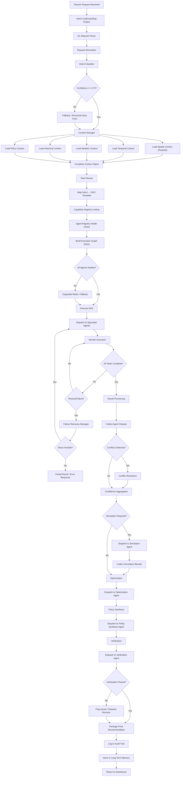

# VOLUME 2: SUPERVISOR AI AGENT & MULTI-AGENT ARCHITECTURE

## Smart Urban Planning & AI Decision Support Platform

**Document ID:** SUPADSP-ARCH-V2-VOL2  
**Version:** 2.0.0  
**Classification:** Government Restricted — Internal Use Only

---

## Table of Contents — Volume 2

1. [Supervisor AI Agent — Overview](#1-supervisor-ai-agent--overview)
2. [Intent Understanding Engine](#2-intent-understanding-engine)
3. [Task Planner & Execution Graph](#3-task-planner--execution-graph)
4. [Memory Architecture](#4-memory-architecture)
5. [Agent Registry & Capability Registry](#5-agent-registry--capability-registry)
6. [Context Manager](#6-context-manager)
7. [Confidence Aggregation & Decision Coordination](#7-confidence-aggregation--decision-coordination)
8. [Supervisor Internal Workflow](#8-supervisor-internal-workflow)
9. [Traffic Intelligence Agent](#9-traffic-intelligence-agent)
10. [Pollution Intelligence Agent](#10-pollution-intelligence-agent)
11. [Energy Intelligence Agent](#11-energy-intelligence-agent)
12. [Weather Intelligence Agent](#12-weather-intelligence-agent)
13. [Simulation Agent](#13-simulation-agent)
14. [Optimization Agent](#14-optimization-agent)
15. [Policy Synthesis Agent](#15-policy-synthesis-agent)
16. [Verification Agent](#16-verification-agent)
17. [Inter-Agent Communication Protocol](#17-inter-agent-communication-protocol)
18. [Explainable AI Framework](#18-explainable-ai-framework)
19. [Agent Design Specifications](#19-agent-design-specifications)

---

## 1. Supervisor AI Agent — Overview

### 1.1 Fundamental Design

The Supervisor AI Agent is the **central nervous system** of the entire platform. It is the single entry point for all planner requests and the sole coordinator of all AI operations.

**What the Supervisor IS:**
- An intelligent workflow coordinator
- A Chief Urban Planning Officer in software form
- The single point of entry into the AI platform
- A deterministic, auditable, and explainable orchestration engine

**What the Supervisor IS NOT:**
- A chatbot
- A prediction engine
- An LLM
- A model that generates free-text responses
- A direct consumer of external AI APIs

### 1.2 Supervisor Responsibilities

| # | Responsibility | Description |
|---|---|---|
| R-01 | **Understand planner request** | Parse natural language or structured input to identify intent, domain, location, time frame |
| R-02 | **Understand user intent** | Classify request into one of 25+ planning categories using locally-trained classifier |
| R-03 | **Identify requested domain(s)** | Determine which domains (traffic, pollution, energy) are relevant |
| R-04 | **Identify contextual information** | Determine what supporting data (weather, calendar, construction, etc.) is needed |
| R-05 | **Determine required agents** | Query Capability Registry to map capabilities to available specialist agents |
| R-06 | **Determine execution order** | Build dependency graph to identify sequential vs. parallel execution |
| R-07 | **Build execution graph (DAG)** | Construct a Directed Acyclic Graph of tasks with dependencies |
| R-08 | **Allocate tasks** | Dispatch tasks to specialist agents with complete context objects |
| R-09 | **Monitor execution** | Track progress, detect failures, manage timeouts |
| R-10 | **Collect intermediate outputs** | Gather results from each agent as they complete |
| R-11 | **Transfer outputs between agents** | Feed outputs from upstream agents as inputs to downstream agents |
| R-12 | **Aggregate results** | Merge outputs from multiple agents into a unified result |
| R-13 | **Resolve conflicts** | Handle contradictory recommendations from different agents |
| R-14 | **Merge confidence scores** | Compute overall confidence from individual agent confidences |
| R-15 | **Trigger simulation** | Invoke Simulation Agent when scenario analysis is required |
| R-16 | **Trigger optimization** | Invoke Optimization Agent for multi-objective optimization |
| R-17 | **Generate recommendation request** | Package results for Policy Synthesis Agent |
| R-18 | **Request policy synthesis** | Invoke Policy Synthesis Agent to produce government-ready recommendation |
| R-19 | **Trigger verification** | Invoke Verification Agent to check compliance and feasibility |
| R-20 | **Return final recommendation** | Deliver verified recommendation package to the dashboard |
| R-21 | **Maintain execution history** | Log all steps for auditability |
| R-22 | **Maintain planner context** | Remember previous requests within a session |
| R-23 | **Maintain recommendation history** | Store all recommendations for trend analysis and precedent |
| R-24 | **Maintain decision traceability** | Full lineage from request to recommendation to approval |

### 1.3 Supervisor Internal Architecture

```
┌──────────────────────────────────────────────────────────────────────────┐
│                         SUPERVISOR AI AGENT                              │
│                                                                          │
│  ╔═══════════════════════════════════════════════════════════════════╗   │
│  ║              INTENT UNDERSTANDING ENGINE                          ║   │
│  ║  ┌──────────────┐ ┌──────────────┐ ┌──────────────────────────┐ ║   │
│  ║  │ NL Request   │ │ Request      │ │ Planning Objective       │ ║   │
│  ║  │ Parser       │ │ Normalizer   │ │ Detector                 │ ║   │
│  ║  │              │ │              │ │                          │ ║   │
│  ║  │ Extracts:    │ │ Standardizes:│ │ Classifies into:         │ ║   │
│  ║  │ • entities   │ │ • locations  │ │ • 25+ intent categories  │ ║   │
│  ║  │ • locations  │ │ • time refs  │ │ using locally-trained    │ ║   │
│  ║  │ • time refs  │ │ • domain     │ │ transformer classifier   │ ║   │
│  ║  │ • constraints│ │   terms      │ │                          │ ║   │
│  ║  └──────────────┘ └──────────────┘ └──────────────────────────┘ ║   │
│  ╚═══════════════════════════════════════════════════════════════════╝   │
│                                  │                                       │
│                                  ▼                                       │
│  ╔═══════════════════════════════════════════════════════════════════╗   │
│  ║                    CONTEXT MANAGER                                ║   │
│  ║  ┌──────────────┐ ┌──────────────┐ ┌──────────────────────────┐ ║   │
│  ║  │ Execution    │ │ Historical   │ │ Spatial Context          │ ║   │
│  ║  │ Context      │ │ Context      │ │ Loader                   │ ║   │
│  ║  │ Builder      │ │ Loader       │ │ (PostGIS queries)        │ ║   │
│  ║  └──────────────┘ └──────────────┘ └──────────────────────────┘ ║   │
│  ║  ┌──────────────┐ ┌──────────────┐ ┌──────────────────────────┐ ║   │
│  ║  │ GIS Context  │ │ Weather      │ │ Policy Context           │ ║   │
│  ║  │ Loader       │ │ Context Ldr  │ │ Loader                   │ ║   │
│  ║  └──────────────┘ └──────────────┘ └──────────────────────────┘ ║   │
│  ╚═══════════════════════════════════════════════════════════════════╝   │
│                                  │                                       │
│                                  ▼                                       │
│  ╔═══════════════════════════════════════════════════════════════════╗   │
│  ║                      TASK PLANNER                                 ║   │
│  ║  ┌──────────────┐ ┌──────────────┐ ┌──────────────────────────┐ ║   │
│  ║  │ Execution    │ │ Dependency   │ │ Execution Graph          │ ║   │
│  ║  │ Planner      │ │ Resolver     │ │ Builder (DAG)            │ ║   │
│  ║  └──────────────┘ └──────────────┘ └──────────────────────────┘ ║   │
│  ║  ┌──────────────┐ ┌──────────────┐                              ║   │
│  ║  │ Agent        │ │ Workflow     │                              ║   │
│  ║  │ Scheduler    │ │ Manager      │                              ║   │
│  ║  └──────────────┘ └──────────────┘                              ║   │
│  ╚═══════════════════════════════════════════════════════════════════╝   │
│                                  │                                       │
│                                  ▼                                       │
│  ╔═══════════════════════════════════════════════════════════════════╗   │
│  ║                 EXECUTION ENGINE                                  ║   │
│  ║  ┌──────────────┐ ┌──────────────┐ ┌──────────────────────────┐ ║   │
│  ║  │ Agent        │ │ Execution    │ │ Failure Recovery         │ ║   │
│  ║  │ Dispatcher   │ │ Monitor      │ │ Manager                  │ ║   │
│  ║  └──────────────┘ └──────────────┘ └──────────────────────────┘ ║   │
│  ║  ┌──────────────┐ ┌──────────────┐                              ║   │
│  ║  │ Retry        │ │ Timeout      │                              ║   │
│  ║  │ Manager      │ │ Manager      │                              ║   │
│  ║  └──────────────┘ └──────────────┘                              ║   │
│  ╚═══════════════════════════════════════════════════════════════════╝   │
│                                  │                                       │
│                                  ▼                                       │
│  ╔═══════════════════════════════════════════════════════════════════╗   │
│  ║              RESULT PROCESSING ENGINE                             ║   │
│  ║  ┌──────────────┐ ┌──────────────┐ ┌──────────────────────────┐ ║   │
│  ║  │ Confidence   │ │ Recommend.   │ │ Conflict                 │ ║   │
│  ║  │ Aggregator   │ │ Aggregator   │ │ Resolver                 │ ║   │
│  ║  └──────────────┘ └──────────────┘ └──────────────────────────┘ ║   │
│  ║  ┌──────────────┐ ┌──────────────┐ ┌──────────────────────────┐ ║   │
│  ║  │ Decision     │ │ Policy       │ │ Verification             │ ║   │
│  ║  │ Coordinator  │ │ Coordinator  │ │ Coordinator              │ ║   │
│  ║  └──────────────┘ └──────────────┘ └──────────────────────────┘ ║   │
│  ╚═══════════════════════════════════════════════════════════════════╝   │
│                                                                          │
│  ╔═══════════════════════════════════════════════════════════════════╗   │
│  ║              REGISTRIES & SUPPORT                                 ║   │
│  ║  ┌──────────────┐ ┌──────────────┐ ┌──────────────────────────┐ ║   │
│  ║  │ Agent        │ │ Capability   │ │ Audit Manager            │ ║   │
│  ║  │ Registry     │ │ Registry     │ │ & Workflow Logger        │ ║   │
│  ║  │ Client       │ │ Client       │ │                          │ ║   │
│  ║  └──────────────┘ └──────────────┘ └──────────────────────────┘ ║   │
│  ╚═══════════════════════════════════════════════════════════════════╝   │
│                                                                          │
│  ╔═══════════════════════════════════════════════════════════════════╗   │
│  ║                    MEMORY MANAGER                                 ║   │
│  ║  ┌──────────────┐ ┌──────────────┐ ┌──────────────┐            ║   │
│  ║  │ Short-Term   │ │ Long-Term    │ │ Knowledge    │            ║   │
│  ║  │ Memory       │ │ Memory       │ │ Memory       │            ║   │
│  ║  └──────────────┘ └──────────────┘ └──────────────┘            ║   │
│  ║  ┌──────────────┐                                               ║   │
│  ║  │ Spatial      │                                               ║   │
│  ║  │ Memory       │                                               ║   │
│  ║  └──────────────┘                                               ║   │
│  ╚═══════════════════════════════════════════════════════════════════╝   │
└──────────────────────────────────────────────────────────────────────────┘
```

### 1.4 Communication Rules

| Rule | Description |
|---|---|
| **R-COMM-01** | Users communicate **ONLY** with the Supervisor (via API Gateway) |
| **R-COMM-02** | The Supervisor communicates with Specialist Agents (via internal REST + event bus) |
| **R-COMM-03** | Specialist Agents communicate with their own Sub-Agents (internal method calls or sub-service REST) |
| **R-COMM-04** | Sub-Agents **never** communicate directly with the Supervisor |
| **R-COMM-05** | Prediction models **never** communicate with users |
| **R-COMM-06** | Specialist Agents **never** communicate with each other directly — all cross-agent data flows through the Supervisor |
| **R-COMM-07** | The Supervisor forwards outputs from one agent as inputs to downstream agents when dependencies exist |
| **R-COMM-08** | Asynchronous alerts/notifications bypass the Supervisor via the event bus (Kafka) to the Notification Service |

---

## 2. Intent Understanding Engine

### 2.1 Purpose

The Intent Understanding Engine transforms free-form planner requests into structured, actionable planning tasks. It is the first processing stage within the Supervisor and determines the entire downstream execution path.

### 2.2 Architecture

```
                   Planner Request (Natural Language or Structured)
                                     │
                                     ▼
                        ┌─────────────────────────┐
                        │   NL Request Parser      │
                        │                          │
                        │  • Named Entity          │
                        │    Recognition (NER)     │
                        │  • Location extraction   │
                        │  • Time expression       │
                        │    parsing               │
                        │  • Constraint            │
                        │    extraction            │
                        │  • Domain keyword        │
                        │    detection             │
                        └────────────┬─────────────┘
                                     │
                                     ▼
                        ┌─────────────────────────┐
                        │   Request Normalizer     │
                        │                          │
                        │  • Resolve location      │
                        │    aliases (HITEC City    │
                        │    → ward IDs)           │
                        │  • Normalize time        │
                        │    references            │
                        │  • Standardize domain    │
                        │    terminology           │
                        │  • Validate constraints  │
                        └────────────┬─────────────┘
                                     │
                                     ▼
                        ┌─────────────────────────┐
                        │  Planning Objective      │
                        │  Detector / Intent       │
                        │  Classifier              │
                        │                          │
                        │  Locally-trained          │
                        │  transformer classifier  │
                        │  (DistilBERT-class)      │
                        │                          │
                        │  Output: Intent class +  │
                        │  confidence score        │
                        └────────────┬─────────────┘
                                     │
                                     ▼
                        ┌─────────────────────────┐
                        │  Structured Intent       │
                        │  Object                  │
                        │                          │
                        │  {                       │
                        │    intent: "MULTI_DOMAIN │
                        │      _OPTIMIZATION",     │
                        │    domains: ["traffic",  │
                        │      "pollution"],       │
                        │    location: {           │
                        │      type: "area",       │
                        │      name: "HITEC City", │
                        │      ward_ids: [...]     │
                        │    },                    │
                        │    time_frame: {...},    │
                        │    constraints: [...],   │
                        │    confidence: 0.94      │
                        │  }                       │
                        └──────────────────────────┘
```

### 2.3 Intent Taxonomy

The Intent Classifier supports the following planning categories, designed for future expansion without redesign:

| Intent ID | Intent Category | Description | Required Agents |
|---|---|---|---|
| INT-001 | TRAFFIC_FORECAST | Predict traffic conditions for a location/time | Weather, Traffic |
| INT-002 | TRAFFIC_OPTIMIZATION | Optimize traffic flow, reduce congestion | Weather, Traffic, Optimization |
| INT-003 | TRAFFIC_SIMULATION | Simulate traffic impact of road closures, events | Weather, Traffic, Simulation |
| INT-004 | POLLUTION_PREDICTION | Predict AQI and pollutant levels | Weather, Pollution |
| INT-005 | POLLUTION_MITIGATION | Plan pollution reduction interventions | Weather, Traffic, Pollution, Optimization |
| INT-006 | POLLUTION_SOURCE_ANALYSIS | Identify and analyze emission sources | Pollution |
| INT-007 | ENERGY_FORECAST | Predict energy demand and consumption | Weather, Energy |
| INT-008 | ENERGY_OPTIMIZATION | Optimize energy usage, reduce consumption | Weather, Energy, Optimization |
| INT-009 | ENERGY_RENEWABLE | Analyze renewable energy potential | Energy |
| INT-010 | TRAFFIC_POLLUTION_OPTIMIZATION | Jointly optimize traffic and pollution | Weather, Traffic, Pollution, Optimization |
| INT-011 | TRAFFIC_ENERGY_OPTIMIZATION | Jointly optimize traffic and energy | Weather, Traffic, Energy, Optimization |
| INT-012 | MULTI_DOMAIN_OPTIMIZATION | Optimize across all three domains | Weather, Traffic, Pollution, Energy, Optimization |
| INT-013 | MULTI_DOMAIN_PLANNING | Comprehensive planning across domains | All agents |
| INT-014 | WEEKLY_PLANNING | Generate weekly operational plan | Weather, Traffic, Pollution, Energy |
| INT-015 | MONTHLY_PLANNING | Generate monthly strategic plan | Weather, Traffic, Pollution, Energy, Optimization |
| INT-016 | SCENARIO_SIMULATION | What-if analysis for a specific scenario | Weather, Simulation, relevant domain agents |
| INT-017 | INFRASTRUCTURE_PLANNING | Plan infrastructure changes/improvements | Traffic, Energy, Simulation, Optimization |
| INT-018 | EMERGENCY_PLANNING | Plan for emergency scenarios (floods, disasters) | Weather, Traffic, Simulation |
| INT-019 | WEATHER_IMPACT_ANALYSIS | Analyze weather impact on domains | Weather, Traffic, Pollution, Energy |
| INT-020 | ROAD_CLOSURE_SIMULATION | Simulate impact of road closures | Weather, Traffic, Pollution, Simulation |
| INT-021 | CONSTRUCTION_IMPACT | Analyze construction project impact | Traffic, Pollution, Simulation |
| INT-022 | BUDGET_OPTIMIZATION | Optimize resource allocation within budget | Optimization |
| INT-023 | POLICY_RECOMMENDATION | Generate policy recommendation | All relevant agents + Policy Synthesis |
| INT-024 | HISTORICAL_ANALYSIS | Analyze historical trends and patterns | Relevant domain agents |
| INT-025 | TREND_ANALYSIS | Identify and project trends | Relevant domain agents |
| INT-026 | DASHBOARD_ANALYTICS | Generate analytical views and dashboards | Analytics services |
| INT-027 | REPORT_GENERATION | Generate structured reports | Reporting services |
| INT-028 | FESTIVAL_IMPACT | Analyze impact of festivals/events | Weather, Traffic, Pollution, Simulation |
| INT-029 | FLOOD_RISK_ANALYSIS | Assess flood risk for areas | Weather, Simulation |
| INT-030 | HEAT_WAVE_ANALYSIS | Assess heat wave impact | Weather, Energy |

### 2.4 Intent Classifier Training

| Aspect | Specification |
|---|---|
| **Model Architecture** | DistilBERT-class fine-tuned transformer (or smaller custom transformer trained on domain-specific corpus) |
| **Training Data** | Labeled dataset of 5,000+ planner request examples mapped to intent categories. Generated from: historical planning queries, government meeting minutes, synthetic examples from planning templates |
| **Training Strategy** | Supervised fine-tuning with chronological train/val/test split. Active learning loop to improve with real usage data |
| **Inference** | Locally served via FastAPI, no external API dependency |
| **Fallback** | If confidence < 0.75, fall back to rule-based keyword matching + structured input form |
| **Accuracy Target** | ≥ 95% F1 on the bounded intent taxonomy |
| **Latency Target** | < 50ms per classification |
| **Retraining** | Monthly, with newly labeled production requests added to training set |

### 2.5 Named Entity Recognition (NER)

| Entity Type | Examples | Extraction Method |
|---|---|---|
| **Location** | "HITEC City", "Ward 12", "Gachibowli", "Outer Ring Road" | SpaCy NER + custom gazetteer of Hyderabad locations |
| **Time** | "tomorrow morning", "next week", "August 15", "peak hours" | Dateutil + custom temporal expression parser |
| **Domain** | "congestion", "AQI", "electricity demand", "pollution" | Keyword matching against domain ontology |
| **Constraint** | "within budget of ₹5 crore", "without closing roads" | Rule-based constraint pattern extraction |
| **Metric** | "minimize", "reduce", "optimize", "forecast" | Verb classification against planning action vocabulary |
| **Infrastructure** | "metro station", "power substation", "junction" | Custom gazetteer of Hyderabad infrastructure |

---

## 3. Task Planner & Execution Graph

### 3.1 Task Planning Process

The Task Planner converts a structured intent into an executable Directed Acyclic Graph (DAG) of tasks.

#### Example 1: Simple Traffic Forecast

**Planner Request:** "Forecast traffic on IT Corridor for tomorrow morning"

**Generated Execution Graph:**
```
[Load Weather Context] ──► [Traffic Forecast] ──► [Recommendation Package]
```

**Tasks:**
| Step | Task | Agent | Dependencies | Can Parallelize |
|---|---|---|---|---|
| 1 | Load weather forecast for IT Corridor, tomorrow AM | Weather Agent | None | - |
| 2 | Forecast traffic with weather context | Traffic Agent | Step 1 | No |
| 3 | Package results for dashboard | Supervisor | Step 2 | No |

#### Example 2: Multi-Domain Optimization

**Planner Request:** "Reduce congestion around HITEC City tomorrow morning while minimizing AQI"

**Generated Execution Graph:**
```
                    [Weather Context]
                          │
                    ┌─────┴─────┐
                    ▼           ▼
            [Traffic        [Pollution
             Forecast]       Forecast]
                    │           │
                    └─────┬─────┘
                          ▼
                   [Optimization]
                          │
                          ▼
                 [Policy Synthesis]
                          │
                          ▼
                   [Verification]
                          │
                          ▼
                [Recommendation Package]
```

**Tasks:**
| Step | Task | Agent | Dependencies | Can Parallelize |
|---|---|---|---|---|
| 1 | Load weather context | Weather Agent | None | - |
| 2a | Forecast traffic for HITEC City area | Traffic Agent | Step 1 | Yes (with 2b) |
| 2b | Forecast pollution for HITEC City area | Pollution Agent | Step 1 | Yes (with 2a) |
| 3 | Multi-objective optimization (minimize congestion + minimize AQI) | Optimization Agent | Steps 2a, 2b | No |
| 4 | Generate policy recommendation | Policy Synthesis Agent | Step 3 | No |
| 5 | Verify against government rules | Verification Agent | Step 4 | No |
| 6 | Package final recommendation | Supervisor | Step 5 | No |

#### Example 3: Energy Forecast (Traffic Agent Should NOT Execute)

**Planner Request:** "Forecast electricity demand for Kukatpally next week"

**Generated Execution Graph:**
```
[Weather Context] ──► [Energy Forecast] ──► [Recommendation Package]
```

**Tasks:**
| Step | Task | Agent | Dependencies | Can Parallelize |
|---|---|---|---|---|
| 1 | Load weather forecast for Kukatpally, next week | Weather Agent | None | - |
| 2 | Forecast energy demand with weather context | Energy Agent | Step 1 | No |
| 3 | Package results for dashboard | Supervisor | Step 2 | No |

Traffic Agent is **never invoked** because the Capability Registry does not map "energy forecast" to any traffic capability.

#### Example 4: Complex Scenario Simulation

**Planner Request:** "Simulate the impact of closing Cyber Towers junction for 3 months due to metro construction on traffic, pollution, and energy"

**Generated Execution Graph:**
```
                         [Weather Context]
                               │
                    ┌──────────┼──────────┐
                    ▼          ▼          ▼
              [Traffic     [Pollution  [Energy
              Simulation]  Impact]     Impact]
                    │          │          │
                    └──────────┼──────────┘
                               ▼
                      [Scenario Comparison]
                               │
                               ▼
                       [Optimization]
                               │
                               ▼
                     [Policy Synthesis]
                               │
                               ▼
                       [Verification]
                               │
                               ▼
                  [Recommendation Package]
```

### 3.2 Execution Graph Builder — DAG Construction Rules

| Rule | Description |
|---|---|
| **DG-01** | Weather context is always the first node (all domain predictions depend on weather) |
| **DG-02** | Domain agents that do not depend on each other's output execute in parallel |
| **DG-03** | If Traffic output feeds Pollution (e.g., traffic volume → emission estimation), Traffic must complete before Pollution |
| **DG-04** | Optimization always comes after all domain predictions are complete |
| **DG-05** | Policy Synthesis always comes after Optimization |
| **DG-06** | Verification always comes after Policy Synthesis |
| **DG-07** | Simulation, when required, replaces or augments the standard prediction path |
| **DG-08** | If a cached result exists for the same query within the cache TTL, reuse it instead of re-executing |
| **DG-09** | If an agent is unhealthy (per Agent Registry), the Supervisor marks the task as degraded and attempts fallback |
| **DG-10** | The DAG is constructed deterministically from the intent classification — same intent + same parameters = same DAG |

### 3.3 Dynamic Agent Scheduling

| Decision | How Determined |
|---|---|
| **Which agents** | Capability Registry maps required capabilities to available agents |
| **When** | Dependency graph determines execution order |
| **Why** | Intent classification determines why each agent is invoked |
| **In what order** | Topological sort of the DAG |
| **With what inputs** | Context Manager builds complete input objects; upstream outputs feed downstream inputs |
| **For how long** | Each agent has a configured timeout (Agent Registry stores average response time) |
| **Parallel execution** | Independent nodes in the DAG execute concurrently (asyncio.gather or task queue) |
| **Cached results reuse** | Redis cache checked before agent dispatch; cache key = agent + input hash |
| **Previous recommendations** | Long-term memory queried for similar past requests within configurable recency window |

### 3.4 Task Planner — Intent-to-DAG Template Mapping

For each intent category, a deterministic DAG template exists:

```python
# Simplified pseudocode of DAG template registry
DAG_TEMPLATES = {
    "TRAFFIC_FORECAST": [
        Task("weather_context", agent="weather", depends_on=[]),
        Task("traffic_forecast", agent="traffic", depends_on=["weather_context"]),
        Task("package_results", agent="supervisor", depends_on=["traffic_forecast"]),
    ],
    "MULTI_DOMAIN_OPTIMIZATION": [
        Task("weather_context", agent="weather", depends_on=[]),
        Task("traffic_forecast", agent="traffic", depends_on=["weather_context"]),
        Task("pollution_forecast", agent="pollution", depends_on=["weather_context"]),
        Task("optimization", agent="optimization", depends_on=["traffic_forecast", "pollution_forecast"]),
        Task("policy_synthesis", agent="policy", depends_on=["optimization"]),
        Task("verification", agent="verification", depends_on=["policy_synthesis"]),
        Task("package_results", agent="supervisor", depends_on=["verification"]),
    ],
    # ... 25+ templates
}
```

---

## 4. Memory Architecture

### 4.1 Four-Tier Memory Design

```
┌─────────────────────────────────────────────────────────────────┐
│                    SUPERVISOR MEMORY ARCHITECTURE                │
│                                                                  │
│  ┌────────────────────────────────────────────────────────────┐ │
│  │ TIER 1: SHORT-TERM MEMORY (In-Process / Redis)             │ │
│  │                                                             │ │
│  │  Current Request Context     │ Current Execution State     │ │
│  │  Current Agent Outputs       │ Intermediate Results        │ │
│  │  Temporary Variables         │ Conversation State          │ │
│  │  Session Context             │ DAG Execution Progress      │ │
│  │                                                             │ │
│  │  Storage: In-process dict + Redis (TTL: session duration)  │ │
│  │  Access: < 1ms                                             │ │
│  └────────────────────────────────────────────────────────────┘ │
│                                                                  │
│  ┌────────────────────────────────────────────────────────────┐ │
│  │ TIER 2: LONG-TERM MEMORY (PostgreSQL)                      │ │
│  │                                                             │ │
│  │  Historical Recommendations  │ Historical Predictions      │ │
│  │  Historical Policies         │ Approved Plans              │ │
│  │  Rejected Plans              │ Government Decisions        │ │
│  │  Previous Simulations        │ Historical Optimization     │ │
│  │  Infrastructure Changes      │ Historical Traffic Data     │ │
│  │  Historical Pollution Data   │ Historical Energy Data      │ │
│  │  Approval History            │ Decision Audit Trail        │ │
│  │                                                             │ │
│  │  Storage: PostgreSQL (indexed, partitioned by date)        │ │
│  │  Access: < 50ms                                            │ │
│  └────────────────────────────────────────────────────────────┘ │
│                                                                  │
│  ┌────────────────────────────────────────────────────────────┐ │
│  │ TIER 3: KNOWLEDGE MEMORY (Elasticsearch)                   │ │
│  │                                                             │ │
│  │  Government Regulations      │ Environmental Policies      │ │
│  │  Planning Standards          │ Department Rules            │ │
│  │  Urban Planning Guidelines   │ Road Standards              │ │
│  │  Energy Policies             │ Pollution Standards         │ │
│  │  Historical Policy Documents │ Government Circulars        │ │
│  │  Master Plans (HMDA/GHMC)    │ Planning Manuals            │ │
│  │                                                             │ │
│  │  Storage: Elasticsearch (full-text indexed, BM25 search)  │ │
│  │  Access: < 100ms                                           │ │
│  └────────────────────────────────────────────────────────────┘ │
│                                                                  │
│  ┌────────────────────────────────────────────────────────────┐ │
│  │ TIER 4: SPATIAL MEMORY (PostGIS)                           │ │
│  │                                                             │ │
│  │  GIS Context (ward geometry)  │ Road Networks              │ │
│  │  Administrative Boundaries    │ Critical Infrastructure    │ │
│  │  Spatial Relationships        │ Building Footprints        │ │
│  │  Metro Routes                 │ Bus Routes                 │ │
│  │  Industrial Zones             │ Lake/River Boundaries      │ │
│  │  Hospital Locations           │ School Locations           │ │
│  │  Power Substations            │ Police/Fire Stations       │ │
│  │                                                             │ │
│  │  Storage: PostGIS (spatial indexed, R-tree)                │ │
│  │  Access: < 50ms for spatial queries                        │ │
│  └────────────────────────────────────────────────────────────┘ │
└─────────────────────────────────────────────────────────────────┘
```

### 4.2 Memory Access Patterns

| Memory Tier | When Accessed | What Is Retrieved | Access Pattern |
|---|---|---|---|
| Short-Term | Every request | Current session state, in-progress results | Read/write per request |
| Long-Term | Context loading phase | Similar past recommendations, historical trends | Read during planning, write after completion |
| Knowledge | Verification and policy synthesis | Applicable regulations, standards, precedents | Read-only during processing |
| Spatial | Context loading phase | Geographical context for the requested location | Read-only during planning |

---

## 5. Agent Registry & Capability Registry

### 5.1 Agent Registry

The Agent Registry is a centralized service that maintains the state of all specialist agents in the platform.

#### Agent Registry Schema

| Field | Type | Description |
|---|---|---|
| agent_id | UUID | Unique identifier |
| agent_name | String | Human-readable name (e.g., "Traffic Intelligence Agent") |
| agent_type | Enum | SPECIALIST, CONTEXTUAL, OPTIMIZATION, POLICY, VERIFICATION, SIMULATION |
| version | SemVer | Current version (e.g., "2.1.0") |
| capabilities | List[String] | List of capability IDs this agent provides |
| health_status | Enum | HEALTHY, DEGRADED, UNHEALTHY, MAINTENANCE |
| availability | Enum | AVAILABLE, BUSY, OFFLINE |
| priority | Integer | Scheduling priority (1=highest) |
| dependencies | List[UUID] | Agent IDs this agent depends on |
| supported_models | List[String] | ML models this agent uses |
| execution_cost | Float | Relative computational cost (1.0 = baseline) |
| avg_response_time_ms | Integer | Average response time in milliseconds |
| last_health_check | Timestamp | Last successful health check |
| deployment_status | Enum | DEPLOYED, DEPLOYING, STOPPED |
| endpoint_url | String | Internal service URL |
| supported_workflows | List[String] | Workflow types this agent participates in |
| max_concurrent_requests | Integer | Concurrency limit |
| current_load | Integer | Current active request count |

#### Agent Registry Operations

| Operation | Description |
|---|---|
| `register(agent)` | Register a new agent or update an existing agent's metadata |
| `deregister(agent_id)` | Remove an agent from the registry |
| `discover(capability)` | Find all agents that provide a given capability |
| `health_check(agent_id)` | Check agent health via `/health` endpoint |
| `get_status(agent_id)` | Retrieve current status and metadata |
| `list_all()` | List all registered agents with their statuses |
| `update_load(agent_id, load)` | Update current load counter |

### 5.2 Capability Registry

The Capability Registry maps abstract capabilities to concrete agents. The Supervisor requests capabilities, NOT agents.

#### Capability Registry Schema

| Field | Type | Description |
|---|---|---|
| capability_id | String | Unique identifier (e.g., "traffic_forecast") |
| capability_name | String | Human-readable name |
| capability_category | Enum | PREDICTION, OPTIMIZATION, SIMULATION, RECOMMENDATION, VERIFICATION, CONTEXTUAL |
| description | String | What this capability does |
| providing_agents | List[UUID] | Agent IDs that can provide this capability |
| primary_agent | UUID | Preferred agent for this capability |
| fallback_agents | List[UUID] | Fallback agents if primary is unavailable |
| input_schema | JSON Schema | Expected input format |
| output_schema | JSON Schema | Expected output format |
| avg_latency_ms | Integer | Expected response time |
| requires_context | List[String] | Context types required (e.g., "weather", "spatial") |

#### Capability Examples

| Capability ID | Capability Name | Providing Agent | Category |
|---|---|---|---|
| traffic_forecast | Traffic Flow Forecast | Traffic Agent | PREDICTION |
| congestion_prediction | Congestion Level Prediction | Traffic Agent | PREDICTION |
| accident_detection | Accident Detection | Traffic Agent (CV sub-agent) | PREDICTION |
| signal_optimization | Traffic Signal Optimization | Traffic Agent | OPTIMIZATION |
| aqi_forecast | AQI Forecast | Pollution Agent | PREDICTION |
| pm25_prediction | PM2.5 Level Prediction | Pollution Agent | PREDICTION |
| pollution_hotspot | Pollution Hotspot Detection | Pollution Agent | PREDICTION |
| dispersion_modeling | Pollution Dispersion Modeling | Pollution Agent | PREDICTION |
| energy_demand_forecast | Energy Demand Forecast | Energy Agent | PREDICTION |
| peak_load_prediction | Peak Load Prediction | Energy Agent | PREDICTION |
| weather_forecast | Weather Forecast | Weather Agent | CONTEXTUAL |
| flood_risk | Flood Risk Assessment | Weather Agent | CONTEXTUAL |
| scenario_simulation | Scenario Simulation | Simulation Agent | SIMULATION |
| road_closure_sim | Road Closure Simulation | Simulation Agent | SIMULATION |
| multi_objective_opt | Multi-Objective Optimization | Optimization Agent | OPTIMIZATION |
| budget_optimization | Budget Optimization | Optimization Agent | OPTIMIZATION |
| policy_synthesis | Policy Recommendation Generation | Policy Synthesis Agent | RECOMMENDATION |
| govt_rule_validation | Government Rule Validation | Verification Agent | VERIFICATION |
| compliance_check | Regulatory Compliance Check | Verification Agent | VERIFICATION |

### 5.3 How the Supervisor Uses Registries

```
Planner Request: "Reduce congestion while minimizing pollution"
                          │
                          ▼
              Intent: TRAFFIC_POLLUTION_OPTIMIZATION
                          │
                          ▼
         Required Capabilities:
         [weather_forecast, traffic_forecast, aqi_forecast,
          multi_objective_opt, policy_synthesis, govt_rule_validation]
                          │
                          ▼
         Capability Registry Lookup:
         weather_forecast     → Weather Agent
         traffic_forecast     → Traffic Agent
         aqi_forecast         → Pollution Agent
         multi_objective_opt  → Optimization Agent
         policy_synthesis     → Policy Synthesis Agent
         govt_rule_validation → Verification Agent
                          │
                          ▼
         Agent Registry Health Check:
         Weather Agent     → HEALTHY ✓
         Traffic Agent     → HEALTHY ✓
         Pollution Agent   → HEALTHY ✓
         Optimization Agent → HEALTHY ✓
         Policy Synthesis  → HEALTHY ✓
         Verification      → HEALTHY ✓
                          │
                          ▼
         Build DAG & Execute
```

---

## 6. Context Manager

### 6.1 Purpose

Before any specialist agent executes, the Supervisor's Context Manager builds a complete execution context object containing all relevant information for the task.

### 6.2 Context Object Schema

```json
{
  "request_id": "uuid-v4",
  "session_id": "uuid-v4",
  "user_id": "uuid-v4",
  "user_role": "URBAN_PLANNER",
  "user_department": "GHMC",
  "timestamp": "2026-08-06T09:00:00+05:30",
  
  "spatial_context": {
    "location_type": "area",
    "location_name": "HITEC City",
    "ward_ids": ["W-064", "W-065"],
    "hmda_zone": "Zone-5",
    "latitude": 17.4435,
    "longitude": 78.3772,
    "geometry": "POLYGON((...))  -- WKT",
    "road_segments": ["SEG-001", "SEG-002", "..."],
    "administrative_boundary": "GHMC",
    "nearby_infrastructure": {
      "metro_stations": ["HITEC City", "Raidurg"],
      "hospitals": ["Continental Hospital", "KIMS"],
      "police_stations": ["Madhapur PS"],
      "schools": ["Oakridge", "Manthan"],
      "power_substations": ["HITEC-SS-01"]
    }
  },
  
  "temporal_context": {
    "target_time": "2026-08-07T08:00:00+05:30",
    "time_range": {"start": "2026-08-07T07:00:00", "end": "2026-08-07T11:00:00"},
    "day_type": "WEEKDAY",
    "is_holiday": false,
    "is_festival": false,
    "active_events": [],
    "active_construction": [
      {"id": "CONST-042", "location": "Cyber Towers Junction", "type": "metro_construction"}
    ]
  },
  
  "weather_context": {
    "forecast": {
      "temperature_c": 32,
      "humidity_pct": 72,
      "rainfall_mm": 0,
      "wind_speed_kmh": 12,
      "storm_probability": 0.05,
      "flood_risk": "LOW"
    }
  },
  
  "historical_context": {
    "similar_past_requests": ["REQ-2024-001", "REQ-2024-045"],
    "previous_recommendations": [
      {"id": "REC-2024-032", "status": "APPROVED", "outcome": "EFFECTIVE"}
    ],
    "historical_traffic_baseline": {"avg_speed_kmh": 22, "avg_congestion_index": 0.72},
    "historical_aqi_baseline": {"avg_aqi": 125, "avg_pm25": 55},
    "historical_energy_baseline": {"avg_demand_mw": 45}
  },
  
  "policy_context": {
    "active_policies": ["POL-2024-012"],
    "recent_approvals": [],
    "applicable_regulations": ["TSPCB-AQ-2024", "GHMC-TRAFFIC-2024"],
    "budget_constraints": {"available_budget_inr": 50000000},
    "department_preferences": {"priority": "traffic_over_energy"}
  },
  
  "current_conditions": {
    "traffic_alerts": [],
    "pollution_alerts": [{"type": "AQI_WARNING", "aqi": 180, "location": "Madhapur"}],
    "energy_alerts": [],
    "weather_alerts": []
  }
}
```

### 6.3 Context Loading Pipeline

| Step | Context Type | Source | Latency |
|---|---|---|---|
| 1 | Spatial Context | PostGIS (ward geometry, road network, infrastructure) | < 50ms |
| 2 | Temporal Context | PostgreSQL (calendar, events, construction schedules) | < 20ms |
| 3 | Weather Context | Weather Agent (forecast) or Redis (cached forecast) | < 100ms |
| 4 | Historical Context | PostgreSQL (past recommendations, baselines) + TimescaleDB (historical data) | < 100ms |
| 5 | Policy Context | PostgreSQL (policies, budgets) + Elasticsearch (regulations) | < 100ms |
| 6 | Current Conditions | Redis (cached latest alerts and conditions) | < 10ms |
| **Total** | **Complete Context** | **All sources** | **< 400ms** |

---

## 7. Confidence Aggregation & Decision Coordination

### 7.1 Confidence Scoring Framework

Every specialist agent returns a confidence score with its output. The Supervisor aggregates these into an overall recommendation confidence.

#### Per-Agent Confidence

| Agent | Confidence Source | Range | Method |
|---|---|---|---|
| Traffic Agent | Model prediction uncertainty | 0.0 - 1.0 | Quantile regression / conformal prediction intervals |
| Pollution Agent | Model prediction uncertainty | 0.0 - 1.0 | Calibrated prediction intervals from TFT quantile outputs |
| Energy Agent | Model prediction uncertainty | 0.0 - 1.0 | XGBoost quantile regression + historical error analysis |
| Weather Agent | Forecast confidence | 0.0 - 1.0 | LSTM/TFT uncertainty estimation |
| Optimization Agent | Solution quality | 0.0 - 1.0 | Pareto front hypervolume / constraint satisfaction ratio |
| Verification Agent | Compliance score | 0.0 - 1.0 | Rule pass rate (passed rules / total applicable rules) |

#### Aggregated Confidence Calculation

```python
def aggregate_confidence(agent_confidences: Dict[str, float], 
                         agent_weights: Dict[str, float]) -> float:
    """
    Weighted harmonic mean of individual agent confidences.
    Harmonic mean penalizes low-confidence outliers more than arithmetic mean.
    """
    weighted_sum = sum(w / c for c, w in zip(
        [agent_confidences[a] for a in agent_weights],
        [agent_weights[a] for a in agent_weights]
    ))
    total_weight = sum(agent_weights.values())
    return total_weight / weighted_sum

# Default weights (configurable per intent)
WEIGHTS = {
    "traffic": 0.30,
    "pollution": 0.25,
    "energy": 0.20,
    "weather": 0.10,
    "optimization": 0.10,
    "verification": 0.05,
}
```

### 7.2 Conflict Resolution

When agents produce contradictory outputs (e.g., Traffic Agent recommends opening a road, Pollution Agent recommends keeping it closed):

| Strategy | When Applied |
|---|---|
| **Pareto Dominance** | If one option dominates another in all objectives, choose the dominant |
| **Weighted Priority** | Apply department-priority weights from context (configurable) |
| **Optimization** | Feed conflicting options into Optimization Agent for formal trade-off analysis |
| **Escalation** | If no automated resolution is possible, flag for human review with both options |

### 7.3 Decision Coordination

```
Agent Outputs Collected
         │
         ▼
┌─────────────────┐    
│ Conflict         │───No───► Confidence Aggregation ──► Policy Synthesis
│ Detected?        │
└───────┬──────────┘
        │Yes
        ▼
┌─────────────────┐
│ Pareto           │───Resolved───► Confidence Aggregation ──► Policy Synthesis
│ Dominance?       │
└───────┬──────────┘
        │No
        ▼
┌─────────────────┐
│ Optimization     │───Resolved───► Confidence Aggregation ──► Policy Synthesis
│ Agent            │
└───────┬──────────┘
        │Unresolved
        ▼
┌─────────────────┐
│ Escalate to      │
│ Human Review     │
└──────────────────┘
```

---

## 8. Supervisor Internal Workflow

### 8.1 Complete Supervisor Workflow



### 8.2 Supervisor Decision Points

| Decision Point | How Supervisor Decides |
|---|---|
| What is the planner asking? | Intent Understanding Engine classifies the request |
| Which departments are involved? | Intent→domain mapping in the intent taxonomy |
| Which AI models are required? | Capability Registry resolves capabilities to agents to models |
| Which datasets are required? | Each agent knows its own data requirements; context manager loads common data |
| Which contextual intelligence is required? | Intent taxonomy specifies required context types per intent |
| Which agents can execute in parallel? | DAG structure — independent nodes execute concurrently |
| Which outputs are dependent? | DAG edges define dependencies |
| Should simulation be executed? | Intent type includes simulation flag; or if uncertainty is high |
| Should optimization be executed? | Intent type includes optimization flag; or if multiple intervention options exist |
| How should results be merged? | Confidence aggregation algorithm + conflict resolution strategy |
| What confidence should be assigned? | Weighted harmonic mean of agent confidences |
| Should recommendations be rejected? | Verification Agent + confidence threshold check |

---

## 9. Traffic Intelligence Agent

### 9.1 Agent Overview

| Attribute | Value |
|---|---|
| **Agent ID** | AGT-TRAFFIC-001 |
| **Purpose** | Comprehensive traffic intelligence for Hyderabad road network |
| **Type** | Specialist Agent |
| **Sub-Agents** | 11 |
| **Primary Models** | DCRNN (GNN), GAT+GRU, LSTM, XGBoost, YOLOv8 |
| **Data Sources** | Road graph (OSM), traffic sensors/SUMO simulation, weather, calendar |
| **Scaling Strategy** | Horizontal scaling of inference services; model replicas behind load balancer |

### 9.2 Sub-Agent Architecture

```
TRAFFIC INTELLIGENCE AGENT
│
├── Traffic Forecast Sub-Agent
│   ├── Model: DCRNN (Diffusion Convolutional Recurrent Neural Network)
│   ├── Alternative: GAT+GRU (Graph Attention + Gated Recurrent Unit)
│   ├── Fallback: Per-segment LSTM
│   ├── Input: Road graph adjacency, historical speeds, weather, calendar features
│   ├── Output: Speed/volume per road segment for next T time steps
│   ├── Training: Offline, chronological split, METR-LA/PeMS-BAY benchmark + SUMO Hyderabad
│   ├── Accuracy: MAPE 8-12% (METR-LA benchmark-aligned)
│   └── Explainability: Top-K contributing road segments, temporal attention weights
│
├── Congestion Prediction Sub-Agent
│   ├── Model: XGBoost classifier on forecast outputs
│   ├── Input: Traffic forecast outputs + road capacity data
│   ├── Output: Congestion level per segment (Free Flow / Moderate / Heavy / Severe)
│   ├── Accuracy: Classification accuracy > 85%
│   └── Explainability: Feature importance (SHAP values)
│
├── Accident Detection Sub-Agent
│   ├── Model: YOLOv8 (camera) + sudden-speed-drop detector (time-series)
│   ├── Input: Camera frames (future) + traffic speed time series
│   ├── Output: Accident probability, location, severity estimate
│   ├── Training: Transfer learning on traffic accident datasets + fine-tune
│   └── Explainability: Bounding box visualization, speed anomaly plot
│
├── Traffic Density Sub-Agent
│   ├── Model: Volume estimation from speed-flow relationship + GNN output
│   ├── Input: Speed forecasts + road capacity
│   ├── Output: Density (vehicles/km) per segment
│   └── Explainability: Density heatmap on GIS layer
│
├── Road Blockage Sub-Agent
│   ├── Model: Rule-based + anomaly detection on speed patterns
│   ├── Input: Real-time speed data, construction schedule, event calendar
│   ├── Output: Blocked/partially-blocked road segments
│   └── Explainability: Blockage reason (construction, accident, event)
│
├── Signal Optimization Sub-Agent
│   ├── Model: Reinforcement Learning (PPO/DQN) or Webster's formula + optimization
│   ├── Input: Traffic density at intersection approaches, pedestrian demand
│   ├── Output: Optimized signal timing plans per intersection
│   ├── Training: SUMO simulation environment for RL training
│   └── Explainability: Before/after delay comparison, signal timing table
│
├── Emergency Routing Sub-Agent
│   ├── Model: Constrained shortest path (A*/Dijkstra) on predicted travel-time graph
│   ├── Input: Origin/destination, live congestion state, road graph
│   ├── Output: Recommended corridor + ETA + signal pre-emption plan
│   └── Explainability: Route overlay on GIS, time comparison vs. alternatives
│
├── Parking Prediction Sub-Agent
│   ├── Model: GBM/LSTM per parking zone cluster
│   ├── Input: Historical occupancy, event calendar, nearby traffic volume
│   ├── Output: Predicted occupancy % per parking zone, confidence
│   └── Explainability: Occupancy trend chart, contributing factors
│
├── Travel Time Prediction Sub-Agent
│   ├── Model: Derived from traffic forecast (aggregate segment times along route)
│   ├── Input: Origin, destination, departure time, traffic forecast
│   ├── Output: Estimated travel time + confidence interval
│   └── Explainability: Segment-by-segment breakdown, bottleneck identification
│
├── Traffic Simulation Sub-Agent
│   ├── Model: SUMO microsimulation (or scenario-perturbed forecast model)
│   ├── Input: Scenario parameters (road closure, event, construction)
│   ├── Output: Simulated traffic state under scenario
│   └── Explainability: Before/after comparison maps, delay metrics
│
└── Traffic Explainability Engine
    ├── Generates SHAP values for XGBoost predictions
    ├── Generates attention weight visualizations for GNN predictions
    ├── Produces templated reasoning summaries (NOT LLM-generated)
    └── Creates comparison tables for alternative interventions
```

### 9.3 Traffic Agent Inputs & Outputs

| Input | Source | Format |
|---|---|---|
| Road network graph | PostGIS (OSM import) | NetworkX graph with adjacency matrix |
| Historical traffic speeds | TimescaleDB | Time series per road segment |
| Weather forecast | Weather Agent output / Redis cache | JSON (temperature, rainfall, wind) |
| Calendar features | PostgreSQL | Day of week, hour, holiday/festival flags |
| Construction schedule | PostgreSQL | Active construction zones with geometry |
| Event calendar | PostgreSQL | Active events with location and expected impact |
| Camera frames (future) | Kafka stream from cameras | Image frames for CV processing |

| Output | Format | Consumer |
|---|---|---|
| Traffic forecast (speed/volume per segment) | JSON array with time series | Supervisor, GIS Dashboard |
| Congestion map | GeoJSON with congestion levels | GIS Dashboard, Pollution Agent |
| Accident alerts | JSON event | Kafka → Notification Service |
| Signal optimization plan | JSON timing table | Supervisor, Policy Synthesis |
| Recommended routes | GeoJSON polylines with ETA | GIS Dashboard |
| Traffic heatmap | Raster tile (precomputed to Redis/MinIO) | GIS Dashboard |
| Confidence scores | Float per prediction | Supervisor |
| Explainability metadata | JSON with SHAP values, feature importance | Dashboard, Policy Synthesis |

### 9.4 Traffic Agent Failure Handling

| Failure Mode | Detection | Recovery |
|---|---|---|
| Primary model (DCRNN) unavailable | Health check failure | Fallback to per-segment LSTM |
| All models unavailable | Agent health = UNHEALTHY | Return cached last prediction + degradation warning |
| Data source unavailable | Timeout on data fetch | Use last available data + flag staleness |
| Prediction confidence too low | Confidence < threshold | Return prediction with explicit low-confidence warning |
| Timeout | Execution exceeds configured timeout | Return partial results for completed segments |

---

## 10. Pollution Intelligence Agent

### 10.1 Agent Overview

| Attribute | Value |
|---|---|
| **Agent ID** | AGT-POLLUTION-001 |
| **Purpose** | Air quality intelligence, pollution prediction, hotspot detection, mitigation planning |
| **Type** | Specialist Agent |
| **Sub-Agents** | 7 |
| **Primary Models** | TFT (Temporal Fusion Transformer), LSTM, Gaussian Plume, XGBoost, Isolation Forest |
| **Data Sources** | CPCB AQI stations, weather data, traffic volume, industrial registry, land use |

### 10.2 Sub-Agent Architecture

```
POLLUTION INTELLIGENCE AGENT
│
├── AQI Prediction Sub-Agent
│   ├── Model: Temporal Fusion Transformer (TFT) — primary
│   ├── Alternative: LSTM with attention
│   ├── Fallback: XGBoost/LightGBM
│   ├── Input: Historical AQI, weather, traffic volume, calendar, industrial activity
│   ├── Output: AQI forecast per station for next T hours (with quantile predictions)
│   ├── Training: CPCB historical data, chronological split
│   ├── Accuracy: RMSE within CPCB station-class tolerance
│   └── Explainability: TFT attention weights, variable importance ranking
│
├── Pollutant Prediction Sub-Agent
│   ├── Predictions: PM2.5, PM10, NO₂, SO₂, CO, O₃ (individual pollutants)
│   ├── Model: Per-pollutant TFT/LSTM or shared multi-output model
│   ├── Input: Historical pollutant readings, weather, source proximity
│   ├── Output: Per-pollutant concentration forecast with confidence
│   └── Explainability: Per-pollutant feature importance
│
├── Pollution Hotspot Detection Sub-Agent
│   ├── Model: Spatial clustering (DBSCAN) on predicted pollution surface + threshold detection
│   ├── Input: Pollution predictions across all stations + interpolated surface
│   ├── Output: Hotspot polygons with severity classification
│   └── Explainability: Hotspot boundary on GIS, contributing sources
│
├── Emission Source Attribution Sub-Agent
│   ├── Model: Wind-direction back-tracking + source registry correlation
│   ├── Input: Wind data, pollution readings, industrial facility registry
│   ├── Output: Probable emission sources with contribution estimates
│   └── Explainability: Source contribution pie chart, wind rose visualization
│
├── Dispersion Modeling Sub-Agent
│   ├── Model: Gaussian Plume (enhanced with street-canyon correction factors)
│   ├── Physics-based: Not ML-trained — parameterized physical model
│   ├── Input: Emission source locations/rates, wind vector, atmospheric stability
│   ├── Output: 2D pollution concentration surface (raster)
│   ├── Enhancement: Street-canyon correction using building height data from PostGIS
│   └── Caching: Precomputed surfaces cached in Redis/MinIO, refreshed on schedule
│
├── Industrial Emission Analysis Sub-Agent
│   ├── Model: Per-facility trend model (time-series regression + change-point detection)
│   ├── Input: CPCB industrial monitoring data, facility registry
│   ├── Output: Facility risk score, trend analysis, compliance status
│   └── Explainability: Trend sparkline, threshold exceedance timeline
│
└── Pollution Explainability Engine
    ├── Generates TFT attention weight visualizations
    ├── Produces variable importance rankings per prediction
    ├── Creates templated reasoning summaries
    └── Generates before/after impact estimates for interventions
```

### 10.3 Cross-Domain Coupling

| Coupling | Direction | Description |
|---|---|---|
| Traffic → Pollution | Traffic volume feeds as input feature | Higher traffic volume = higher vehicular emissions = higher predicted AQI |
| Energy → Pollution | Backup generator usage feeds as source term | Energy peak demand → backup generators → emission spike |
| Weather → Pollution | Weather forecast feeds as input feature | Wind speed/direction affects pollutant dispersion; temperature affects chemical reactions |

---

## 11. Energy Intelligence Agent

### 11.1 Agent Overview

| Attribute | Value |
|---|---|
| **Agent ID** | AGT-ENERGY-001 |
| **Purpose** | Energy demand forecasting, consumption analysis, optimization, and renewable planning |
| **Type** | Specialist Agent |
| **Sub-Agents** | 6 |
| **Primary Models** | XGBoost, LightGBM, LSTM, Linear/MILP optimizer |
| **Data Sources** | TGNPDCL/TGSPDCL consumption data, weather, building metadata, smart meter data |

### 11.2 Sub-Agent Architecture

```
ENERGY INTELLIGENCE AGENT
│
├── Load Forecast Sub-Agent
│   ├── Model: XGBoost (primary), LSTM (alternative)
│   ├── Input: Historical load, weather forecast, calendar, building metadata
│   ├── Output: Load forecast per zone/substation for next T hours
│   ├── Accuracy: MAPE 5-10% (ASHRAE-class)
│   └── Explainability: SHAP values, feature importance
│
├── Peak Demand Prediction Sub-Agent
│   ├── Model: XGBoost classifier + peak magnitude regression
│   ├── Input: Load forecast, weather extremes, event calendar
│   ├── Output: Peak demand time, magnitude, probability
│   └── Explainability: Contributing factors (temperature, events)
│
├── Building Consumption Analysis Sub-Agent
│   ├── Model: Per-building baseline model (regression on weather + occupancy)
│   ├── Input: Building energy consumption history, weather, occupancy data
│   ├── Output: Building efficiency score, anomaly flags, savings potential
│   └── Explainability: Consumption vs. baseline comparison chart
│
├── Street Light Optimization Sub-Agent
│   ├── Model: Isolation forest for fault detection + rule-based/RL dimming policy
│   ├── Input: Per-pole consumption logs, ambient light, traffic density
│   ├── Output: Fault list, optimized dimming schedule
│   └── Explainability: Fault markers on GIS, energy savings estimate
│
├── Renewable Analysis Sub-Agent
│   ├── Model: Physical irradiance model + regression correction for solar
│   ├── Input: Building footprints (PostGIS), solar irradiance data, weather
│   ├── Output: Rooftop solar potential per building, generation estimate
│   └── Explainability: Solar potential heatmap, building-level estimates
│
└── Energy Explainability Engine
    ├── SHAP values for XGBoost predictions
    ├── Feature importance rankings
    ├── Cost-benefit analysis templates
    └── Carbon reduction estimates
```

---

## 12. Weather Intelligence Agent

### 12.1 Agent Overview

| Attribute | Value |
|---|---|
| **Agent ID** | AGT-WEATHER-001 |
| **Purpose** | Weather forecasting and contextual intelligence for all domain agents |
| **Type** | Contextual Agent (NOT a primary domain) |
| **Sub-Agents** | 3 |
| **Primary Models** | LSTM, TFT, Gradient-Boosted Classifier (for alerts) |
| **Data Sources** | IMD station data, ERA5 reanalysis |

### 12.2 Sub-Agent Architecture

```
WEATHER INTELLIGENCE AGENT (Contextual)
│
├── Weather Forecast Sub-Agent
│   ├── Model: LSTM / Temporal Fusion Transformer
│   ├── Input: Historical weather station data, calendar features
│   ├── Output: 24-48h forecast: temperature, humidity, rainfall, wind speed/direction
│   ├── Training: IMD/ERA5 historical data, chronological split
│   └── Metrics: RMSE for continuous variables, Brier score for events
│
├── Severe Weather Alert Sub-Agent
│   ├── Model: Lightweight classifier (XGBoost) on threshold-crossing events
│   ├── Input: Weather forecast outputs
│   ├── Output: Storm probability, flood risk, heatwave flag, lightning risk
│   ├── Alert Mechanism: Publishes to Kafka event bus when severity >= threshold
│   └── Consumers: Notification Service, Traffic Agent, Pollution Agent, Energy Agent
│
└── Weather Impact Analysis Sub-Agent
    ├── Model: Gradient-boosted regressors mapping weather deltas → domain-outcome deltas
    ├── Input: Weather forecast + historical weather-vs-domain-outcome pairs
    ├── Output: Per-domain impact estimate (e.g., "+15% congestion if storm hits")
    └── Training: Regression on historical weather-event → domain-outcome correlations
```

### 12.3 Weather as Contextual Intelligence

The Weather Agent is NOT a standalone domain. It exists to enrich predictions in Traffic, Pollution, and Energy:

| Domain | How Weather Is Used |
|---|---|
| Traffic | Rainfall → speed reduction; visibility → accident risk; storms → congestion spikes |
| Pollution | Wind → pollutant dispersion; temperature → chemical reaction rates; inversions → pollution trapping |
| Energy | Temperature → cooling/heating demand; solar irradiance → renewable generation; storms → outage risk |

---

## 13. Simulation Agent

### 13.1 Agent Overview

| Attribute | Value |
|---|---|
| **Agent ID** | AGT-SIMULATION-001 |
| **Purpose** | Scenario planning, what-if analysis, impact simulation |
| **Type** | Specialist Agent |
| **Sub-Agents** | 5 |
| **Approach** | Scenario-perturbed inputs fed through domain agents, OR SUMO microsimulation |

### 13.2 Sub-Agent Architecture

```
SIMULATION AGENT
│
├── Traffic Simulation Sub-Agent
│   ├── Approach: Perturb traffic model inputs with scenario parameters OR run SUMO
│   ├── Scenarios: Road closure, festival, construction, accident, emergency
│   ├── Output: Simulated traffic state under scenario
│   └── Comparison: Before vs. after congestion metrics
│
├── Infrastructure Simulation Sub-Agent
│   ├── Approach: Modify graph topology (add/remove roads, change capacity)
│   ├── Scenarios: New road, flyover, metro line, signal changes
│   ├── Output: Impact on traffic flow, travel times
│   └── Comparison: Current vs. proposed infrastructure metrics
│
├── Disaster Simulation Sub-Agent
│   ├── Approach: Combine all domain models under disaster-scenario inputs
│   ├── Scenarios: Flood, earthquake, heatwave, industrial accident
│   ├── Output: Multi-domain impact report (traffic + pollution + energy)
│   └── Comparison: Scenario impact vs. baseline
│
├── Policy Impact Simulation Sub-Agent
│   ├── Approach: Simulate effect of proposed policy on all affected domains
│   ├── Scenarios: Odd-even traffic rule, industrial shutdown order, EV charging incentive
│   ├── Output: Predicted policy outcomes across domains
│   └── Comparison: Policy scenario vs. no-action baseline
│
└── Scenario Comparison Engine
    ├── Accepts multiple scenario outputs
    ├── Generates side-by-side comparison tables
    ├── Ranks scenarios by multi-objective criteria
    └── Produces comparison visualizations for dashboard
```

---

## 14. Optimization Agent

### 14.1 Agent Overview

| Attribute | Value |
|---|---|
| **Agent ID** | AGT-OPTIMIZATION-001 |
| **Purpose** | Multi-objective optimization, constraint satisfaction, policy ranking |
| **Type** | Specialist Agent |
| **Sub-Agents** | 4 |
| **Primary Algorithms** | NSGA-II, NSGA-III, Bayesian Optimization, MILP |
| **Framework** | pymoo (Python Multi-Objective Optimization) |

### 14.2 Sub-Agent Architecture

```
OPTIMIZATION AGENT
│
├── Multi-Objective Optimization Sub-Agent
│   ├── Algorithm: NSGA-II (primary), NSGA-III (for >3 objectives)
│   ├── Framework: pymoo
│   ├── Input: Candidate interventions + effect vectors from domain agents
│   ├── Output: Pareto front of trade-off solutions, ranked
│   ├── Objectives: Configurable (minimize congestion, minimize AQI, minimize cost, etc.)
│   └── Caching: Common ward/intervention Pareto fronts cached in Redis
│
├── Constraint Optimization Sub-Agent
│   ├── Algorithm: MILP (Mixed Integer Linear Programming) via scipy/PuLP
│   ├── Input: Decision variables, constraint set (budget, capacity, regulations)
│   ├── Output: Optimal feasible solution subject to constraints
│   └── Use: Budget allocation, resource scheduling, signal timing
│
├── Budget Optimization Sub-Agent
│   ├── Algorithm: Knapsack variant + NSGA-II
│   ├── Input: Ranked interventions with costs/benefits from domain agents
│   ├── Output: Optimal allocation of fixed budget across interventions/wards
│   └── Use: Multi-ward resource allocation, annual planning budget distribution
│
└── Trade-off Analysis Engine
    ├── Generates Pareto front visualization
    ├── Produces trade-off tables (Option A vs. B vs. C)
    ├── Calculates marginal improvements per additional resource unit
    └── Ranks options by configurable priority weights
```

---

## 15. Policy Synthesis Agent

### 15.1 Agent Overview

| Attribute | Value |
|---|---|
| **Agent ID** | AGT-POLICY-001 |
| **Purpose** | Convert technical AI outputs into government-ready recommendation documents |
| **Type** | Specialist Agent |
| **Approach** | Templated generation (NOT LLM free-text), structured policy cards |

### 15.2 Policy Card Output Schema

```json
{
  "recommendation_id": "REC-2026-08-001",
  "generated_at": "2026-08-07T10:30:00+05:30",
  "request_id": "REQ-2026-08-042",
  "planner": {"user_id": "...", "name": "...", "department": "GHMC"},
  
  "executive_summary": "Implement signal timing optimization at 5 junctions along IT Corridor between 7:00-10:00 AM to reduce morning peak congestion by an estimated 18% while keeping AQI impact below +3 points.",
  
  "recommendation": {
    "primary_action": "Signal timing optimization at 5 junctions",
    "location": "IT Corridor (HITEC City to Gachibowli)",
    "time_frame": "Weekday morning peak hours (07:00 - 10:00)",
    "affected_wards": ["W-064", "W-065", "W-066"],
    "implementation_type": "OPERATIONAL"
  },
  
  "justification": {
    "problem_statement": "Morning peak congestion index on IT Corridor reaches 0.85 (severe), causing 35-minute average delays",
    "key_findings": [
      "Signal timings at 5 junctions are not synchronized with peak flow patterns",
      "Adjacent parallel roads have 40% unused capacity during peak hours",
      "Weather forecast shows clear conditions — no weather-related disruption expected"
    ],
    "supporting_data": {
      "traffic_forecast_confidence": 0.91,
      "pollution_impact_confidence": 0.87,
      "optimization_quality": 0.93
    }
  },
  
  "estimated_cost": {
    "implementation_cost_inr": 500000,
    "recurring_cost_inr_monthly": 0,
    "cost_category": "LOW",
    "funding_source_suggestion": "GHMC Traffic Management Budget"
  },
  
  "estimated_timeline": {
    "implementation_days": 7,
    "review_period_days": 14,
    "full_effect_days": 30
  },
  
  "expected_benefits": {
    "congestion_reduction_pct": 18,
    "travel_time_reduction_minutes": 8,
    "aqi_impact": "+3 points (negligible)",
    "energy_impact": "Neutral",
    "affected_commuters_daily": 45000,
    "annual_fuel_savings_estimate_inr": 15000000
  },
  
  "expected_risks": [
    {"risk": "Increased congestion on parallel roads during adjustment period", "probability": "MEDIUM", "mitigation": "Gradual phased implementation over 7 days"},
    {"risk": "Pedestrian crossing time reduced", "probability": "LOW", "mitigation": "Maintain minimum pedestrian green phase per IRC standards"}
  ],
  
  "alternative_strategies": [
    {
      "strategy": "Road widening at bottleneck junctions",
      "estimated_improvement_pct": 25,
      "estimated_cost_inr": 50000000,
      "timeline_months": 18,
      "reason_not_primary": "High cost and long implementation time"
    },
    {
      "strategy": "Congestion pricing during peak hours",
      "estimated_improvement_pct": 22,
      "estimated_cost_inr": 10000000,
      "timeline_months": 6,
      "reason_not_primary": "Requires policy approval and public notification"
    }
  ],
  
  "confidence_score": 0.89,
  "confidence_breakdown": {
    "traffic_confidence": 0.91,
    "pollution_confidence": 0.87,
    "optimization_confidence": 0.93,
    "verification_confidence": 0.95
  },
  
  "explainability": {
    "top_features": [
      {"feature": "Morning peak hour traffic volume", "importance": 0.32},
      {"feature": "Current signal cycle length mismatch", "importance": 0.28},
      {"feature": "Parallel road capacity utilization", "importance": 0.18}
    ],
    "model_used": "DCRNN (Traffic) + TFT (Pollution) + NSGA-II (Optimization)",
    "reasoning_template": "Based on traffic forecast showing severe congestion (index 0.85) during morning peak at IT Corridor, with 5 junctions having suboptimal signal timing and 40% unused capacity on parallel routes, signal timing optimization is the most cost-effective intervention with expected 18% congestion reduction."
  },
  
  "compliance": {
    "verification_status": "PASSED",
    "rules_checked": 12,
    "rules_passed": 12,
    "applicable_standards": ["IRC Signal Timing Guidelines", "GHMC Traffic Management Policy"],
    "environmental_compliance": "PASSED",
    "budget_compliance": "PASSED"
  },
  
  "implementation_priority": "HIGH",
  "department_assignment": "GHMC Traffic Engineering Division",
  "approval_required_from": ["Traffic Planning Officer", "Municipal Commissioner"]
}
```

---

## 16. Verification Agent

### 16.1 Agent Overview

| Attribute | Value |
|---|---|
| **Agent ID** | AGT-VERIFICATION-001 |
| **Purpose** | Validate recommendations against government rules, regulations, and constraints |
| **Type** | Specialist Agent |
| **Sub-Agents** | 5 |
| **Approach** | Rule-based validation with configurable rule sets |

### 16.2 Sub-Agent Architecture

```
VERIFICATION AGENT
│
├── Government Rule Validation Sub-Agent
│   ├── Rules: GHMC regulations, IRC standards, municipal bylaws
│   ├── Input: Policy recommendation + applicable rules from Knowledge Memory
│   ├── Output: Pass/fail per rule, citations, violation details
│   └── Update: Rules are versioned and updatable without code changes
│
├── Environmental Compliance Sub-Agent
│   ├── Rules: TSPCB regulations, CPCB standards, NGT orders
│   ├── Input: Predicted environmental impact of recommendation
│   ├── Output: Environmental compliance status, threshold checks
│   └── Metrics: AQI within CPCB limits, noise within permissible levels
│
├── Budget Validation Sub-Agent
│   ├── Rules: Department budget limits, spending authorization levels
│   ├── Input: Estimated cost from Policy Synthesis + department budget
│   ├── Output: Budget compliance (within/exceeds limit), authorization level needed
│   └── Escalation: If exceeds limit, identifies next approval authority
│
├── Infrastructure Feasibility Sub-Agent
│   ├── Rules: Road capacity limits, infrastructure physical constraints
│   ├── Input: Proposed interventions + infrastructure data from PostGIS
│   ├── Output: Feasibility assessment (feasible/infeasible), constraint violations
│   └── GIS: Spatial validation using PostGIS queries
│
└── Safety Validation Sub-Agent
    ├── Rules: Traffic safety standards, emergency vehicle access, pedestrian safety
    ├── Input: Proposed signal/traffic changes
    ├── Output: Safety compliance status, minimum standards checks
    └── Standards: IRC pedestrian crossing times, emergency vehicle corridor widths
```

---

## 17. Inter-Agent Communication Protocol

### 17.1 Communication Patterns

| Pattern | Usage | Technology |
|---|---|---|
| **Synchronous Request/Response** | Supervisor → Agent dispatch, Agent → Sub-agent calls | Internal REST (FastAPI) |
| **Asynchronous Event** | Alerts, retraining triggers, GIS layer updates | Apache Kafka |
| **Pub/Sub Notification** | Anomaly alerts to notification service | Kafka topics |

### 17.2 Agent Message Schema

```json
{
  "message_id": "uuid-v4",
  "correlation_id": "request-uuid-v4",
  "source_agent": "AGT-TRAFFIC-001",
  "target_agent": "SUPERVISOR",
  "message_type": "AGENT_RESPONSE",
  "timestamp": "2026-08-07T10:30:15+05:30",
  "payload": {
    "task_id": "TASK-001",
    "status": "COMPLETED",
    "result": { "..." },
    "confidence": 0.91,
    "execution_time_ms": 1250,
    "model_version": "traffic-dcrnn-v2.1.0",
    "explainability": { "..." }
  },
  "metadata": {
    "agent_version": "2.1.0",
    "model_id": "MODEL-TRAFFIC-DCRNN-001"
  }
}
```

### 17.3 Kafka Event Topics

| Topic | Publisher | Subscribers | Purpose |
|---|---|---|---|
| `platform.traffic.alerts` | Traffic Agent | Notification Service, Supervisor | Traffic anomalies and alerts |
| `platform.pollution.alerts` | Pollution Agent | Notification Service, Supervisor | Pollution threshold exceedances |
| `platform.energy.alerts` | Energy Agent | Notification Service, Supervisor | Energy demand spikes, outage risks |
| `platform.weather.alerts` | Weather Agent | All domain agents, Notification Service | Severe weather warnings |
| `platform.model.drift` | ML Monitoring Service | Retraining Pipeline | Model drift detection events |
| `platform.model.retrain` | Retraining Pipeline | MLflow, Notification Service | Retraining completion events |
| `platform.gis.layer.update` | GIS Service | GIS Dashboard (WebSocket bridge) | GIS layer refresh triggers |
| `platform.audit.events` | All services | Audit Log Service | All auditable actions |
| `platform.recommendations` | Policy Synthesis Agent | Dashboard, Notification Service | New recommendation generated |

---

## 18. Explainable AI Framework

### 18.1 Explainability Requirements

Every AI recommendation must include:

| Element | Description | Method |
|---|---|---|
| **Prediction Confidence** | Calibrated probability that the prediction is accurate | Quantile regression / conformal prediction |
| **Feature Importance** | Top-K features driving the prediction | SHAP values (XGBoost), attention weights (TFT/DCRNN) |
| **Model Explanation** | Which model produced this result and its accuracy profile | Model registry metadata |
| **Reasoning Summary** | Human-readable explanation of why this recommendation was made | Templated generation from feature contributions (NOT LLM free-text) |
| **Alternative Recommendations** | Other options considered and why they were ranked lower | Optimization Agent Pareto front |
| **Limitations** | Known limitations of the prediction/recommendation | Model card + data quality flags |
| **Risk Assessment** | Risks associated with following or not following the recommendation | Rule-based risk scoring |

### 18.2 Explainability Pipeline

```
Model Prediction
       │
       ▼
┌──────────────────┐
│ Confidence        │
│ Estimation        │
│ (Quantile/        │
│  Conformal)       │
└────────┬──────────┘
         │
         ▼
┌──────────────────┐
│ Feature           │
│ Importance        │
│ (SHAP/Attention)  │
└────────┬──────────┘
         │
         ▼
┌──────────────────┐
│ Reasoning         │
│ Template          │
│ Generator         │
│ (NOT LLM)         │
└────────┬──────────┘
         │
         ▼
┌──────────────────┐
│ Explainability    │
│ Package           │
│ (JSON)            │
└───────────────────┘
```

### 18.3 Reasoning Template Example

```python
TEMPLATES = {
    "traffic_congestion_high": (
        "Based on traffic forecast showing {congestion_level} congestion "
        "(index {congestion_index:.2f}) during {time_period} at {location}, "
        "with top contributing factors being {top_features}, "
        "{recommendation_action} is the most cost-effective intervention "
        "with expected {improvement_pct}% congestion reduction. "
        "Confidence: {confidence:.0%}."
    ),
    # ... more templates per scenario
}
```

---

## 19. Agent Design Specifications

### 19.1 Standard Agent Design Template

Every specialist agent follows this standard design template:

| Section | Content |
|---|---|
| **Purpose** | Single sentence describing the agent's role |
| **Responsibilities** | Enumerated list of what this agent does |
| **Internal Architecture** | Component diagram showing sub-agents and their relationships |
| **Sub-Agents** | List of sub-agents with their ML models, inputs, outputs |
| **Inputs** | Data inputs with source, format, and access pattern |
| **Outputs** | Data outputs with format, consumers, and latency targets |
| **Context Requirements** | What context data this agent needs from the Context Manager |
| **ML Models** | Models used, with algorithm, training data, accuracy, and alternatives |
| **Training Dataset** | Source datasets, preprocessing, split strategy |
| **Inference Pipeline** | Request → preprocessing → model → postprocessing → response |
| **Confidence Estimation** | How confidence is calculated for this agent's predictions |
| **Explainability** | How this agent's predictions are explained |
| **Failure Handling** | Failure modes, detection, recovery, fallback strategies |
| **Monitoring** | Metrics, alerts, SLIs/SLOs |
| **Logging** | What is logged, log levels, audit trail entries |
| **Scaling** | Horizontal scaling strategy, resource requirements |
| **APIs** | Exposed API endpoints with request/response schemas |
| **Dependencies** | Other agents and services this agent depends on |

### 19.2 Agent API Specification

Every specialist agent exposes the following standard REST API:

| Endpoint | Method | Description |
|---|---|---|
| `/health` | GET | Health check (returns HEALTHY/DEGRADED/UNHEALTHY) |
| `/predict` | POST | Primary prediction endpoint |
| `/simulate` | POST | Simulation endpoint (where applicable) |
| `/explain` | POST | Generate explainability for a previous prediction |
| `/metrics` | GET | Prometheus metrics endpoint |
| `/info` | GET | Agent metadata (version, models, capabilities) |

---

*End of Volume 2 — Supervisor AI Agent & Multi-Agent Architecture*

*Next: Volume 3 — Enterprise Data Architecture*
