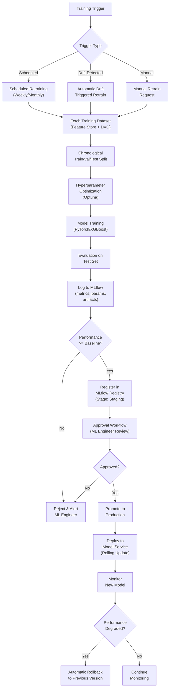

# VOLUME 4: AI/ML PLATFORM & MLOps

## Smart Urban Planning & AI Decision Support Platform

**Document ID:** SUPADSP-ARCH-V2-VOL4 | **Version:** 2.0.0 | **Classification:** Government Restricted

---

## 1. ML Platform Architecture

### 1.1 Platform Overview

```
╔══════════════════════════════════════════════════════════════════════╗
║                     ML PLATFORM ARCHITECTURE                        ║
║                                                                      ║
║  ┌────────────────────────────────────────────────────────────────┐ ║
║  │                    DATA LAYER                                  │ ║
║  │  Feature Store (Feast) ←→ Data Warehouse (TimescaleDB/MinIO)  │ ║
║  └────────────────────────┬───────────────────────────────────────┘ ║
║                           │                                          ║
║  ┌────────────────────────▼───────────────────────────────────────┐ ║
║  │                TRAINING PIPELINE (Airflow)                     │ ║
║  │  Dataset versioning (DVC) → Feature retrieval (Feast) →       │ ║
║  │  Training (PyTorch/XGBoost) → Evaluation → Experiment         │ ║
║  │  Tracking (MLflow) → Model Artifact → Registry                │ ║
║  └────────────────────────┬───────────────────────────────────────┘ ║
║                           │                                          ║
║  ┌────────────────────────▼───────────────────────────────────────┐ ║
║  │                MODEL REGISTRY (MLflow)                         │ ║
║  │  Model versioning → Approval workflow → Stage transitions     │ ║
║  │  (None → Staging → Production → Archived)                     │ ║
║  └────────────────────────┬───────────────────────────────────────┘ ║
║                           │                                          ║
║  ┌────────────────────────▼───────────────────────────────────────┐ ║
║  │              MODEL SERVING (FastAPI / Triton)                  │ ║
║  │  Inference endpoints → Online feature retrieval → Prediction  │ ║
║  │  → Confidence estimation → Explainability → Response          │ ║
║  └────────────────────────┬───────────────────────────────────────┘ ║
║                           │                                          ║
║  ┌────────────────────────▼───────────────────────────────────────┐ ║
║  │              MODEL MONITORING (Evidently AI + Prometheus)      │ ║
║  │  Prediction accuracy → Data drift → Concept drift →           │ ║
║  │  Feature drift → Latency → Failure rate → Alerts             │ ║
║  └────────────────────────┬───────────────────────────────────────┘ ║
║                           │                                          ║
║  ┌────────────────────────▼───────────────────────────────────────┐ ║
║  │              RETRAINING PIPELINE                               │ ║
║  │  Drift trigger / Schedule → Retrain → Validate → Approve →   │ ║
║  │  Deploy / Rollback                                             │ ║
║  └────────────────────────────────────────────────────────────────┘ ║
╚══════════════════════════════════════════════════════════════════════╝
```

### 1.2 Training Pipeline



### 1.3 Model Registry (MLflow)

#### Model Lifecycle Stages

| Stage | Description | Transition |
|---|---|---|
| **None** | Model trained but not registered | → Staging (after evaluation passes) |
| **Staging** | Model registered, awaiting approval | → Production (after ML engineer approval) |
| **Production** | Model actively serving predictions | → Archived (when replaced by newer version) |
| **Archived** | Historical model, retained for audit | Terminal state (retained for compliance) |

#### Model Registry Schema

| Field | Description | Example |
|---|---|---|
| Model ID | Unique identifier | `traffic-dcrnn-v2.1.0` |
| Model Name | Descriptive name | `Traffic Forecast DCRNN` |
| Version | Semantic version | `2.1.0` |
| Domain | Intelligence domain | `traffic` |
| Algorithm | ML algorithm used | `DCRNN (GNN)` |
| Framework | Training framework | `PyTorch 2.3` |
| Training Dataset | Dataset version reference | `traffic-dataset-v4.2 (DVC)` |
| Training Date | When trained | `2026-07-15T10:00:00Z` |
| Evaluation Metrics | Performance on test set | `{mape: 0.092, mae: 2.1, rmse: 3.4}` |
| Hyperparameters | Training hyperparameters | `{lr: 0.001, epochs: 100, hidden: 64}` |
| Owner | Responsible ML engineer | `ml-engineer-001` |
| Approval Status | Review status | `APPROVED` |
| Approved By | Approver | `ml-lead-001` |
| Deployment Status | Current deployment state | `PRODUCTION` |
| Inference Endpoint | Service URL | `http://traffic-model-svc:8000/predict` |
| Artifact Path | MinIO path | `s3://model-artifacts/traffic/dcrnn/v2.1.0/` |
| Drift Status | Current drift state | `STABLE` |
| Last Retrained | Last retraining date | `2026-07-15` |
| ONNX Available | Whether ONNX export exists | `true` |

### 1.4 Model Monitoring

#### Monitored Metrics

| Metric | Type | Threshold | Action |
|---|---|---|---|
| Prediction MAE/MAPE | Performance | > 1.5× baseline | Alert + auto-retrain trigger |
| Prediction latency (p95) | Latency | > 500ms | Alert, scaling review |
| Inference failure rate | Reliability | > 1% | Alert, failover to backup model |
| Data drift (KS statistic) | Data quality | > 0.1 on any feature | Alert, investigate |
| Concept drift (prediction error trend) | Model quality | Statistically significant upward trend | Auto-retrain trigger |
| Feature drift | Feature quality | Distribution shift detected | Alert, feature pipeline review |
| Model health check | Availability | Failure to respond | Restart pod, alert |
| GPU/CPU utilization | Resource | > 80% sustained | Scale out, alert |

#### Monitoring Stack

| Tool | Purpose |
|---|---|
| **Evidently AI** | Data drift, concept drift, model performance reports (batch) |
| **Prometheus** | Real-time metrics collection (latency, throughput, errors) |
| **Grafana** | Monitoring dashboards (model-specific and platform-wide) |
| **Custom drift detector** | Scheduled comparison of latest prediction errors vs. deployment baseline |

### 1.5 Retraining Pipeline

| Trigger | Condition | Frequency |
|---|---|---|
| **Scheduled** | Calendar-based (weekly or monthly depending on domain) | Weekly for traffic/pollution, monthly for energy |
| **Drift-triggered** | Automated: when live validation error on newest data batch exceeds threshold vs. deployed model | As detected |
| **Manual** | ML engineer requests retrain (e.g., after new dataset ingestion) | Ad-hoc |

#### Retraining Workflow

| Step | Action | Owner |
|---|---|---|
| 1 | Trigger received (schedule/drift/manual) | System / ML Engineer |
| 2 | Fetch latest training data from Feature Store | Airflow pipeline |
| 3 | Train new model version with same architecture | Training pipeline |
| 4 | Evaluate on held-out test set | Training pipeline |
| 5 | Compare metrics against currently deployed model | Training pipeline |
| 6 | If improved: register in MLflow as Staging | Training pipeline |
| 7 | ML Engineer reviews metrics, approves or rejects | ML Engineer |
| 8 | If approved: promote to Production (rolling update) | Deployment pipeline |
| 9 | Monitor new model for 24 hours (canary period) | Monitoring pipeline |
| 10 | If degraded during canary: automatic rollback | Deployment pipeline |
| 11 | If stable: confirm deployment, archive previous version | System |

---

## 2. Model Recommendations by Domain

### 2.1 Traffic Intelligence Models

| Task | Primary Model | Alternative Models | Why Selected | Training Strategy | Eval Metrics | Expected Accuracy |
|---|---|---|---|---|---|---|
| Traffic Forecasting | DCRNN (Diffusion Convolutional RNN) | GAT+GRU, STGCN, Per-segment LSTM | Captures spatio-temporal dependencies in road graph; state-of-the-art on METR-LA/PeMS benchmarks | Offline, chronological split, multi-step horizon | MAE, MAPE, RMSE | MAPE 8-12% |
| Congestion Prediction | XGBoost Classifier | LightGBM, Random Forest | Fast, interpretable, excellent on tabular features derived from forecast outputs | Supervised on labeled congestion levels | Accuracy, F1, AUC | Accuracy > 85% |
| Accident Detection (CV) | YOLOv8 | Faster R-CNN, SSD | Best speed/accuracy trade-off for real-time detection; easy to fine-tune | Transfer learning + fine-tune on local footage | mAP@0.5, Recall | Dependent on training data |
| Accident Detection (TS) | Isolation Forest / Autoencoder | One-Class SVM | Sudden speed drops; unsupervised anomaly on speed stream | Unsupervised on normal patterns | Precision, Recall | Task-dependent |
| Signal Optimization | PPO (RL) / Webster's Formula | DQN, A2C | RL learns adaptive policies; Webster's as deterministic baseline | RL: SUMO environment; Webster's: analytical | Delay reduction, throughput improvement | 10-20% delay reduction |
| Route Optimization | A* / Dijkstra on predicted graph | Contraction Hierarchies | Standard shortest-path on dynamically-weighted graph | N/A (graph algorithm) | Route quality, ETA accuracy | < 15% ETA error |
| Travel Time Estimation | Aggregation of segment forecasts | DeepTTE | Composition of per-segment GNN outputs along route | Derived from traffic forecast model | MAE on route travel time | MAE < 3 min for city routes |
| Parking Prediction | GBM per parking zone | LSTM | Tabular features (occupancy history, events, traffic) suit GBM well | Supervised regression | MAPE, MAE | MAPE < 15% |

### 2.2 Pollution Intelligence Models

| Task | Primary Model | Alternative Models | Why Selected | Training Strategy | Eval Metrics | Expected Accuracy |
|---|---|---|---|---|---|---|
| AQI Forecasting | Temporal Fusion Transformer (TFT) | LSTM with attention, DeepAR | Multi-horizon with quantile outputs; built-in variable importance; handles multi-source inputs | Offline, chronological split | RMSE, MAE, Quantile loss | RMSE within CPCB tolerance |
| Pollutant Prediction | TFT (multi-output) | Per-pollutant LSTM, XGBoost | Shared encoder captures cross-pollutant correlations | Offline, chronological split | RMSE per pollutant | Domain-typical |
| Dispersion Modeling | Gaussian Plume + corrections | AERMOD, CALPUFF | Computationally efficient, well-understood physics; enhanced with street-canyon corrections from building height data | Physics-based parameterization | Visual/field validation | N/A (physics model) |
| Hotspot Detection | DBSCAN + threshold | HDBSCAN, KDE | Spatial clustering identifies contiguous high-pollution areas | Unsupervised on predicted pollution surface | Spatial accuracy | Validated against known hotspots |
| Source Attribution | Wind back-tracking + regression | Receptor modeling | Combines wind direction with facility registry; practical for available data | Semi-supervised with facility labels | Attribution accuracy | Limited by wind data resolution |
| Industrial Compliance | Change-point detection + trend regression | CUSUM, Bayesian changepoint | Detects emission pattern changes indicating compliance violations | Time-series analysis per facility | False positive rate | < 10% false positive target |
| Noise Mapping | Traffic-volume regression | CNN on sensor data | Derives noise from traffic proxy where dedicated sensors are absent | Supervised on available sensor ground truth | MAE (dB) | Task-dependent |

### 2.3 Energy Intelligence Models

| Task | Primary Model | Alternative Models | Why Selected | Training Strategy | Eval Metrics | Expected Accuracy |
|---|---|---|---|---|---|---|
| Load Forecasting | XGBoost | LightGBM, LSTM, Informer, N-HiTS | Industry standard for tabular energy data; fast, interpretable, strong baseline | Offline, chronological split | MAPE, RMSE | MAPE 5-10% |
| Peak Demand Prediction | XGBoost Classifier + Regressor | Random Forest | Classifier for peak occurrence + regressor for peak magnitude | Supervised on historical peak events | F1 (classification), MAE (regression) | F1 > 80% |
| Building Consumption | Per-building regression | Building simulation (EnergyPlus) | Regression on weather + occupancy features per building baseline | Supervised per building | MAPE per building | MAPE < 15% |
| Street Light Fault | Isolation Forest / Autoencoder | DBSCAN on consumption pattern | Anomaly detection on per-pole consumption stream | Unsupervised on normal consumption | Precision, Recall | Precision > 85% |
| Renewable (Solar) | Physical irradiance + regression | PVLib model | Physical model corrected with local calibration | Analytical + regression correction | MAE on generation | ± 10% generation estimate |
| Outage Prediction | Gradient Boosted Classifier | Logistic Regression | Predicts outage probability per feeder from load/weather/age | Supervised on outage history | AUC, Recall | AUC > 0.75 |
| Carbon Estimation | Emission factor × consumption | Process-based model | Standardized carbon accounting methodology | Deterministic calculation | Accuracy of emission factors | ± 5% with verified factors |

### 2.4 Weather Intelligence Models

| Task | Primary Model | Alternative Models | Why Selected | Training Strategy | Eval Metrics | Expected Accuracy |
|---|---|---|---|---|---|---|
| Temperature/Humidity/Wind | LSTM | TFT, XGBoost | LSTM captures temporal dependencies in weather sequences | Offline, chronological split | RMSE | Domain-typical for 24-48h horizon |
| Rainfall | TFT | LSTM, ConvLSTM | Multi-horizon quantile outputs for rainfall probability and amount | Offline, chronological split | RMSE, Brier score | Short-horizon nowcasting accuracy |
| Storm/Flood/Heatwave Alerts | XGBoost Classifier | Lightweight CNN, Rule-based | Classification on threshold-crossing events; fast and interpretable | Supervised on historical events | F1, Recall | Recall > 90% (minimize missed events) |
| Weather Impact Translation | Gradient Boosted Regressor | Linear regression | Maps weather deltas to domain outcome deltas (trained on historical pairs) | Regression on weather-domain correlations | MAE per domain | Directional accuracy > 80% |

### 2.5 Optimization Models

| Task | Primary Algorithm | Alternative Algorithms | Why Selected |
|---|---|---|---|
| Multi-Objective Optimization | NSGA-II (pymoo) | NSGA-III, MOEA/D | Well-established for 2-3 objectives; pymoo provides mature implementation |
| Constraint Optimization | MILP (PuLP/scipy) | CP-SAT (OR-Tools) | Standard for budget/resource allocation with linear constraints |
| Budget Optimization | Knapsack + NSGA-II | Branch-and-bound | Portfolio selection across wards with budget constraint |
| Bayesian Optimization | Optuna (for hyperparameters) | SMAC, HyperOpt | Used for ML hyperparameter tuning, not operational optimization |

### 2.6 Graph Intelligence Models

| Task | Model | Why Selected |
|---|---|---|
| Road network representation | GraphSAGE / GAT | Inductive learning on large road graphs; attention captures variable node importance |
| Spatial relationship learning | Graph Attention Networks | Attention mechanism learns which spatial neighbors matter most per prediction |
| Knowledge representation | Neo4j Knowledge Graph (optional) | For complex multi-hop relationship queries (Phase 2+) |

### 2.7 Computer Vision Models

| Task | Model | Why Selected |
|---|---|---|
| Accident Detection | YOLOv8 | Best real-time detection speed/accuracy trade-off |
| Vehicle/Pedestrian Counting | YOLOv8 + tracking | Detection + DeepSORT tracking for counting |
| Waterlogging Detection | Lightweight CNN | Simple binary classification from camera frames |
| Land-Use Change Detection | CNN (Siamese) | Paired satellite scene comparison for change detection |
| Road Surface Assessment | Vision Transformer (ViT) | Classification of road condition from periodic imagery |

### 2.8 Anomaly Detection Models

| Task | Model | Why Selected |
|---|---|---|
| Domain Monitoring (Traffic/Pollution/Energy) | Isolation Forest | Fast, unsupervised, works well on multivariate time-series features |
| Anomaly Severity Scoring | Autoencoder (reconstruction error) | Normalized reconstruction error provides continuous severity score |
| Change Point Detection | Bayesian Online Changepoint Detection | Detects regime changes in time-series streams |

---

## 3. Explainable AI (XAI) Framework

### 3.1 Explainability Methods per Model Type

| Model Type | Explainability Method | Output |
|---|---|---|
| XGBoost/LightGBM | SHAP (TreeExplainer) | Per-feature contribution to each prediction |
| LSTM/TFT | Attention weights + Temporal attention visualization | Which time steps and features the model focused on |
| DCRNN/GNN | Graph attention weights | Which road segments (graph nodes) influenced the prediction |
| YOLO (CV) | Bounding box + GradCAM | Visual highlighting of detected regions |
| Gaussian Plume | Physical parameter attribution | Emission source, wind direction, atmospheric stability contribution |
| NSGA-II | Pareto front visualization + trade-off tables | Visual comparison of all non-dominated solutions |
| Isolation Forest | Anomaly score decomposition | Which features pushed the point toward anomalous |

### 3.2 Government-Ready Explanation Format

Every recommendation delivered to the dashboard includes:

```json
{
  "confidence": 0.89,
  "confidence_interpretation": "HIGH — Model predictions align within ±10% of historical accuracy on similar scenarios",
  "top_contributing_factors": [
    {"factor": "Morning peak traffic volume at HITEC City junction", "importance": 0.32, "direction": "increases congestion"},
    {"factor": "Signal cycle time exceeds optimal for current flow", "importance": 0.28, "direction": "causes delay"},
    {"factor": "Parallel route capacity underutilized", "importance": 0.18, "direction": "opportunity for diversion"}
  ],
  "model_info": {
    "model": "DCRNN v2.1.0 + TFT v1.3.0 + NSGA-II",
    "training_data": "12 months of traffic + 18 months of CPCB pollution data",
    "last_validated": "2026-08-01",
    "known_limitations": ["Synthetic traffic data from SUMO — not yet validated against real sensor data", "Pollution dispersion assumes flat terrain (no street-canyon model applied in this area)"]
  },
  "reasoning": "Based on traffic forecast showing severe congestion (index 0.85) during morning peak at IT Corridor, with 5 junctions having suboptimal signal timing and 40% unused capacity on parallel routes, signal timing optimization is the most cost-effective intervention with expected 18% congestion reduction.",
  "alternatives_considered": 3,
  "alternative_summary": "Road widening (higher cost, 18-month timeline) and congestion pricing (requires policy approval) were ranked lower due to cost and implementation constraints."
}
```

---

## 4. Knowledge Base Architecture

### 4.1 Knowledge Base Contents

| Category | Content Examples | Storage | Access Method |
|---|---|---|---|
| Government Regulations | GHMC bylaws, TSPCB regulations, NGT orders | Elasticsearch | Full-text search, keyword retrieval |
| Environmental Policies | CPCB air quality standards, noise limits | Elasticsearch | Keyword + metadata filter |
| Planning Standards | IRC road design standards, signal timing guidelines | Elasticsearch | Document search |
| Road Standards | IRC geometric design, pavement design | Elasticsearch | Document search |
| Energy Standards | BEE standards, grid codes | Elasticsearch | Document search |
| Historical Policies | Past recommendations and their outcomes | PostgreSQL | Structured query |
| GIS Metadata | Layer descriptions, data sources, update frequency | PostgreSQL | Catalog API |
| Master Plans | GHMC Master Plan, HMDA structure plan | MinIO + Elasticsearch | Document search + PDF access |
| Department SOPs | Standard operating procedures per department | Elasticsearch | Department-scoped search |

### 4.2 Knowledge Retrieval for Agents

The Verification Agent and Policy Synthesis Agent access the Knowledge Base to:
- Find applicable regulations for a given recommendation type
- Retrieve precedent policies for similar scenarios
- Check compliance standards and thresholds
- Load government guidelines and constraints

Retrieval is **keyword-based BM25 search** (Elasticsearch), NOT vector-embedding RAG:
- Government documents have precise, standardized terminology
- BM25 with domain-specific synonyms provides accurate retrieval
- No external embedding model dependency required
- Fully auditable (search query → matched documents → cited in recommendation)

---

*End of Volume 4 — AI/ML Platform & MLOps*

*Next: Volume 5 — GIS Architecture*
