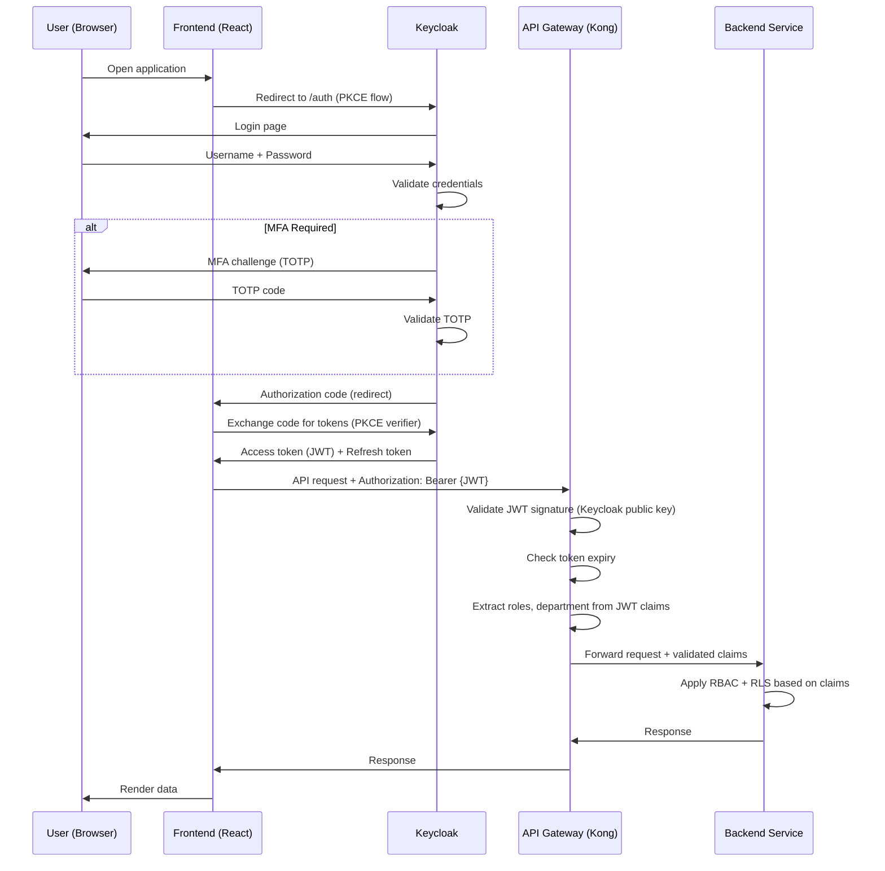

# VOLUME 8: SECURITY ARCHITECTURE

## Smart Urban Planning & AI Decision Support Platform

**Document ID:** SUPADSP-ARCH-V2-VOL8 | **Version:** 2.0.0 | **Classification:** Government Restricted

---

## Table of Contents — Volume 8

1. [Zero-Trust Architecture](#1-zero-trust-architecture)
2. [RBAC Model & User Roles](#2-rbac-model--user-roles)
3. [Identity & Access Management](#3-identity--access-management)
4. [Network Security](#4-network-security)
5. [Data Security](#5-data-security)
6. [Application Security](#6-application-security)
7. [API Security](#7-api-security)
8. [AI/ML Security](#8-aiml-security)
9. [Audit & Compliance](#9-audit--compliance)
10. [Government Compliance Framework](#10-government-compliance-framework)
11. [Threat Model](#11-threat-model)
12. [Incident Response](#12-incident-response)
13. [Security Testing](#13-security-testing)

---

## 1. Zero-Trust Architecture

### 1.1 Zero-Trust Principles

The platform adopts a Zero-Trust security model: **never trust, always verify**. Every request, every service-to-service call, every data access is authenticated and authorized regardless of network location.

| Principle | Implementation |
|---|---|
| **Verify Explicitly** | Every API request carries a JWT token validated by the API Gateway; every inter-service call uses mTLS certificates |
| **Use Least Privilege** | RBAC grants minimum permissions per role; row-level security restricts data by department |
| **Assume Breach** | All internal communications encrypted (mTLS); micro-segmented network; comprehensive audit logging; lateral movement minimized |

### 1.2 Security Architecture Layers

```
╔══════════════════════════════════════════════════════════════════════════╗
║                      SECURITY ARCHITECTURE LAYERS                       ║
║                                                                          ║
║  Layer 1: PERIMETER SECURITY                                            ║
║  ┌────────────────────────────────────────────────────────────────────┐ ║
║  │ WAF (OWASP Top-10) │ DDoS Protection │ IP Allowlisting │ TLS 1.3 │ ║
║  └────────────────────────────────────────────────────────────────────┘ ║
║                                                                          ║
║  Layer 2: API SECURITY                                                   ║
║  ┌────────────────────────────────────────────────────────────────────┐ ║
║  │ OAuth2/OIDC (Keycloak) │ JWT Validation │ Rate Limiting │         │ ║
║  │ API Versioning │ Request Validation │ CORS Policy                  │ ║
║  └────────────────────────────────────────────────────────────────────┘ ║
║                                                                          ║
║  Layer 3: APPLICATION SECURITY                                           ║
║  ┌────────────────────────────────────────────────────────────────────┐ ║
║  │ Input Validation │ Output Encoding │ CSRF Protection │             │ ║
║  │ Content Security Policy │ Secure Headers │ Dependency Scanning     │ ║
║  └────────────────────────────────────────────────────────────────────┘ ║
║                                                                          ║
║  Layer 4: SERVICE SECURITY                                               ║
║  ┌────────────────────────────────────────────────────────────────────┐ ║
║  │ mTLS (mutual TLS) │ Service Mesh (Istio/Linkerd) │                │ ║
║  │ Network Policies (K8s) │ Service-to-Service Auth                   │ ║
║  └────────────────────────────────────────────────────────────────────┘ ║
║                                                                          ║
║  Layer 5: DATA SECURITY                                                  ║
║  ┌────────────────────────────────────────────────────────────────────┐ ║
║  │ Encryption at Rest (AES-256) │ Encryption in Transit (TLS 1.3) │  │ ║
║  │ Row-Level Security │ Column-Level Encryption │ Data Masking        │ ║
║  └────────────────────────────────────────────────────────────────────┘ ║
║                                                                          ║
║  Layer 6: INFRASTRUCTURE SECURITY                                        ║
║  ┌────────────────────────────────────────────────────────────────────┐ ║
║  │ K8s RBAC │ Pod Security Standards │ Network Segmentation │         │ ║
║  │ Secret Management (Vault) │ Container Image Scanning               │ ║
║  └────────────────────────────────────────────────────────────────────┘ ║
║                                                                          ║
║  Layer 7: MONITORING & RESPONSE                                          ║
║  ┌────────────────────────────────────────────────────────────────────┐ ║
║  │ Audit Logging │ SIEM │ Intrusion Detection │ Incident Response     │ ║
║  └────────────────────────────────────────────────────────────────────┘ ║
╚══════════════════════════════════════════════════════════════════════════╝
```

---

## 2. RBAC Model & User Roles

### 2.1 Role Hierarchy

```
SUPER_ADMIN
├── SYSTEM_ADMIN
├── SECURITY_ADMIN
│
├── CITY_COMMISSIONER
│   ├── MUNICIPAL_COMMISSIONER
│   │   ├── ZONAL_COMMISSIONER
│   │   │   └── WARD_OFFICER
│   │
│   ├── TRAFFIC_COMMISSIONER
│   │   ├── TRAFFIC_PLANNING_OFFICER
│   │   ├── TRAFFIC_ENGINEER
│   │   └── TRAFFIC_CONTROL_OPERATOR
│   │
│   ├── ENVIRONMENTAL_COMMISSIONER
│   │   ├── TSPCB_OFFICER
│   │   └── ENVIRONMENTAL_OFFICER
│   │
│   └── ENERGY_COMMISSIONER
│       ├── ENERGY_PLANNING_ENGINEER
│       └── ENERGY_ANALYST
│
├── CHIEF_URBAN_PLANNER
│   ├── SENIOR_URBAN_PLANNER
│   └── URBAN_PLANNER
│
├── DISASTER_MANAGEMENT_OFFICER
│
├── ML_ENGINEER
│   └── DATA_ANALYST
│
├── GIS_ANALYST
│
├── SMART_CITY_ADMINISTRATOR
│
├── REPORT_VIEWER
│
└── AUDITOR
```

### 2.2 Complete Role-Permission Matrix

| Permission | Super Admin | System Admin | Commissioner | Traffic Officer | Env Officer | Energy Officer | Urban Planner | ML Engineer | Data Analyst | GIS Analyst | Auditor |
|---|---|---|---|---|---|---|---|---|---|---|---|
| **Dashboard — Executive** | ✓ | ✓ | ✓ | ✗ | ✗ | ✗ | ✗ | ✗ | ✗ | ✗ | ✗ |
| **Dashboard — Traffic** | ✓ | ✓ | ✓ | ✓ | ✗ | ✗ | ✓ | ✗ | ✗ | ✗ | ✗ |
| **Dashboard — Pollution** | ✓ | ✓ | ✓ | ✗ | ✓ | ✗ | ✓ | ✗ | ✗ | ✗ | ✗ |
| **Dashboard — Energy** | ✓ | ✓ | ✓ | ✗ | ✗ | ✓ | ✓ | ✗ | ✗ | ✗ | ✗ |
| **Dashboard — GIS** | ✓ | ✓ | ✓ | ✓ | ✓ | ✓ | ✓ | ✗ | ✓ | ✓ | ✗ |
| **Dashboard — AI/ML** | ✓ | ✓ | ✗ | ✗ | ✗ | ✗ | ✗ | ✓ | ✗ | ✗ | ✗ |
| **Dashboard — System** | ✓ | ✓ | ✗ | ✗ | ✗ | ✗ | ✗ | ✗ | ✗ | ✗ | ✗ |
| **Submit Planning Request** | ✓ | ✗ | ✓ | ✓ | ✓ | ✓ | ✓ | ✗ | ✗ | ✗ | ✗ |
| **View Recommendations** | ✓ | ✗ | ✓ | ✓ | ✓ | ✓ | ✓ | ✗ | ✗ | ✗ | ✓ |
| **Approve Recommendations** | ✓ | ✗ | ✓ | ✗ | ✗ | ✗ | ✗ | ✗ | ✗ | ✗ | ✗ |
| **Reject Recommendations** | ✓ | ✗ | ✓ | ✗ | ✗ | ✗ | ✗ | ✗ | ✗ | ✗ | ✗ |
| **Request Revision** | ✓ | ✗ | ✓ | ✓ | ✓ | ✓ | ✓ | ✗ | ✗ | ✗ | ✗ |
| **Run Simulation** | ✓ | ✗ | ✓ | ✓ | ✓ | ✓ | ✓ | ✗ | ✗ | ✗ | ✗ |
| **Generate Reports** | ✓ | ✗ | ✓ | ✓ | ✓ | ✓ | ✓ | ✗ | ✓ | ✗ | ✓ |
| **Export Data** | ✓ | ✗ | ✓ | ✓ | ✓ | ✓ | ✓ | ✓ | ✓ | ✓ | ✗ |
| **Manage GIS Layers** | ✓ | ✓ | ✗ | ✗ | ✗ | ✗ | ✗ | ✗ | ✗ | ✓ | ✗ |
| **Deploy Models** | ✓ | ✗ | ✗ | ✗ | ✗ | ✗ | ✗ | ✓ | ✗ | ✗ | ✗ |
| **Approve Model Deploy** | ✓ | ✗ | ✗ | ✗ | ✗ | ✗ | ✗ | ✓ | ✗ | ✗ | ✗ |
| **Trigger Retraining** | ✓ | ✗ | ✗ | ✗ | ✗ | ✗ | ✗ | ✓ | ✗ | ✗ | ✗ |
| **Manage Users** | ✓ | ✓ | ✗ | ✗ | ✗ | ✗ | ✗ | ✗ | ✗ | ✗ | ✗ |
| **Manage Roles** | ✓ | ✓ | ✗ | ✗ | ✗ | ✗ | ✗ | ✗ | ✗ | ✗ | ✗ |
| **View Audit Logs** | ✓ | ✓ | ✗ | ✗ | ✗ | ✗ | ✗ | ✗ | ✗ | ✗ | ✓ |
| **System Configuration** | ✓ | ✓ | ✗ | ✗ | ✗ | ✗ | ✗ | ✗ | ✗ | ✗ | ✗ |
| **Manage Feature Flags** | ✓ | ✓ | ✗ | ✗ | ✗ | ✗ | ✗ | ✗ | ✗ | ✗ | ✗ |
| **Upload Datasets** | ✓ | ✗ | ✗ | ✗ | ✗ | ✗ | ✗ | ✓ | ✓ | ✓ | ✗ |
| **Manage Notifications** | ✓ | ✓ | ✓ | ✗ | ✗ | ✗ | ✗ | ✗ | ✗ | ✗ | ✗ |

### 2.3 Row-Level Security (RLS)

| Data Scope | Rule | Effect |
|---|---|---|
| Traffic data | Traffic officers see only traffic domain | RLS policy on all traffic views/tables |
| Pollution data | Environmental officers see only pollution domain | RLS policy on pollution views/tables |
| Energy data | Energy officers see only energy domain | RLS policy on energy views/tables |
| Ward-level data | Ward officers see only their assigned wards | RLS policy filters by user's ward assignment |
| Zone-level data | Zonal officers see only their assigned zone | RLS policy filters by user's zone assignment |
| All data | Commissioners and urban planners see all domains | No RLS restriction for cross-domain roles |
| Audit logs | Only auditors and super admins can view | RLS + table-level permissions |
| Model artifacts | Only ML engineers can access model storage | MinIO bucket policy + application-level auth |

### 2.4 Department-Scoped Data Access

```sql
-- Example: Row-Level Security for Traffic Data
CREATE POLICY traffic_department_policy ON traffic_observations
    FOR SELECT
    USING (
        current_setting('app.user_role') IN ('SUPER_ADMIN', 'SYSTEM_ADMIN', 'CITY_COMMISSIONER', 
            'CHIEF_URBAN_PLANNER', 'SENIOR_URBAN_PLANNER', 'URBAN_PLANNER')
        OR current_setting('app.user_department') = 'TRAFFIC'
    );

-- Example: Ward-scoped access
CREATE POLICY ward_scoped_policy ON ward_data
    FOR SELECT
    USING (
        current_setting('app.user_role') IN ('SUPER_ADMIN', 'CITY_COMMISSIONER', 'CHIEF_URBAN_PLANNER')
        OR ward_id = ANY(string_to_array(current_setting('app.user_wards'), ',')::uuid[])
    );
```

---

## 3. Identity & Access Management

### 3.1 Keycloak Configuration

| Configuration | Value |
|---|---|
| **Realm** | `supadsp-realm` |
| **Clients** | `supadsp-web` (public, PKCE), `supadsp-api` (confidential, service account) |
| **Identity Providers** | Local user database, optional LDAP/AD federation for government SSO |
| **Authentication Flow** | Browser: Username/Password → MFA (TOTP) → Token issuance |
| **Token Configuration** | Access token TTL: 15 minutes; Refresh token TTL: 8 hours; Offline token: disabled |
| **Password Policy** | Min 12 chars, mixed case, numbers, symbols; rotation every 90 days for privileged roles |
| **MFA Policy** | Required for: SUPER_ADMIN, SYSTEM_ADMIN, COMMISSIONER, ML_ENGINEER (model deployment) |
| **Brute Force Protection** | Account lockout after 5 failed attempts for 30 minutes |
| **Session Management** | Max 3 concurrent sessions per user; admin can force-terminate sessions |

### 3.2 Authentication Flow



### 3.3 JWT Token Claims

```json
{
  "sub": "user-uuid",
  "iss": "https://keycloak.supadsp.gov.in/realms/supadsp-realm",
  "aud": "supadsp-web",
  "exp": 1722980000,
  "iat": 1722979100,
  "realm_access": {
    "roles": ["URBAN_PLANNER"]
  },
  "resource_access": {
    "supadsp-web": {
      "roles": ["URBAN_PLANNER"]
    }
  },
  "department": "GHMC_PLANNING",
  "department_id": "dept-uuid",
  "assigned_wards": ["W-064", "W-065"],
  "assigned_zones": ["ZONE-5"],
  "organization": "GHMC",
  "full_name": "Dr. Priya Sharma",
  "email": "priya.sharma@ghmc.gov.in",
  "mfa_verified": true
}
```

---

## 4. Network Security

### 4.1 Network Segmentation

```
┌──────────────────────────────────────────────────────────────────────┐
│                    NETWORK ZONES                                     │
│                                                                      │
│  ┌──────────────────────────────────────────────────────────────┐   │
│  │  ZONE 1: DMZ (Demilitarized Zone)                            │   │
│  │  • API Gateway (Kong)                                        │   │
│  │  • Web Application (React static files via CDN/Nginx)       │   │
│  │  • WAF                                                       │   │
│  │  • Reverse Proxy                                             │   │
│  │  Firewall Rules: Only HTTPS (443) from external             │   │
│  └──────────────────────────┬───────────────────────────────────┘   │
│                              │ (only 8000, 8080)                     │
│  ┌──────────────────────────▼───────────────────────────────────┐   │
│  │  ZONE 2: APPLICATION ZONE                                    │   │
│  │  • Supervisor AI Agent                                       │   │
│  │  • All Specialist Agents (Traffic, Pollution, Energy, etc.)  │   │
│  │  • GIS API Service                                           │   │
│  │  • Notification, Reporting, Admin services                   │   │
│  │  • Keycloak                                                  │   │
│  │  Firewall Rules: Only from DMZ (API Gateway); no direct     │   │
│  │  external access                                              │   │
│  └──────────────────────────┬───────────────────────────────────┘   │
│                              │ (only DB ports)                       │
│  ┌──────────────────────────▼───────────────────────────────────┐   │
│  │  ZONE 3: DATA ZONE                                           │   │
│  │  • PostgreSQL / PostGIS / TimescaleDB                        │   │
│  │  • Redis                                                     │   │
│  │  • Elasticsearch                                             │   │
│  │  • Kafka                                                     │   │
│  │  • MinIO                                                     │   │
│  │  • MLflow                                                    │   │
│  │  Firewall Rules: Only from Application Zone; no external     │   │
│  │  access; no DMZ access                                        │   │
│  └──────────────────────────┬───────────────────────────────────┘   │
│                              │                                       │
│  ┌──────────────────────────▼───────────────────────────────────┐   │
│  │  ZONE 4: ML TRAINING ZONE                                    │   │
│  │  • Training compute nodes (GPU if available)                 │   │
│  │  • Airflow workers                                           │   │
│  │  Firewall Rules: Access to Data Zone only; no external       │   │
│  │  access; isolated from Application Zone                       │   │
│  └──────────────────────────────────────────────────────────────┘   │
│                                                                      │
│  ┌──────────────────────────────────────────────────────────────┐   │
│  │  ZONE 5: MONITORING ZONE                                     │   │
│  │  • Prometheus, Grafana, Loki, Jaeger                         │   │
│  │  • Can reach all zones for metric/log collection              │   │
│  │  • Admin-only UI access                                       │   │
│  └──────────────────────────────────────────────────────────────┘   │
└──────────────────────────────────────────────────────────────────────┘
```

### 4.2 Kubernetes Network Policies

```yaml
# Example: Restrict Data Zone access to Application Zone only
apiVersion: networking.k8s.io/v1
kind: NetworkPolicy
metadata:
  name: data-zone-ingress
  namespace: data
spec:
  podSelector: {}
  policyTypes:
    - Ingress
  ingress:
    - from:
        - namespaceSelector:
            matchLabels:
              zone: application
      ports:
        - port: 5432  # PostgreSQL
        - port: 6379  # Redis
        - port: 9200  # Elasticsearch
        - port: 9092  # Kafka
        - port: 9000  # MinIO
```

### 4.3 mTLS (Mutual TLS)

All inter-service communication within the cluster uses mutual TLS:

| Aspect | Implementation |
|---|---|
| **Certificate Authority** | Private CA managed via cert-manager (Kubernetes) |
| **Certificate Rotation** | Automatic rotation every 24 hours (short-lived certificates) |
| **Service Identity** | Each service gets a unique identity certificate (SPIFFE-compatible) |
| **Enforcement** | Service mesh (Istio/Linkerd) enforces mTLS for all mesh traffic |
| **External Traffic** | TLS 1.3 at ingress; certificate pinning for government networks |

---

## 5. Data Security

### 5.1 Encryption

| Data State | Encryption | Algorithm | Key Management |
|---|---|---|---|
| **At Rest — PostgreSQL** | Transparent Data Encryption (TDE) | AES-256 | HashiCorp Vault |
| **At Rest — MinIO** | Server-Side Encryption | AES-256-GCM | Vault-managed keys |
| **At Rest — Redis** | Redis encryption (if persistent) | AES-256 | Vault-managed keys |
| **At Rest — Elasticsearch** | Search Guard / X-Pack encryption | AES-256 | Vault-managed keys |
| **At Rest — Kafka** | Disk encryption (OS-level) | AES-256 | Vault-managed keys |
| **At Rest — Backup** | Encrypted backups | AES-256-GCM | Vault-managed, offline copy |
| **In Transit — External** | TLS 1.3 | ECDHE+AES-256-GCM | Public CA (Let's Encrypt or Gov CA) |
| **In Transit — Internal** | mTLS | TLS 1.3 | Private CA (cert-manager) |
| **Sensitive Fields** | Column-level encryption | AES-256-GCM | Vault-managed, application-level |

### 5.2 Data Classification

| Classification | Description | Examples | Protection |
|---|---|---|---|
| **PUBLIC** | Non-sensitive, publicly available | OSM data, CPCB published AQI | Standard access controls |
| **INTERNAL** | Government internal use only | Predictions, recommendations, analysis | Authentication required; RBAC enforced |
| **CONFIDENTIAL** | Sensitive government data | Budget data, infrastructure vulnerability | Role-restricted; encrypted; audit logged |
| **RESTRICTED** | Highly sensitive | Security configurations, admin credentials, encryption keys | MFA required; encrypted at rest and in transit; access heavily logged |

### 5.3 Data Residency

| Requirement | Implementation |
|---|---|
| All data stored within India | Government cloud (NIC/MeghRaj) or sovereign infrastructure within Indian territory |
| No data leaves government network | No external API calls that transmit government data (core AI constraint) |
| No cloud SaaS dependencies | All services self-hosted; no Snowflake, no BigQuery, no external managed services |
| Backup data within India | DR site within India; cross-region replication to government-approved facility |

---

## 6. Application Security

### 6.1 OWASP Top-10 Mitigations

| OWASP Risk | Mitigation |
|---|---|
| A01: Broken Access Control | RBAC via Keycloak; RLS in PostgreSQL; API Gateway enforces auth on every request |
| A02: Cryptographic Failures | TLS 1.3 everywhere; AES-256 at rest; no sensitive data in URLs or logs |
| A03: Injection | Parameterized queries (SQLAlchemy ORM); input validation at API layer (Pydantic models) |
| A04: Insecure Design | Threat modeling during design; security review for every module; principle of least privilege |
| A05: Security Misconfiguration | Infrastructure-as-Code (Terraform); configuration scanning; hardened container images |
| A06: Vulnerable Components | Automated dependency scanning (Snyk/Dependabot); container image scanning (Trivy) |
| A07: Auth Failures | Keycloak with MFA; brute-force protection; session management; password policies |
| A08: Software & Data Integrity | Signed container images; verified artifact checksums; CI/CD pipeline integrity |
| A09: Logging & Monitoring Failures | Comprehensive audit logging; centralized log aggregation (Loki); alerting (Prometheus) |
| A10: SSRF | URL validation; allowlisted external endpoints; network policies restrict outbound |

### 6.2 Security Headers

All API responses include:

```
Strict-Transport-Security: max-age=31536000; includeSubDomains; preload
X-Content-Type-Options: nosniff
X-Frame-Options: DENY
X-XSS-Protection: 0  (CSP preferred)
Content-Security-Policy: default-src 'self'; script-src 'self'; style-src 'self' 'unsafe-inline'; img-src 'self' data: blob:; connect-src 'self' wss:;
Referrer-Policy: strict-origin-when-cross-origin
Permissions-Policy: camera=(), microphone=(), geolocation=()
Cache-Control: no-store, no-cache, must-revalidate (for sensitive endpoints)
```

---

## 7. API Security

### 7.1 API Security Controls

| Control | Implementation |
|---|---|
| **Authentication** | OAuth2/OIDC via Keycloak; JWT Bearer tokens on every request |
| **Authorization** | Role extraction from JWT claims; RBAC enforcement at service level |
| **Rate Limiting** | Kong rate-limiting plugin; per-user and per-endpoint limits |
| **Input Validation** | Pydantic models for all request bodies; strict schema validation |
| **Output Filtering** | Response schemas exclude internal fields; department-scoped responses |
| **API Versioning** | URL-based versioning (`/api/v1/`); backward-compatible changes |
| **Request Size Limits** | Max request body: 10 MB (file uploads: 100 MB via dedicated endpoint) |
| **Timeout** | Gateway timeout: 120 seconds; service timeout: configurable per endpoint |
| **CORS** | Restricted to platform domain; no wildcard origins |
| **Request Logging** | All requests logged with sanitized bodies (no sensitive data in logs) |

### 7.2 API Key Security (Service-to-Service)

| Aspect | Policy |
|---|---|
| Key Format | 256-bit random, base64-encoded |
| Rotation | Every 90 days; automated rotation via Vault |
| Storage | HashiCorp Vault; never in source code, environment variables, or config files |
| Scope | Per-service keys; each key limited to specific API endpoints |
| Revocation | Immediate revocation capability; audit logged |

---

## 8. AI/ML Security

### 8.1 AI-Specific Security Concerns

| Concern | Mitigation |
|---|---|
| **Model Poisoning** | Training data validated via quality framework; data provenance tracked; anomaly detection on training data |
| **Adversarial Inputs** | Input validation on all prediction requests; range checks; anomaly detection on input features |
| **Model Theft** | Model artifacts stored in encrypted MinIO; access restricted to ML engineers; download audit logged |
| **Data Leakage** | No training data in model responses; feature importance limited to top-K (not raw data) |
| **Bias & Fairness** | Ward-level analysis for prediction bias; regular fairness audits; bias metrics tracked per model |
| **Explainability Manipulation** | SHAP values computed server-side; not user-modifiable; audit trail for explainability access |
| **Model Supply Chain** | All base models from verified sources; no untrusted pre-trained weights without review |
| **Inference Denial-of-Service** | Rate limiting on prediction endpoints; request queue with timeout; circuit breaker |

### 8.2 Model Access Control

| Action | Who Can Do It | Approval Required |
|---|---|---|
| View model performance metrics | ML Engineer, Data Analyst | No |
| Train new model | ML Engineer | No |
| Register model in staging | ML Engineer | No |
| Promote model to production | ML Engineer | Yes (ML Lead approval) |
| Rollback model | ML Engineer | No (emergency procedure) |
| Delete model | Super Admin | Yes (documented justification) |
| Download model artifact | ML Engineer | Audit logged |
| Modify feature definitions | ML Engineer | Yes (reviewed change) |

---

## 9. Audit & Compliance

### 9.1 Audit Coverage

| Category | Events Captured |
|---|---|
| **Authentication** | Login success/failure, MFA verification, session creation/termination, password change |
| **Authorization** | Permission checks (granted/denied), role changes, department assignments |
| **Data Access** | Queries executed, data exported, reports generated, datasets downloaded |
| **AI Decisions** | Every planning request, intent classification, agent dispatch, prediction, recommendation |
| **Approval Workflow** | Recommendation submitted, reviewed, approved, rejected, revision requested |
| **Model Management** | Model trained, registered, promoted, deployed, rolled back, deprecated |
| **Configuration** | System config changes, feature flag toggles, user management actions |
| **System** | Service start/stop, deployment events, scaling events, error events |

### 9.2 Audit Log Retention

| Log Type | Retention Period | Storage |
|---|---|---|
| Authentication logs | 3 years | Elasticsearch + PostgreSQL |
| Authorization logs | 3 years | Elasticsearch + PostgreSQL |
| AI decision logs | 7 years | PostgreSQL (immutable) |
| Recommendation audit trail | 7 years | PostgreSQL (immutable) |
| Approval workflow logs | 7 years | PostgreSQL (immutable) |
| Data access logs | 3 years | Elasticsearch |
| System logs | 1 year | Loki (compressed) |
| Model management logs | 5 years | PostgreSQL |

### 9.3 Audit Query API

| Endpoint | Purpose |
|---|---|
| `GET /api/v1/audit/events` | Search audit events with filters (user, action, resource, date range) |
| `GET /api/v1/audit/events/{id}` | Get specific audit event details |
| `GET /api/v1/audit/user/{id}/activity` | Get all activity for a specific user |
| `GET /api/v1/audit/resource/{type}/{id}/history` | Get complete history of a resource |
| `GET /api/v1/audit/recommendations/{id}/trail` | Get complete approval trail for a recommendation |
| `GET /api/v1/audit/reports/compliance` | Generate compliance audit report |

---

## 10. Government Compliance Framework

### 10.1 Applicable Standards & Guidelines

| Standard | Description | Compliance Strategy |
|---|---|---|
| **GIGW 3.0** | Guidelines for Indian Government Websites | UI accessibility, bilingual support, government branding |
| **IT Act 2000** | Information Technology Act | Data protection, cyber security, electronic records |
| **DPDP Act 2023** | Digital Personal Data Protection Act | Limited PII; consent management where applicable; data minimization |
| **NIC Guidelines** | National Informatics Centre standards | Government cloud deployment; NIC-approved infrastructure |
| **MeghRaj Policy** | Government Cloud adoption policy | Deployment on government cloud infrastructure |
| **CERT-In Guidelines** | Indian Computer Emergency Response Team | Incident reporting; vulnerability management; security best practices |
| **IS/ISO 27001** | Information Security Management System | Security controls mapped to ISO 27001 Annex A |
| **WCAG 2.1 AA** | Web Content Accessibility Guidelines | Accessible UI design; keyboard navigation; screen reader support |

### 10.2 Government Cloud Compliance

| Requirement | Implementation |
|---|---|
| Data sovereignty | All data stored on Indian government-approved infrastructure |
| Government email domains | User accounts restricted to `.gov.in` email domains |
| Government branding | Platform branding follows GIGW guidelines |
| Hindi/Telugu support | UI supports English (primary), Hindi, Telugu (Phase 2) |
| Accessibility | WCAG 2.1 AA compliance; high contrast mode; keyboard navigation |
| Security audit | Annual security audit by CERT-In empaneled auditor |
| Penetration testing | Bi-annual penetration testing by certified team |

---

## 11. Threat Model

### 11.1 Key Threats & Mitigations

| Threat ID | Threat | STRIDE Category | Likelihood | Impact | Mitigation |
|---|---|---|---|---|---|
| TH-01 | Unauthorized access to platform | Spoofing | Medium | High | Keycloak auth, MFA, brute-force protection |
| TH-02 | Privilege escalation | Elevation of Privilege | Low | Critical | Strict RBAC, RLS, regular access reviews |
| TH-03 | SQL injection | Tampering | Low | Critical | Parameterized queries, ORM, input validation |
| TH-04 | API abuse / DDoS | Denial of Service | Medium | High | Rate limiting, WAF, auto-scaling |
| TH-05 | Data exfiltration | Information Disclosure | Low | Critical | RLS, audit logging, data classification, DLP |
| TH-06 | Model manipulation | Tampering | Low | High | Data validation, model signing, access control |
| TH-07 | Insider threat | Multiple | Medium | High | Least privilege, audit trails, session monitoring |
| TH-08 | Supply chain attack | Tampering | Low | High | Dependency scanning, container scanning, signed images |
| TH-09 | Network sniffing | Information Disclosure | Low | Medium | mTLS, TLS 1.3, no plaintext protocols |
| TH-10 | Stale/compromised credentials | Spoofing | Medium | High | Short-lived tokens, MFA, credential rotation |

---

## 12. Incident Response

### 12.1 Incident Response Plan

| Phase | Actions |
|---|---|
| **Detection** | Automated alerts (Prometheus, Grafana), audit log anomalies, user reports |
| **Triage** | Security team assesses severity (P1-P4); assigns incident commander |
| **Containment** | Isolate affected service/user; revoke compromised credentials; block attacker IP |
| **Eradication** | Patch vulnerability; rotate credentials; update WAF rules |
| **Recovery** | Restore from clean backups; verify integrity; gradual service restoration |
| **Post-Incident** | Root cause analysis; lessons learned; security improvement plan; CERT-In notification if required |

### 12.2 Severity Classification

| Severity | Definition | Response Time | Escalation |
|---|---|---|---|
| P1 (Critical) | Data breach, complete service outage, active attack | 15 minutes | CISO, Commissioner |
| P2 (High) | Partial service degradation, suspected breach | 1 hour | Security Lead |
| P3 (Medium) | Non-critical vulnerability, minor security event | 4 hours | Security Team |
| P4 (Low) | Informational, policy violation, minor misconfiguration | 24 hours | Security Team |

---

## 13. Security Testing

### 13.1 Testing Schedule

| Test Type | Frequency | Scope | Tool/Method |
|---|---|---|---|
| **SAST** (Static Analysis) | Every commit (CI/CD) | Application source code | Semgrep, Bandit (Python) |
| **DAST** (Dynamic Analysis) | Weekly | Running application APIs | OWASP ZAP |
| **Dependency Scanning** | Every build (CI/CD) | Third-party dependencies | Snyk, Dependabot |
| **Container Scanning** | Every image build | Docker images | Trivy |
| **Infrastructure Scanning** | Weekly | Kubernetes, network config | kube-bench, Falco |
| **Penetration Testing** | Bi-annual | Full platform | External CERT-In empaneled team |
| **Security Audit** | Annual | Full platform + policies | External auditor |
| **Red Team Exercise** | Annual | Full platform | Simulated advanced attack |
| **Access Review** | Quarterly | All user accounts + roles | Manual review + automated dormant account detection |

---

*End of Volume 8 — Security Architecture*

*Next: Volume 9 — Infrastructure & Deployment Architecture*
