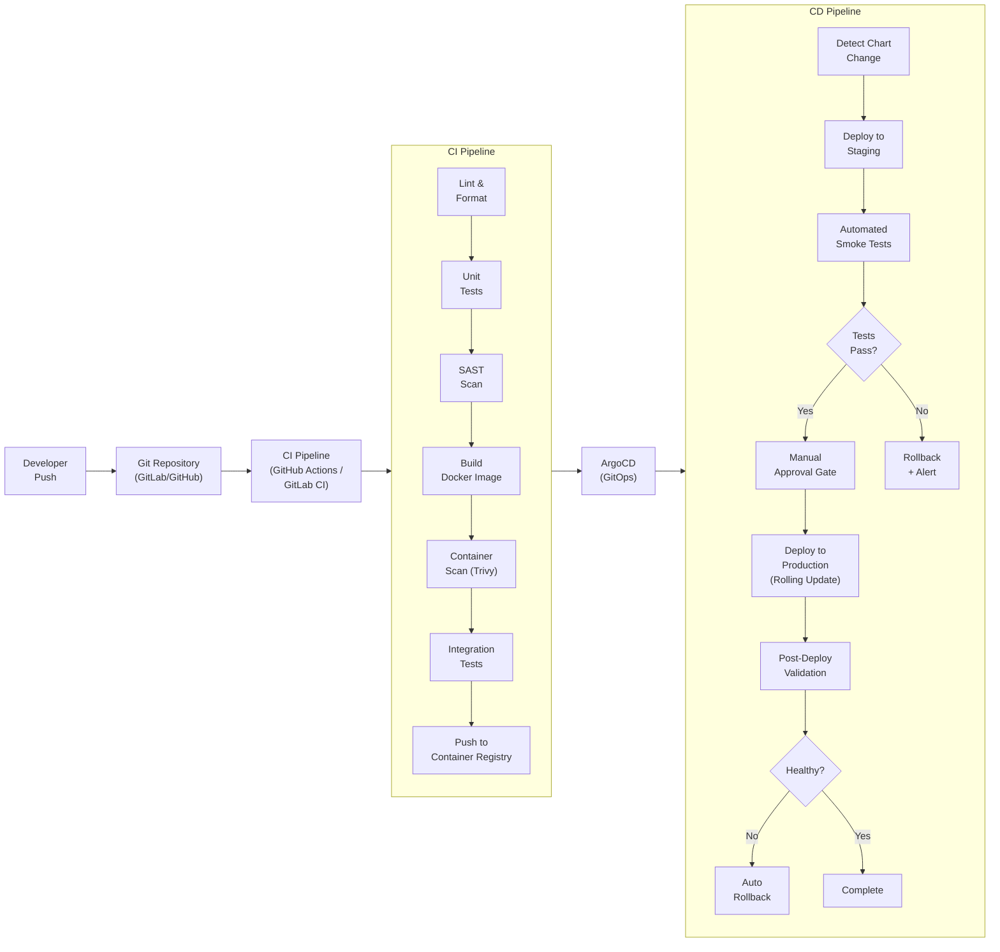

# VOLUME 9: INFRASTRUCTURE & DEPLOYMENT ARCHITECTURE

## Smart Urban Planning & AI Decision Support Platform

**Document ID:** SUPADSP-ARCH-V2-VOL9 | **Version:** 2.0.0 | **Classification:** Government Restricted

---

## Table of Contents — Volume 9

1. [Container Deployment Architecture](#1-container-deployment-architecture)
2. [Service Network & Security Strategy](#2-service-network--security-strategy)
3. [Docker Compose Configuration](#3-docker-compose-configuration)
4. [CI/CD Pipeline](#4-cicd-pipeline)
5. [Container Orchestration & Management](#5-container-orchestration--management)
6. [Infrastructure as Code](#6-infrastructure-as-code)
7. [Monitoring & Observability](#7-monitoring--observability)
8. [Logging Architecture](#8-logging-architecture)
9. [Distributed Tracing](#9-distributed-tracing)
10: [Scaling Strategy](#10-scaling-strategy)
11. [Resource Requirements](#11-resource-requirements)
12. [Disaster Recovery & Business Continuity](#12-disaster-recovery--business-continuity)
13. [Deployment Environments](#13-deployment-environments)

---

## 1. Container Deployment Architecture

### 1.1 Docker Compose Architecture

```
╔��������������������������������������������������������������������������╗
â•‘                DOCKER COMPOSE CONTAINER ARCHITECTURE                     â•‘
â•‘                                                                          â•‘
║  ┌─────────────────────────────────────────────────────────────────�    ║
║  │  APPLICATION CONTAINER CLUSTER                                  │    ║
║  │  • supadsp-supervisor-orchestrator (FastAPI API, port 8000)      │    ║
║  │  • supadsp-frontend (React Vite Web App, port 3000)             │    ║
║  │  • Domain Specialist Agent containers                           │    ║
║  └─────────────────────────────────────────────────────────────────┘    ║
â•‘                                                                          â•‘
║  ┌─────────────────────────────────────────────────────────────────�    ║
║  │  DATA & STORAGE CONTAINER CLUSTER                               │    ║
║  │  • supadsp-postgres (TimescaleDB + PostGIS, port 5432)          │    ║
║  │  • supadsp-redis (Redis 7 Cache, port 6379)                     │    ║
║  │  • supadsp-elasticsearch (ES 8 Search, port 9200)               │    ║
║  │  • supadsp-minio (S3 Object Storage, port 9000/9001)            │    ║
║  │  • supadsp-kafka & supadsp-zookeeper (Event Bus, port 9092)     │    ║
║  └─────────────────────────────────────────────────────────────────┘    ║
â•‘                                                                          â•‘
║  ┌─────────────────────────────────────────────────────────────────�    ║
║  │  GIS & PLATFORM SERVICES CLUSTER                                │    ║
║  │  • supadsp-geoserver & supadsp-martin (Tile Servers, 8082/3001) │    ║
║  │  • supadsp-mlflow & supadsp-keycloak (5000 / 8080)             │    ║
║  │  • supadsp-prometheus & supadsp-grafana (9090 / 3000)           │    ║
║  └─────────────────────────────────────────────────────────────────┘    ║
```”‚    â•‘
║  │  • Min: 4 nodes, Max: 8 nodes (HPA)                           │    ║
║  │  Resources: 8 vCPU, 32 GB RAM per node                        │    ║
║  └─────────────────────────────────────────────────────────────────┘    ║
â•‘                                                                          â•‘
║  ┌─────────────────────────────────────────────────────────────────�    ║
║  │  WORKER NODE POOL: DATA (3 nodes, dedicated)                    │    ║
║  │  • Storage-optimized instances                                  │    ║
║  │  • PostgreSQL, PostGIS, TimescaleDB, Redis, Elasticsearch      │    ║
║  │  • Kafka, MinIO, MLflow                                        │    ║
║  │  • Min: 3 nodes (HA)                                           │    ║
║  │  Resources: 8 vCPU, 64 GB RAM, 500 GB SSD per node            │    ║
║  └─────────────────────────────────────────────────────────────────┘    ║
â•‘                                                                          â•‘
║  ┌─────────────────────────────────────────────────────────────────�    ║
║  │  WORKER NODE POOL: ML TRAINING (1-2 nodes, auto-scaled)        │    ║
║  │  • GPU instances (if available) or CPU-optimized               │    ║
║  │  • Model training, Airflow workers, batch processing           │    ║
║  │  • Auto-scaled: 0 nodes when idle, 2 during training          │    ║
║  │  Resources: 16 vCPU, 64 GB RAM, optional GPU per node         │    ║
║  └─────────────────────────────────────────────────────────────────┘    ║
â•‘                                                                          â•‘
║  ┌─────────────────────────────────────────────────────────────────�    ║
║  │  WORKER NODE POOL: MONITORING (2 nodes, dedicated)              │    ║
║  │  • Prometheus, Grafana, Loki, Jaeger                           │    ║
║  │  • Resources: 4 vCPU, 16 GB RAM per node                      │    ║
║  └─────────────────────────────────────────────────────────────────┘    ║
╚���������������������������������������������������������������������������
```

### 1.2 Kubernetes Components

| Component | Purpose | Configuration |
|---|---|---|
| **Ingress Controller** | External traffic routing | Nginx Ingress Controller with TLS termination |
| **cert-manager** | TLS certificate management | Let's Encrypt (external) + Private CA (internal mTLS) |
| **CoreDNS** | Service discovery | Cluster DNS for service name resolution |
| **MetalLB / Cloud LB** | Load balancing | L4 load balancer for ingress |
| **Persistent Volume** | Storage | StorageClass with SSD-backed PVs for databases |
| **Network Policies** | Micro-segmentation | Calico or Cilium for network policy enforcement |
| **Pod Security Standards** | Container security | Restricted PSS for all namespaces; baseline for monitoring |
| **Secrets Management** | Credential management | External Secrets Operator + HashiCorp Vault |
| **Resource Quotas** | Fair resource allocation | Per-namespace CPU/memory quotas |

---

## 2. Namespace Strategy

| Namespace | Contents | Resource Quota |
|---|---|---|
| `supadsp-gateway` | Kong API Gateway, Ingress | 4 CPU, 8 GB |
| `supadsp-auth` | Keycloak | 4 CPU, 8 GB |
| `supadsp-supervisor` | Supervisor AI Agent, Agent Registry, Capability Registry, Context Manager | 8 CPU, 16 GB |
| `supadsp-agents` | Traffic, Pollution, Energy, Weather, Simulation, Optimization, Policy, Verification agents | 16 CPU, 32 GB |
| `supadsp-models` | Model serving endpoints (FastAPI or Triton) | 16 CPU, 32 GB (+ GPU if available) |
| `supadsp-gis` | GeoServer, Martin, GIS API | 8 CPU, 16 GB |
| `supadsp-data` | PostgreSQL, PostGIS, TimescaleDB, Redis, Elasticsearch, Kafka, MinIO | 32 CPU, 128 GB |
| `supadsp-mlops` | MLflow, Feast, Airflow | 8 CPU, 16 GB |
| `supadsp-platform` | Notification, Reporting, Admin, Audit services | 4 CPU, 8 GB |
| `supadsp-frontend` | React app (Nginx) | 2 CPU, 4 GB |
| `supadsp-monitoring` | Prometheus, Grafana, Loki, Jaeger | 8 CPU, 32 GB |
| `supadsp-training` | Training jobs (GPU/CPU compute) | Auto-scaled, burst capacity |

---

## 3. Helm Chart Structure

```
supadsp-helm/
├── Chart.yaml                    # Umbrella chart
├── values.yaml                   # Default values
├── values-dev.yaml               # Development overrides
├── values-staging.yaml           # Staging overrides
├── values-production.yaml        # Production overrides
│
├── charts/
│   ├── supadsp-supervisor/
│   │   ├── Chart.yaml
│   │   ├── values.yaml
│   │   └── templates/
│   │       ├── deployment.yaml
│   │       ├── service.yaml
│   │       ├── hpa.yaml
│   │       ├── pdb.yaml          # Pod Disruption Budget
│   │       ├── configmap.yaml
│   │       ├── networkpolicy.yaml
│   │       └── serviceaccount.yaml
│   │
│   ├── supadsp-traffic-agent/
│   ├── supadsp-pollution-agent/
│   ├── supadsp-energy-agent/
│   ├── supadsp-weather-agent/
│   ├── supadsp-simulation-agent/
│   ├── supadsp-optimization-agent/
│   ├── supadsp-policy-agent/
│   ├── supadsp-verification-agent/
│   ├── supadsp-gis-api/
│   ├── supadsp-notification/
│   ├── supadsp-reporting/
│   ├── supadsp-admin/
│   ├── supadsp-audit/
│   ├── supadsp-frontend/
│   │
│   ├── supadsp-postgresql/       # Bitnami PostgreSQL HA chart
│   ├── supadsp-redis/            # Bitnami Redis chart
│   ├── supadsp-kafka/            # Bitnami Kafka chart
│   ├── supadsp-elasticsearch/    # Elastic official chart
│   ├── supadsp-minio/            # MinIO operator chart
│   ├── supadsp-keycloak/         # Bitnami Keycloak chart
│   ├── supadsp-kong/             # Kong Helm chart
│   ├── supadsp-geoserver/        # Custom GeoServer chart
│   ├── supadsp-martin/           # Custom Martin chart
│   ├── supadsp-mlflow/           # Custom MLflow chart
│   ├── supadsp-airflow/          # Official Airflow chart
│   ├── supadsp-prometheus/       # kube-prometheus-stack
│   ├── supadsp-grafana/          # Grafana chart
│   ├── supadsp-loki/             # Loki chart
│   └── supadsp-jaeger/           # Jaeger chart
```

### 3.1 Example Deployment Manifest

```yaml
# Supervisor AI Agent Deployment
apiVersion: apps/v1
kind: Deployment
metadata:
  name: supervisor-agent
  namespace: supadsp-supervisor
  labels:
    app: supervisor-agent
    component: ai
    tier: orchestration
spec:
  replicas: 2
  strategy:
    type: RollingUpdate
    rollingUpdate:
      maxUnavailable: 0
      maxSurge: 1
  selector:
    matchLabels:
      app: supervisor-agent
  template:
    metadata:
      labels:
        app: supervisor-agent
      annotations:
        prometheus.io/scrape: "true"
        prometheus.io/port: "8100"
        prometheus.io/path: "/metrics"
    spec:
      serviceAccountName: supervisor-agent
      securityContext:
        runAsNonRoot: true
        runAsUser: 1000
        fsGroup: 1000
      containers:
        - name: supervisor-agent
          image: registry.supadsp.gov.in/supadsp/supervisor-agent:v2.1.0
          ports:
            - containerPort: 8100
              name: http
          resources:
            requests:
              cpu: "500m"
              memory: "1Gi"
            limits:
              cpu: "2"
              memory: "4Gi"
          env:
            - name: DATABASE_URL
              valueFrom:
                secretKeyRef:
                  name: supervisor-db-secret
                  key: url
            - name: REDIS_URL
              valueFrom:
                secretKeyRef:
                  name: redis-secret
                  key: url
            - name: AGENT_REGISTRY_URL
              value: "http://agent-registry-svc.supadsp-supervisor:8101"
            - name: CAPABILITY_REGISTRY_URL
              value: "http://capability-registry-svc.supadsp-supervisor:8102"
          livenessProbe:
            httpGet:
              path: /health
              port: http
            initialDelaySeconds: 30
            periodSeconds: 10
          readinessProbe:
            httpGet:
              path: /health
              port: http
            initialDelaySeconds: 15
            periodSeconds: 5
          volumeMounts:
            - name: config
              mountPath: /app/config
              readOnly: true
      volumes:
        - name: config
          configMap:
            name: supervisor-config
---
apiVersion: autoscaling/v2
kind: HorizontalPodAutoscaler
metadata:
  name: supervisor-agent-hpa
  namespace: supadsp-supervisor
spec:
  scaleTargetRef:
    apiVersion: apps/v1
    kind: Deployment
    name: supervisor-agent
  minReplicas: 2
  maxReplicas: 6
  metrics:
    - type: Resource
      resource:
        name: cpu
        target:
          type: Utilization
          averageUtilization: 70
    - type: Resource
      resource:
        name: memory
        target:
          type: Utilization
          averageUtilization: 80
---
apiVersion: policy/v1
kind: PodDisruptionBudget
metadata:
  name: supervisor-agent-pdb
  namespace: supadsp-supervisor
spec:
  minAvailable: 1
  selector:
    matchLabels:
      app: supervisor-agent
```

---

## 4. CI/CD Pipeline

### 4.1 Pipeline Architecture



### 4.2 Pipeline Stages

| Stage | Actions | Tools | Fail Criteria |
|---|---|---|---|
| **Lint** | Code formatting, linting | Ruff (Python), ESLint (JS), markdownlint | Any lint error |
| **Unit Tests** | Run unit tests | pytest (Python), Jest (React) | Coverage < 80% or any failure |
| **SAST** | Static security analysis | Semgrep, Bandit | High/Critical findings |
| **Build** | Build Docker image | Docker, multi-stage builds | Build failure |
| **Container Scan** | Scan image for vulnerabilities | Trivy | Critical CVE found |
| **Integration Tests** | API integration tests | pytest + httpx | Any failure |
| **Dependency Scan** | Check dependency vulnerabilities | Snyk / Dependabot | Critical vulnerabilities |
| **Push** | Push image to private registry | Container Registry | Push failure |
| **Deploy Staging** | ArgoCD syncs staging environment | ArgoCD | Sync failure |
| **Smoke Tests** | Basic health and functionality tests | pytest, k6 | Any failure |
| **Approval Gate** | Manual approval for production | ArgoCD / GitLab MR | Rejection |
| **Deploy Production** | Rolling update in production | ArgoCD | Pod health check failure |
| **Post-Deploy Validation** | Verify production health | Prometheus health checks | SLO violation |
| **Rollback** | Automatic rollback if unhealthy | ArgoCD rollback | N/A |

### 4.3 Branch Strategy

| Branch | Purpose | CI/CD |
|---|---|---|
| `main` | Production-ready code | Deploy to production (after staging + approval) |
| `develop` | Integration branch | Deploy to staging automatically |
| `feature/*` | Feature development | CI only (lint, test, build) |
| `hotfix/*` | Emergency fixes | Fast-track to production (approval required) |
| `release/*` | Release preparation | Deploy to staging for acceptance testing |

---

## 5. GitOps with ArgoCD

### 5.1 ArgoCD Application Structure

```yaml
# ArgoCD Application for Supervisor Agent
apiVersion: argoproj.io/v1alpha1
kind: Application
metadata:
  name: supadsp-supervisor
  namespace: argocd
spec:
  project: supadsp
  source:
    repoURL: https://gitlab.supadsp.gov.in/supadsp/helm-charts.git
    targetRevision: main
    path: charts/supadsp-supervisor
    helm:
      valueFiles:
        - values-production.yaml
  destination:
    server: https://kubernetes.default.svc
    namespace: supadsp-supervisor
  syncPolicy:
    automated:
      prune: true
      selfHeal: true
    syncOptions:
      - CreateNamespace=true
    retry:
      limit: 3
      backoff:
        duration: 5s
        factor: 2
        maxDuration: 3m
```

### 5.2 GitOps Workflow

| Step | Description |
|---|---|
| 1 | Developer pushes code change to feature branch |
| 2 | CI pipeline runs (lint, test, build, scan, push image) |
| 3 | Developer creates merge request to `develop` |
| 4 | Code review by team member |
| 5 | Merge to `develop` triggers staging deployment via ArgoCD |
| 6 | Automated smoke tests validate staging deployment |
| 7 | Release branch created from `develop` |
| 8 | Helm chart values updated with new image tag |
| 9 | ArgoCD detects chart change, proposes production sync |
| 10 | Manual approval gate (ML Engineer for models, Platform Lead for services) |
| 11 | ArgoCD deploys to production via rolling update |
| 12 | Post-deployment monitoring validates health |
| 13 | Automatic rollback if health checks fail within canary window |

---

## 6. Infrastructure as Code

### 6.1 Terraform Structure

```
terraform/
├── environments/
│   ├── dev/
│   │   ├── main.tf
│   │   ├── variables.tf
│   │   └── terraform.tfvars
│   ├── staging/
│   │   ├── main.tf
│   │   ├── variables.tf
│   │   └── terraform.tfvars
│   └── production/
│       ├── main.tf
│       ├── variables.tf
│       └── terraform.tfvars
├── modules/
│   ├── kubernetes-cluster/
│   │   ├── main.tf
│   │   ├── variables.tf
│   │   └── outputs.tf
│   ├── networking/
│   │   ├── main.tf        # VPC, subnets, security groups
│   │   ├── variables.tf
│   │   └── outputs.tf
│   ├── storage/
│   │   ├── main.tf        # Persistent volumes, storage classes
│   │   ├── variables.tf
│   │   └── outputs.tf
│   ├── dns/
│   │   ├── main.tf        # DNS records
│   │   ├── variables.tf
│   │   └── outputs.tf
│   └── monitoring/
│       ├── main.tf        # Monitoring stack
│       ├── variables.tf
│       └── outputs.tf
├── backend.tf              # Remote state configuration
└── providers.tf            # Provider configurations
```

### 6.2 State Management

| Aspect | Configuration |
|---|---|
| Backend | Remote state in government-approved object storage (MinIO or equivalent) |
| Locking | State locking via PostgreSQL or DynamoDB-compatible backend |
| Encryption | State file encrypted at rest |
| Versioning | State versioning enabled for rollback |
| Access | State access restricted to Platform Engineering team |

---

## 7. Monitoring & Observability

### 7.1 Observability Stack

```
┌─────────────────────────────────────────────────────────────────�
│                   OBSERVABILITY ARCHITECTURE                     │
│                                                                  │
│  ┌──────────────────────────────────────────────────────────�   │
│  │                     GRAFANA (Visualization)              │   │
│  │  ┌──────────� ┌──────────� ┌──────────� ┌───────────�  │   │
│  │  │Platform  │ │  AI/ML   │ │  Domain  │ │   GIS     │  │   │
│  │  │Dashboard │ │Dashboard │ │Dashboards│ │ Dashboard │  │   │
│  │  └──────────┘ └──────────┘ └──────────┘ └───────────┘  │   │
│  └──────────┬───────────┬──────────────┬────────────────────┘   │
│             │           │              │                         │
│  ┌──────────▼──� ┌──────▼─────� ┌─────▼──────� ┌──────────�  │
│  │ Prometheus  │ │   Loki     │ │  Jaeger    │ │Alertmnger│  │
│  │ (Metrics)   │ │  (Logs)    │ │ (Traces)   │ │ (Alerts) │  │
│  └──────┬──────┘ └──────┬─────┘ └─────┬──────┘ └──────────┘  │
│         │               │             │                         │
│    ┌────▼────�    ┌─────▼────�   ┌────▼────�                  │
│    │All K8s  │    │All K8s   │   │All K8s  │                  │
│    │Services │    │Services  │   │Services │                  │
│    │/metrics │    │stdout    │   │OpenTelm │                  │
│    └─────────┘    └──────────┘   └─────────┘                  │
└─────────────────────────────────────────────────────────────────┘
```

### 7.2 Key Metrics

#### Platform Metrics (Prometheus)

| Metric | Source | Alert Threshold |
|---|---|---|
| `http_request_duration_seconds` | All services | p95 > 2s |
| `http_requests_total` | All services | Error rate > 5% |
| `supervisor_dag_execution_seconds` | Supervisor | p95 > 120s |
| `agent_response_time_seconds` | All agents | p95 > 30s |
| `model_inference_seconds` | Model serving | p95 > 500ms |
| `model_prediction_accuracy` | Monitoring svc | Deviation > 50% from baseline |
| `kafka_consumer_lag` | Kafka consumers | Lag > 10,000 messages |
| `postgresql_connections_active` | PostgreSQL | > 80% of max_connections |
| `redis_memory_usage_bytes` | Redis | > 80% of maxmemory |
| `geoserver_request_duration` | GeoServer | p95 > 2s |
| `tile_request_duration_seconds` | Martin | p95 > 100ms |
| `node_cpu_utilization` | K8s nodes | > 85% sustained |
| `node_memory_utilization` | K8s nodes | > 85% sustained |
| `pod_restart_count` | All pods | > 3 restarts in 15 minutes |
| `container_cpu_throttle_periods` | All containers | Significant throttling detected |

#### AI/ML Metrics

| Metric | Source | Purpose |
|---|---|---|
| `model_mape` | Monitoring service | Prediction accuracy (MAPE) per model |
| `model_rmse` | Monitoring service | Prediction accuracy (RMSE) per model |
| `model_drift_score` | Evidently AI | Data drift detection score |
| `model_concept_drift_score` | Monitoring service | Concept drift indicator |
| `feature_drift_score` | Evidently AI | Per-feature distribution drift |
| `intent_classification_accuracy` | Supervisor | Intent classifier accuracy |
| `recommendation_confidence_avg` | Supervisor | Average recommendation confidence |
| `recommendation_acceptance_rate` | PostgreSQL | Percentage of approved recommendations |

### 7.3 Grafana Dashboards

| Dashboard | Purpose | Key Panels |
|---|---|---|
| **Platform Overview** | Overall system health | Request rate, error rate, latency heatmap, service status |
| **Supervisor AI** | Supervisor performance | Intent distribution, DAG execution times, agent dispatch stats |
| **Traffic Agent** | Traffic model performance | MAPE trend, latency, throughput, drift status |
| **Pollution Agent** | Pollution model performance | RMSE trend, latency, station coverage |
| **Energy Agent** | Energy model performance | MAPE trend, peak prediction accuracy |
| **GIS Platform** | GIS service performance | Tile render time, layer query time, cache hit rate |
| **Kafka** | Event bus health | Consumer lag, partition distribution, throughput |
| **PostgreSQL** | Database health | Connection pool, query latency, replication lag |
| **Redis** | Cache health | Hit rate, memory usage, evictions |
| **Kubernetes** | Cluster health | Node usage, pod status, resource quotas |
| **Model Monitoring** | All ML models | Accuracy trends, drift scores, retraining history |

### 7.4 Alerting Rules

| Alert | Severity | Condition | Notification |
|---|---|---|---|
| Service Down | P1 | Pod not ready for > 5 minutes | Email + SMS to on-call |
| High Error Rate | P1 | Error rate > 10% for 5 minutes | Email + SMS to on-call |
| High Latency | P2 | p95 > 5s for 10 minutes | Email to platform team |
| Model Drift | P2 | Drift score > threshold | Email to ML team |
| Database Connection Exhaustion | P2 | Active connections > 80% | Email to DBA team |
| Disk Space Low | P2 | Disk usage > 85% | Email to infra team |
| Kafka Consumer Lag | P3 | Lag > 10,000 for 30 minutes | Email to platform team |
| Pod Restart Loop | P3 | > 5 restarts in 30 minutes | Email to platform team |
| Certificate Expiry | P3 | Certificate expires in < 14 days | Email to security team |
| Prediction Accuracy Drop | P3 | MAPE > 2× baseline for 24 hours | Email to ML team |

---

## 8. Logging Architecture

### 8.1 Structured Logging Standard

All services emit structured JSON logs:

```json
{
  "timestamp": "2026-08-07T10:30:15.123+05:30",
  "level": "INFO",
  "service": "supervisor-agent",
  "instance": "supervisor-agent-7f4c9b5d4-x9k2m",
  "trace_id": "abc123def456",
  "span_id": "span789",
  "request_id": "req-uuid-001",
  "user_id": "user-uuid-042",
  "message": "DAG execution completed",
  "context": {
    "intent": "MULTI_DOMAIN_OPTIMIZATION",
    "agents_invoked": ["weather", "traffic", "pollution", "optimization"],
    "execution_time_ms": 8500,
    "confidence": 0.89
  }
}
```

### 8.2 Log Levels

| Level | Usage | Retention |
|---|---|---|
| ERROR | Unrecoverable errors, exceptions | 1 year |
| WARN | Recoverable issues, degraded performance | 6 months |
| INFO | Normal operations, request lifecycle | 3 months |
| DEBUG | Detailed debugging (disabled in production) | 7 days (if enabled) |

### 8.3 Loki Configuration

| Aspect | Configuration |
|---|---|
| **Collection** | Promtail DaemonSet on every node; collects stdout/stderr from all pods |
| **Labels** | `namespace`, `pod`, `container`, `service`, `level` |
| **Storage** | MinIO (S3-compatible) for log chunks |
| **Retention** | 3 months for INFO, 1 year for ERROR/WARN |
| **Query** | LogQL via Grafana Explore |

---

## 9. Distributed Tracing

### 9.1 OpenTelemetry Integration

| Aspect | Configuration |
|---|---|
| **SDK** | OpenTelemetry Python SDK in all FastAPI services |
| **Propagation** | W3C TraceContext headers propagated across all HTTP calls |
| **Instrumentation** | Auto-instrumentation for FastAPI, requests, psycopg2, redis-py |
| **Exporter** | OTLP exporter to Jaeger collector |
| **Sampling** | 10% sampling in production; 100% for error traces |

### 9.2 Trace Spans

A typical Supervisor request generates the following trace:

```
[Supervisor: handle_request]  (root span)
  ├── [Supervisor: classify_intent]
  ├── [Supervisor: load_context]
  │   ├── [Context: load_spatial]
  │   ├── [Context: load_temporal]
  │   ├── [Context: load_weather]
  │   └── [Context: load_historical]
  ├── [Supervisor: build_dag]
  ├── [Supervisor: execute_dag]
  │   ├── [Weather Agent: predict]
  │   │   └── [Weather Model: inference]
  │   ├── [Traffic Agent: predict]       (parallel)
  │   │   └── [Traffic Model: inference]
  │   ├── [Pollution Agent: predict]     (parallel)
  │   │   └── [Pollution Model: inference]
  │   ├── [Optimization Agent: optimize]
  │   ├── [Policy Synthesis Agent: generate]
  │   └── [Verification Agent: verify]
  ├── [Supervisor: aggregate_results]
  └── [Supervisor: log_audit]
```

---

## 10. Auto-Scaling Strategy

### 10.1 Horizontal Pod Autoscaler (HPA)

| Service | Min Replicas | Max Replicas | Scale Metric | Target |
|---|---|---|---|---|
| API Gateway (Kong) | 2 | 8 | CPU utilization | 70% |
| Supervisor Agent | 2 | 6 | CPU utilization | 70% |
| Traffic Agent | 2 | 8 | CPU utilization | 70% |
| Pollution Agent | 2 | 6 | CPU utilization | 70% |
| Energy Agent | 2 | 4 | CPU utilization | 70% |
| Weather Agent | 1 | 3 | CPU utilization | 70% |
| Simulation Agent | 1 | 4 | CPU utilization | 70% |
| Optimization Agent | 1 | 4 | CPU utilization | 70% |
| Policy Synthesis | 1 | 3 | CPU utilization | 70% |
| Verification Agent | 1 | 3 | CPU utilization | 70% |
| GIS API | 2 | 6 | CPU utilization | 70% |
| Martin (Tiles) | 2 | 8 | Request rate | 500 req/s |
| Model Serving | 2 | 8 | CPU utilization | 70% |
| Notification Service | 1 | 3 | Queue depth | 100 pending |
| Frontend (Nginx) | 2 | 6 | CPU utilization | 70% |

### 10.2 Cluster Autoscaler

| Node Pool | Min Nodes | Max Nodes | Scale Trigger |
|---|---|---|---|
| Application | 4 | 8 | Pending pods > 0 for > 2 minutes |
| Data | 3 | 3 | Fixed (HA stateful services) |
| ML Training | 0 | 2 | Training job queued |
| Monitoring | 2 | 2 | Fixed |

---

## 11. Resource Requirements

### 11.1 Minimum Production Deployment

| Component | CPU (cores) | RAM (GB) | Storage (GB) | Instances |
|---|---|---|---|---|
| K8s Control Plane | 4 | 8 | 50 | 3 (HA) |
| Application Nodes | 8 | 32 | 100 | 4 |
| Data Nodes | 8 | 64 | 500 (SSD) | 3 (HA) |
| ML Training Nodes | 16 | 64 | 200 | 1-2 (burst) |
| Monitoring Nodes | 4 | 16 | 200 | 2 |
| **Total Minimum** | **~80** | **~320** | **~3 TB** | **~15** |

### 11.2 Storage Requirements

| Data Type | Initial Size | Growth Rate | 1-Year Projection |
|---|---|---|---|
| PostgreSQL (relational) | 10 GB | 2 GB/month | 34 GB |
| PostGIS (spatial) | 5 GB | 0.5 GB/quarter | 7 GB |
| TimescaleDB (time-series) | 50 GB | 20 GB/month (compressed) | 290 GB |
| Redis (cache) | 4 GB | N/A (eviction policy) | 4 GB (max) |
| MinIO (objects) | 100 GB | 50 GB/month | 700 GB |
| Elasticsearch | 20 GB | 5 GB/month | 80 GB |
| Kafka (logs) | 50 GB | Managed via retention | 50 GB (capped) |
| **Total** | **~240 GB** | | **~1.2 TB** |

---

## 12. Disaster Recovery & Business Continuity

### 12.1 RPO and RTO Targets

| Tier | Components | RPO | RTO | Backup Strategy |
|---|---|---|---|---|
| **Tier 1** (Critical) | PostgreSQL, PostGIS, Recommendations, Audit | 1 hour | 4 hours | WAL archiving + hourly snapshots + cross-site replication |
| **Tier 2** (Important) | TimescaleDB, Redis, Elasticsearch | 4 hours | 8 hours | Daily snapshots + WAL archiving |
| **Tier 3** (Standard) | MinIO, Model artifacts, Training data | 24 hours | 24 hours | Daily snapshots + cross-site copy |
| **Tier 4** (Reconstructable) | Kafka, Monitoring data | Best effort | Rebuild | Configuration-as-code; data reconstructable from sources |

### 12.2 Backup Strategy

| Component | Backup Method | Frequency | Retention | Storage |
|---|---|---|---|---|
| PostgreSQL | pg_dump + WAL archive | Hourly WAL, daily full | 30 days full, 7 days WAL | MinIO (encrypted) + off-site |
| TimescaleDB | pg_dump + continuous aggregate rebuild | Daily full | 14 days | MinIO (encrypted) |
| Redis | RDB snapshots | Every 6 hours | 7 days | Local + MinIO |
| Elasticsearch | Snapshot API | Daily | 14 days | MinIO |
| MinIO | Cross-site replication | Continuous | Mirror | DR site |
| Configuration | Git repository | Every commit | Indefinite | GitLab/GitHub |
| Secrets | Vault snapshot | Daily | 30 days | Encrypted off-site |

### 12.3 DR Architecture

```
┌────────────────────────�          ┌────────────────────────�
│   PRIMARY SITE          │          │   DR SITE              │
│   (Government Cloud)    │          │   (Government DR Site) │
│                         │          │                        │
│  K8s Cluster (Active)   │   Async  │  K8s Cluster (Standby) │
│  PostgreSQL (Primary)   │ ──────►  │  PostgreSQL (Replica)  │
│  MinIO (Primary)        │   Repl.  │  MinIO (Mirror)        │
│  Kafka (Primary)        │          │  Kafka (Mirror)        │
│                         │          │                        │
│  All services running   │          │  Cold standby or       │
│                         │          │  warm standby          │
└────────────────────────┘          └────────────────────────┘
```

### 12.4 Failover Procedure

| Step | Action | Time |
|---|---|---|
| 1 | Primary site failure detected (automated monitoring) | 0 min |
| 2 | Alert to DR team | 1 min |
| 3 | Decision to activate DR site | 5-15 min |
| 4 | Promote PostgreSQL replica to primary | 5 min |
| 5 | Update DNS to point to DR site | 5 min |
| 6 | Start application services on DR K8s cluster | 10-30 min |
| 7 | Verify service health and data integrity | 15 min |
| 8 | DR site fully operational | **Total: 1-4 hours** |

---

## 13. Deployment Environments

### 13.1 Environment Strategy

| Environment | Purpose | Infrastructure | Data | Access |
|---|---|---|---|---|
| **Development** | Feature development, debugging | Local K3s or Docker Compose | Synthetic/sample data | Developers |
| **Testing** | Automated testing, CI pipeline | Shared K8s namespace | Synthetic test data | CI/CD pipeline |
| **Staging** | Pre-production validation, UAT | Dedicated K8s cluster (scaled-down replica of prod) | Anonymized production data subset | Developers, QA, select users |
| **Production** | Live government deployment | Full K8s cluster on government cloud | Real government data | Authorized government users |
| **DR** | Disaster recovery standby | Replica K8s cluster at DR site | Replicated from production | Activated only during DR |

### 13.2 Environment Parity

| Aspect | Dev | Staging | Production |
|---|---|---|---|
| Architecture | Same | Same | Same |
| Services | All | All | All |
| Data volume | Minimal | 10% of prod | Full |
| Scaling | Single replica | 1-2 replicas | Full HA |
| Security | Relaxed (dev certs) | Production-like | Full zero-trust |
| Monitoring | Minimal | Full | Full |
| Backups | None | Daily | Per DR policy |

---

*End of Volume 9 — Infrastructure & Deployment Architecture*

*Next: Volume 10 — Workflows, Reporting & Government Approval*
