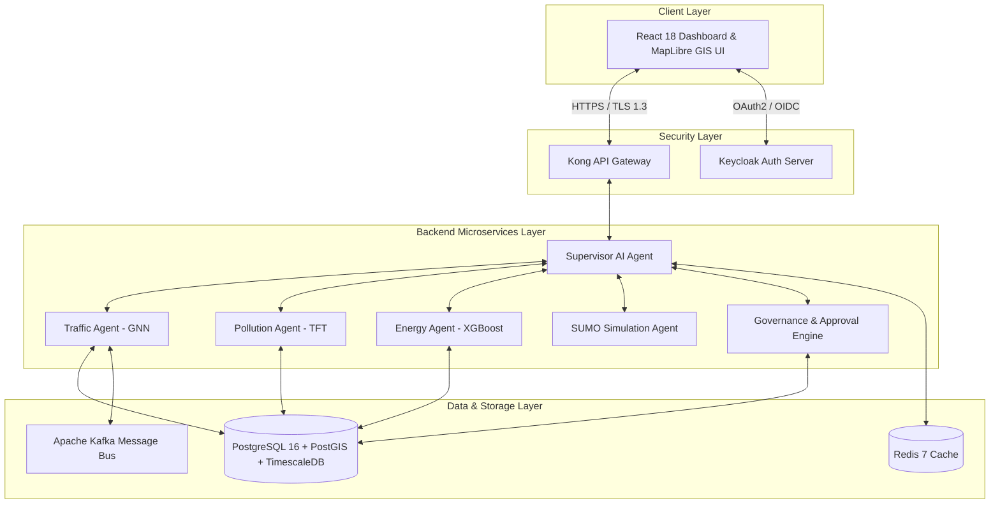
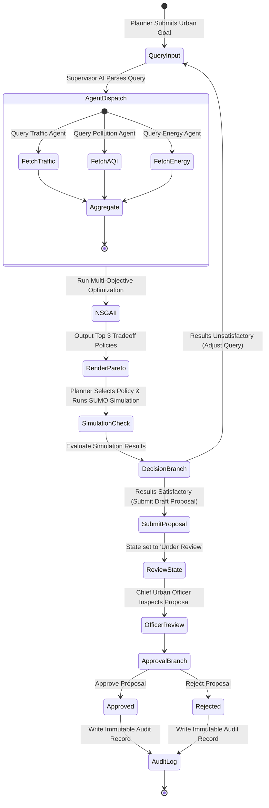
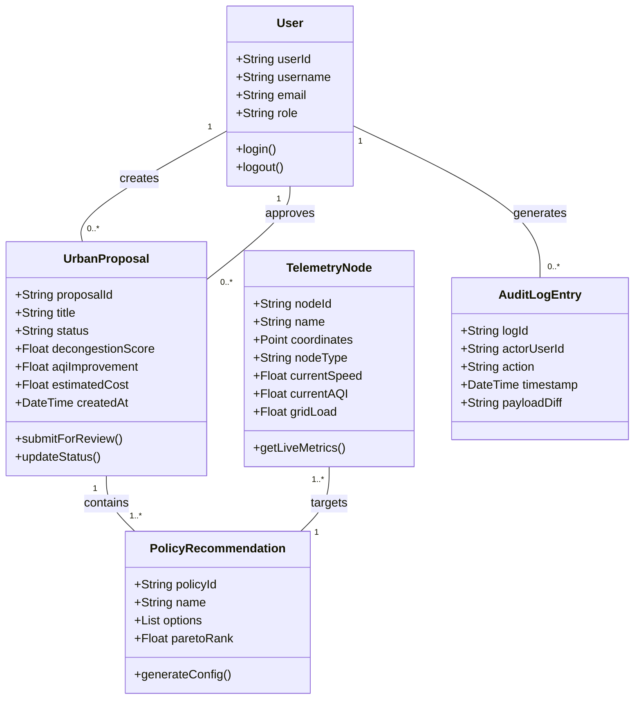
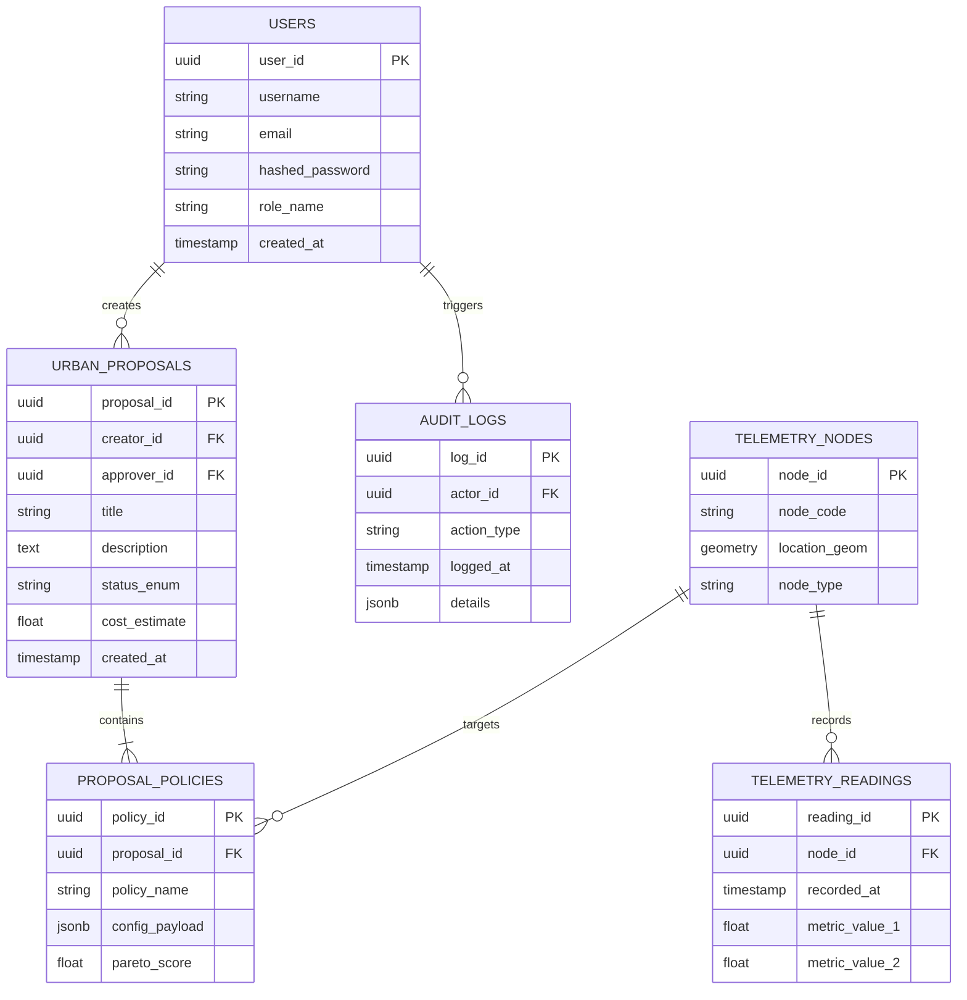
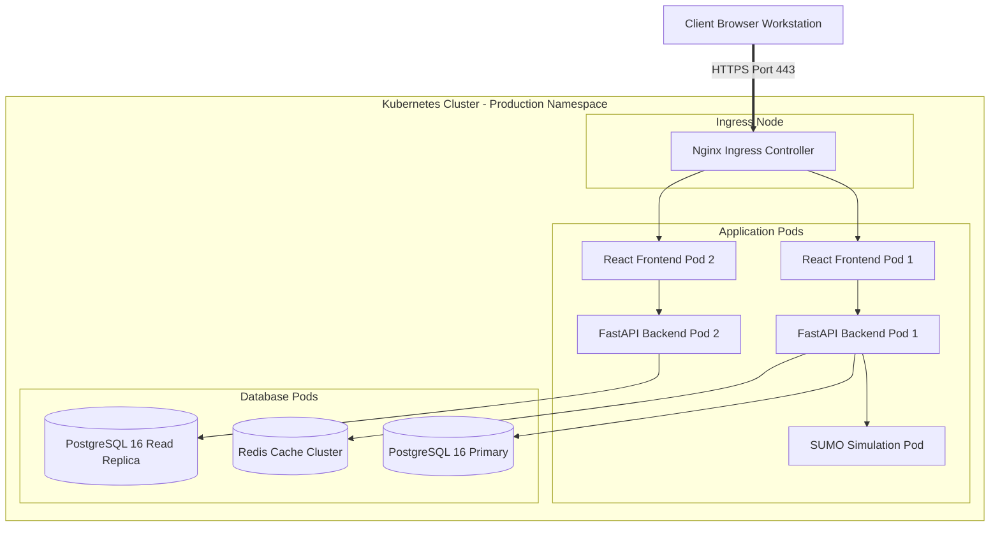
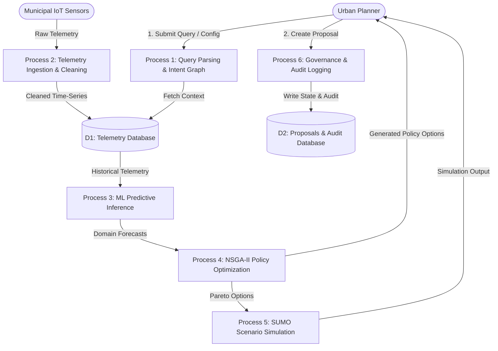

# SOFTWARE REQUIREMENTS SPECIFICATION (SRS)

## FOR

# AGENTIC AI FOR URBAN PLANNING
### Smart Urban Planning & AI Decision Support Platform (SUPADSP)

**Version 1.0 Approved**

---

### **PREPARED BY:**

* **Eadara Poorna Ashik** — 24BD1A052C
* **Gundu Himanish** — 24BD1A052N
* **J. Abhinav Yadav** — 24BD1A052Q
* **K. Manish Yadav** — 24BD1A052T
* **M. Sanjay** — 24BD1A0531

---

* **Department:** Department of Computer Science & Engineering (CSE)
* **Institution:** Keshav Memorial Institute of Technology (KMIT)
* **Location:** Hyderabad, Telangana, India
* **Date:** August 13, 2026

---

## TABLE OF CONTENTS

- [Revision History](#revision-history)
- [1. Introduction](#1-introduction)
  - [1.1 Purpose](#11-purpose)
  - [1.2 Document Conventions](#12-document-conventions)
  - [1.3 Intended Audience and Reading Suggestions](#13-intended-audience-and-reading-suggestions)
  - [1.4 Product Scope](#14-product-scope)
  - [1.5 References](#15-references)
- [2. Overall Description](#2-overall-description)
  - [2.1 Product Perspective](#21-product-perspective)
  - [2.2 Product Functions](#22-product-functions)
  - [2.3 User Classes and Characteristics](#23-user-classes-and-characteristics)
  - [2.4 Operating Environment](#24-operating-environment)
  - [2.5 Design and Implementation Constraints](#25-design-and-implementation-constraints)
  - [2.6 User Documentation](#26-user-documentation)
  - [2.7 Assumptions and Dependencies](#27-assumptions-and-dependencies)
- [3. External Interface Requirements](#3-external-interface-requirements)
  - [3.1 User Interfaces](#31-user-interfaces)
  - [3.2 Hardware Interfaces](#32-hardware-interfaces)
  - [3.3 Software Interfaces](#33-software-interfaces)
  - [3.4 Communications Interfaces](#34-communications-interfaces)
- [4. System Features / Functional Requirements](#4-system-features--functional-requirements)
  - [4.1 Feature 1: Supervisor AI Agent & Policy Synthesis Engine](#41-feature-1-supervisor-ai-agent--policy-synthesis-engine)
  - [4.2 Feature 2: Traffic Intelligence & Volumetric Congestion Forecasting](#42-feature-2-traffic-intelligence--volumetric-congestion-forecasting)
  - [4.3 Feature 3: Air Quality & Pollution Dispersion Intelligence](#43-feature-3-air-quality--pollution-dispersion-intelligence)
  - [4.4 Feature 4: Energy Grid Demand & Substation Peak Forecasting](#44-feature-4-energy-grid-demand--substation-peak-forecasting)
  - [4.5 Feature 5: Interactive GIS Digital Twin & Spatial Visualization](#45-feature-5-interactive-gis-digital-twin--spatial-visualization)
  - [4.6 Feature 6: SUMO Traffic Scenario Simulation Engine](#46-feature-6-sumo-traffic-scenario-simulation-engine)
  - [4.7 Feature 7: Multi-Stage Government Approval & Audit Logging](#47-feature-7-multi-stage-government-approval--audit-logging)
  - [4.8 Feature 8: User Authentication, RBAC & Profile Security](#48-feature-8-user-authentication-rbac--profile-security)
- [5. Non-Functional Requirements](#5-non-functional-requirements)
  - [5.1 Performance Requirements](#51-performance-requirements)
  - [5.2 Safety Requirements](#52-safety-requirements)
  - [5.3 Security Requirements](#53-security-requirements)
  - [5.4 Software Quality Attributes](#54-software-quality-attributes)
  - [5.5 Business Rules](#55-business-rules)
- [6. Other Requirements](#6-other-requirements)
  - [6.1 Database Requirements](#61-database-requirements)
  - [6.2 Data Retention & Backup Requirements](#62-data-retention--backup-requirements)
  - [6.3 Compliance & Legal Requirements](#63-compliance--legal-requirements)
- [7. Software Development Life Cycle (SDLC) Methodology](#7-software-development-life-cycle-sdlc-methodology)
- [8. System Architecture & High-Level Implementation](#8-system-architecture--high-level-implementation)
- [9. Testing and Validation Plan](#9-testing-and-validation-plan)
- [10. Conclusion](#10-conclusion)
- [Appendix A: Glossary](#appendix-a-glossary)
- [Appendix B: Analysis Models / UML Diagrams](#appendix-b-analysis-models--uml-diagrams)
- [Appendix C: To Be Determined (TBD) List](#appendix-c-to-be-determined-tbd-list)
- [Requirement Traceability Matrix](#requirement-traceability-matrix)

---

## REVISION HISTORY

| Version | Date | Description of Changes | Author/Team |
| :--- | :--- | :--- | :--- |
| **1.0** | 13-08-2026 | Initial SRS Creation, IEEE Baseline Formatting, System Features, NFRs, UML Models & Traceability | KMIT CSE Team |

---

# 1. INTRODUCTION

### 1.1 Purpose

This Software Requirements Specification (SRS) document details the functional, non-functional, interface, and structural requirements for the **Agentic AI for Urban Planning** platform (internally designated as **SUPADSP — Smart Urban Planning & AI Decision Support Platform**). 

The primary objective of this document is to establish a rigorous, formal specification between municipal urban planning stakeholders (such as Greater Hyderabad Municipal Corporation — GHMC, and Hyderabad Metropolitan Development Authority — HMDA) and the software engineering team. The SRS serves as the authoritative blueprint governing system architecture, machine learning model integration, data storage, user interface design, testing, and deployment.

This SRS covers Release Version 1.0 of the SUPADSP platform, focusing on the core intelligence domains: Traffic Intelligence, Pollution Intelligence, Energy Intelligence, Interactive GIS Digital Twin Mapping, Multi-Agent Policy Optimization, SUMO Scenario Simulation, and Government Approval Workflows.

### 1.2 Document Conventions

This SRS adheres strictly to the **IEEE Std 830-1998** standard structure, combined with visual clarity and practical detail guidelines from established academic software engineering practices.

* **Heading Formatting:** Major section titles (Level 1) use ALL CAPS bolding (Font Size 16pt equivalent). Subsections (Level 2 & 3) use standard title case bolding (Font Size 14pt and 12pt respectively).
* **Requirement Identification:** Every functional requirement is assigned a structured, unique alphanumeric identifier following the template `FR-[MODULE]-[NUMBER]`.
  * `FR-SUP-*`: Supervisor AI Agent & Policy Engine
  * `FR-TRF-*`: Traffic Intelligence Module
  * `FR-POL-*`: Pollution Intelligence Module
  * `FR-NRG-*`: Energy Intelligence Module
  * `FR-GIS-*`: Interactive GIS Digital Twin Module
  * `FR-SIM-*`: SUMO Simulation Engine Module
  * `FR-GOV-*`: Government Approval & Audit Module
  * `FR-SEC-*`: Authentication & Security Module
* **Priority Conventions:** Every functional requirement specifies an explicit priority level:
  * **Priority 1 (High):** Mission-critical requirement mandatory for system core operation.
  * **Priority 2 (Medium):** Important feature enhancing analytical depth or user experience.
  * **Priority 3 (Low):** Secondary capability or optional operational utility.

### 1.3 Intended Audience and Reading Suggestions

This document is structured to serve a diverse group of stakeholders:

1. **Software Developers & ML Engineers:** Should focus primarily on **Section 3 (External Interfaces)**, **Section 4 (System Features)**, **Section 8 (Implementation)**, and **Appendix B (UML Models)**.
2. **Project Guides, Evaluators & Management:** Should review **Section 1 (Introduction)**, **Section 2 (Overall Description)**, **Section 7 (SDLC Methodology)**, and **Section 10 (Conclusion)**.
3. **Quality Assurance (QA) & Test Engineers:** Should focus on **Section 4 (System Features)**, **Section 5 (Non-Functional Requirements)**, **Section 9 (Testing & Validation)**, and the **Requirement Traceability Matrix**.
4. **System Administrators & DevOps:** Should read **Section 2.4 (Operating Environment)**, **Section 3.4 (Communications)**, and **Section 8 (Architecture)**.
5. **Urban Planners & End Users (GHMC/HMDA Officials):** Should review **Section 1.4 (Scope)**, **Section 2.2 (Product Functions)**, and **Section 3.1 (User Interfaces)**.

Recommended Reading Sequence: `Section 1` → `Section 2` → `Section 4` → `Appendix B` → `Section 9`.

### 1.4 Product Scope

The **Agentic AI for Urban Planning** platform is an enterprise-grade decision support platform designed to assist municipal authorities in analyzing urban telemetry, predicting city disruptions, modeling interventions, and executing multi-objective urban interventions.

#### Core Problem Addressed
Rapid urbanization in metropolitan regions like Hyderabad leads to severe traffic congestion, rising air pollution (AQI hotspots), grid power overload, and uncoordinated municipal policy decisions. Existing municipal tools operate in isolated silos without multi-domain predictive intelligence or automated policy synthesis.

#### Key Objectives & Major Benefits
* **Multi-Domain Intelligence Integration:** Unifies real-time traffic corridor telemetry, air quality sensor data (TSPCB), and electrical substation grid loads onto a single GIS canvas.
* **Agentic Multi-Objective Optimization:** Uses a **Supervisor AI Agent** orchestrating domain-specialist AI models (GNN, LSTM, TFT, XGBoost, pymoo NSGA-II) to generate Pareto-optimal urban intervention policies (e.g., adaptive signal retiming, green corridor routing, load shedding mitigation).
* **Strict Privacy & Offline Autonomy:** Operating entirely using **locally-trained ML/DL models** without any reliance on external commercial LLM APIs, ensuring zero data leakage and full municipal data sovereignty.
* **Evidence-Based Simulation:** Integrates Microscopic SUMO (Simulation of Urban MObility) traffic simulation to evaluate intervention proposals prior to real-world physical implementation.

#### System Boundaries & Out-of-Scope Elements
* **In-Scope:** Real-time spatial dashboard, multi-agent AI orchestration, local ML predictions, SUMO simulation execution, multi-objective optimization, RBAC authentication, government approval workflows, audit trails, exportable reports.
* **Out-of-Scope:** Physical traffic signal hardware relay control (system provides advisory/approved signal plans), direct billing/payments, public citizen complaint triage modules, physical infrastructure construction management.

### 1.5 References

1. **IEEE Std 830-1998:** *IEEE Recommended Practice for Software Requirements Specifications*, IEEE Computer Society.
2. **ISO/IEC/IEEE 29148:2018:** *Systems and software engineering — Life cycle processes — Requirements engineering*.
3. **OpenStreetMap (OSM) Foundation:** *Geospatial Vector Datasets for Hyderabad Metropolitan Region*, 2026.
4. **FastAPI Framework Documentation:** *Async Web Server Architecture for Python*, Python Software Foundation.
5. **MapLibre GL JS Documentation:** *Open-Source JavaScript Library for Vector Maps*, MapLibre Community.
6. **PostGIS & TimescaleDB Extensions:** *Spatial and Time-Series Engine for PostgreSQL 16*, PostgreSQL Global Development Group.
7. **NSGA-II Algorithm:** Deb, K., et al. *A fast and elitist multiobjective genetic algorithm: NSGA-II*, IEEE Transactions on Evolutionary Computation, 2002.
8. **SUMO Documentation:** *Simulation of Urban MObility*, German Aerospace Center (DLR).

---

# 2. OVERALL DESCRIPTION

### 2.1 Product Perspective

The SUPADSP platform is an independent, self-contained multi-agent AI decision support system operating as the core analytical engine for the Municipal Command Center. It integrates with existing municipal sensor networks (CCTV traffic cameras, TSPCB AQI monitors, power substation SCADA units) via API endpoints and data ingest pipelines.

```
+-----------------------------------------------------------------------+
|                    MUNICIPAL SENSOR & DATA FEEDS                      |
|   (Traffic Cameras / Corridors, TSPCB AQI Stations, Power SCADA)      |
+-----------------------------------------------------------------------+
                                   |
                                   v (Kafka / REST Ingestion)
+-----------------------------------------------------------------------+
|               SUPADSP ENTERPRISE BACKEND PLATFORM                     |
|                                                                       |
|   +---------------------------------------------------------------+   |
|   |                     SUPERVISOR AI AGENT                       |   |
|   |         (Intent Graph Engine, Memory & Context Manager)       |   |
|   +---------------------------------------------------------------+   |
|               |                   |                   |               |
|               v                   v                   v               |
|      +-----------------+ +-----------------+ +-----------------+      |
|      | Traffic Agent   | | Pollution Agent | | Energy Agent    |      |
|      | (GNN / LSTM)    | | (LSTM / TFT)    | | (XGBoost)       |      |
|      +-----------------+ +-----------------+ +-----------------+      |
|               \                   |                   /               |
|                +------------------+------------------+                |
|                                   v                                   |
|   +---------------------------------------------------------------+   |
|   |  SIMULATION & OPTIMIZATION AGENTS (SUMO Engine & NSGA-II)     |   |
|   +---------------------------------------------------------------+   |
|                                   |                                   |
|                                   v                                   |
|   +---------------------------------------------------------------+   |
|   |         POLYGLOT STORAGE (PostgreSQL/PostGIS, Redis)          |   |
|   +---------------------------------------------------------------+   |
+-----------------------------------------------------------------------+
                                   |
                                   v (REST / WebSockets)
+-----------------------------------------------------------------------+
|             REACT 18 FRONTEND COMMAND DASHBOARD & GIS MAP             |
+-----------------------------------------------------------------------+
```

### 2.2 Product Functions

The major functions provided by SUPADSP include:

* **Real-time Telemetry Monitoring:** Visualizing live traffic speeds, vehicle volumes, AQI indices (PM2.5, PM10, NO2), and grid power load percentages across Hyderabad urban zones.
* **Predictive AI Forecasting:** Generating 24-hour predictive trendlines for traffic congestion bottlenecks, pollution dispersion plumes, and substation energy peak loads.
* **Agentic Multi-Objective Intervention:** Synthesizing Pareto-optimal urban planning solutions when municipal conflicts arise (e.g., balancing traffic decongestion against pollution reduction).
* **Scenario Simulation Execution:** Running microscopic traffic simulations using SUMO to evaluate proposed corridor closures, signal timing shifts, or vehicle rerouting.
* **Interactive GIS Digital Twin:** Rendering multi-layered spatial maps displaying sensor nodes, congested road segments, heatmaps, and spatial buffer zones using MapLibre GL JS.
* **Government Multi-Stage Approval Workflow:** Tracking proposed interventions through structured Draft → Review → Verification → Approval stages with immutable audit logging.

### 2.3 User Classes and Characteristics

The system caters to four primary user classes with distinct operational privileges:

| User Class | Operational Role | Technical Expertise | Privilege Level | Key Functions Used |
| :--- | :--- | :--- | :--- | :--- |
| **Urban Planner / Municipal Engineer** | Analyzes city corridors, formulates urban intervention proposals, runs scenario simulations. | Moderate (GIS & Urban domain knowledge) | Standard User (Role: `Planner`) | GIS Digital Twin, SUMO Simulation, Predictive Analytics, Draft Proposal Creation. |
| **Chief Urban Officer / Decision Maker** | Reviews synthesized AI policy proposals, evaluates Pareto tradeoffs, approves/rejects decisions. | Domain-focused (Executive governance) | Approver (Role: `Approver`) | Executive Dashboard, Multi-Objective Tradeoff Matrix, Proposal Approval Portal. |
| **AI / System Administrator** | Manages local ML model lifecycle, configures system parameters, handles user provisioning and RBAC. | Advanced (Computer Science & DevOps) | Admin (Role: `Admin`) | User Management, Model Health Monitor, System Audit Logs, Service Settings. |
| **GIS Data Analyst** | Maintains spatial layers, updates OpenStreetMap network nodes, verifies geofence data integrity. | High (Spatial & GIS specialist) | Specialist (Role: `GIS_Analyst`) | Layer Management, Spatial Buffer Configuration, PostGIS Data Sync. |

### 2.4 Operating Environment

The SUPADSP platform operates under the following hardware, software, and network specifications:

#### Server / Cloud Infrastructure Environment
* **Operating System:** Ubuntu Server 22.04 LTS / RHEL 9 (Linux x86_64).
* **Containerization & Orchestration:** Docker 24.0+ & Docker Compose 2.20+.
* **Backend Runtime:** Python 3.11+ (FastAPI microservice architecture).
* **Frontend Runtime:** Node.js 20+ (React 18, Vite build system).
* **Primary Database:** PostgreSQL 16 with PostGIS 3.4+ spatial extension and TimescaleDB time-series extension.
* **Caching & Message Broker:** Redis 7.2 (in-memory state & session cache), Apache Kafka 3.6 (telemetry streaming).
* **AI/ML Libraries:** PyTorch 2.2+, XGBoost 2.0+, pymoo 0.6+ (NSGA-II multi-objective optimization), SUMO 1.19+ (microscopic simulation engine).
* **Identity Management:** Keycloak 23.0+ (OAuth2 / OpenID Connect).

#### Client Workstation Environment
* **Web Browsers:** Google Chrome 120+, Mozilla Firefox 120+, Microsoft Edge 120+, Apple Safari 17+.
* **Display Resolution:** Minimum 1920x1080 (Full HD recommended for multi-panel GIS dashboard).
* **Network Connectivity:** Minimum 10 Mbps stable Broadband / Local Area Network (LAN).

### 2.5 Design and Implementation Constraints

1. **Strict Offline Model Execution Constraint:** In accordance with municipal security guidelines, **no external LLM or AI cloud APIs** (e.g., OpenAI, Anthropic) shall be called. All intelligence must be generated by locally deployed PyTorch, XGBoost, and mathematical optimization models.
2. **Response Time Constraints:** Interactive UI dashboard queries must render in under **2.0 seconds**. Complex spatial SUMO simulations must return preliminary output within **30.0 seconds**.
3. **OGC GIS Compliance:** Spatial layers, vector tiles, and geofence data must conform strictly to OGC (Open Geospatial Consortium) GeoJSON and WMS/WFS standards.
4. **Data Sovereignty & Security:** All municipal telemetry and decision records must reside on local government servers in India, enforcing AES-256 data-at-rest encryption.

### 2.6 User Documentation

The platform shall deliver a comprehensive documentation package comprising:
* **System User Manual:** Step-by-step operational guide for Urban Planners and Chief Urban Officers.
* **Administrator & Deployment Guide:** Technical manual detailing Docker Compose deployment, database migration scripts, and Keycloak setup.
* **API Architecture Reference:** OpenAPI (Swagger) specifications detailing all FastAPI REST endpoints.
* **Troubleshooting & Maintenance Manual:** Log diagnostic procedures, backup restoration steps, and model retraining instructions.

### 2.7 Assumptions and Dependencies

#### Assumptions
1. Continuous availability of simulated/live municipal IoT sensor telemetry streams for traffic, AQI, and power grid status.
2. Urban planning planners possess basic familiarity with web browser interfaces and spatial map interaction.

#### Dependencies
1. **OpenStreetMap Data Availability:** Requires valid spatial vector extracts for the Hyderabad Metropolitan Region.
2. **PostgreSQL / PostGIS Stability:** Dependent on continuous relational and spatial database service availability.
3. **SUMO Microscopic Engine:** Dependent on local execution binaries for SUMO traffic simulation.

---

# 3. EXTERNAL INTERFACE REQUIREMENTS

### 3.1 User Interfaces

The SUPADSP frontend is designed as a responsive, modern dark-themed glassmorphism dashboard built with React 18 and MapLibre GL JS.

* **Login / Authentication Screen:** Provides secure credentials entry, Keycloak OAuth2 redirect button, password visibility toggle, and error notification banner for invalid attempts.
* **Executive Command Dashboard:** Displays high-level KPI cards (Active Vehicles, Avg AQI, Grid Load %, AI Safety Confidence), 24-hour volumetric trend charts, AI domain agent status badges, and sparkline widgets.
* **Interactive GIS Digital Twin View:** Full-screen vector map powered by MapLibre GL JS supporting zoom, pan, layer toggling (Traffic Speed, AQI Sensors, Energy Substations), spatial node selection, and corridor highlighting.
* **Multi-Objective Policy Simulator View:** Interactively renders Pareto frontier scatter plots generated by NSGA-II optimization, allowing planners to compare competing urban intervention strategies across cost, decongestion, and AQI reduction metrics.
* **Proposal Approval Workflow Portal:** Tabular interface showing pending urban planning proposals, approval stage indicators, detailed impact metrics, reviewer comments box, and Approve/Reject buttons.
* **Accessibility & Responsiveness:** UI layout features high-contrast text ratios conforming to WCAG 2.1 AA standards, responsive CSS grid breakpoints, and keyboard navigation support.

### 3.2 Hardware Interfaces

> The system does not require any specialized hardware interface beyond standard client computing workstations (PCs/Laptops/Tablets) and municipal server clusters.

The client system connects to server instances via standard network interfaces (Ethernet / Wi-Fi).

### 3.3 Software Interfaces

```
+------------------+         +------------------+         +------------------+
|  REACT FRONTEND  | <-----> | FASTAPI BACKEND  | <-----> | POSTGRES / POSTGIS|
|  (MapLibre/D3)   |  REST/WS| (Supervisor Agent|  SQL/   | (Spatial Data &  |
+------------------+         +------------------+  Async  |  TimescaleDB)    |
                                      |                   +------------------+
                                      |
                                      v PyTorch / SUMO / pymoo
                             +------------------+
                             | LOCAL AI ENGINE  |
                             | (GNN, XGB, SUMO) |
                             +------------------+
```

* **Database Interface:** PostgreSQL 16 with PostGIS and TimescaleDB via SQLAlchemy async connection pooling (asyncpg driver).
* **AI Model Engine Interface:** Python PyTorch runtime, XGBoost inference models, and `pymoo` optimization solvers invoked via FastAPI service wrappers.
* **SUMO Simulation Interface:** PySimbrite / TraCI (Traffic Control Interface) sockets to communicate with the SUMO microscopic traffic simulation binaries.
* **Identity Management Interface:** OAuth2 / OpenID Connect tokens authenticated against Keycloak identity server.

### 3.4 Communications Interfaces

* **Client-Server Protocol:** HTTPS (TLS 1.3 encrypted) for all RESTful API transactions.
* **Real-time Telemetry Protocol:** Secure WebSockets (`wss://`) pushing live sensor updates to the React dashboard every 5 seconds.
* **Data Format:** JSON (JavaScript Object Notation) for all API request/response payloads, conforming to OpenAPI 3.0 schema definitions.
* **Message Bus Protocol:** Apache Kafka TCP protocol operating over port 9092 for inter-service event communication.

---

# 4. SYSTEM FEATURES / FUNCTIONAL REQUIREMENTS

### 4.1 Feature 1: Supervisor AI Agent & Policy Synthesis Engine

#### 4.1.1 Description and Priority
The Supervisor AI Agent acts as the central intelligence orchestrator. It receives user planning queries, coordinates specialist agents (Traffic, Pollution, Energy), aggregates predictive domain data, and invokes the NSGA-II multi-objective optimization engine to synthesize balanced urban planning policy recommendations.
* **Priority:** Priority 1 (High).

#### 4.1.2 Stimulus/Response Sequences
1. **Planner Input:** Urban planner submits a query (e.g., "Optimize traffic flow along Gachibowli corridor during peak evening hours while maintaining AQI below 150").
2. **Intent Parsing:** Supervisor AI Agent parses query parameters and constructs a task execution DAG (Directed Acyclic Graph).
3. **Specialist Dispatch:** Supervisor requests simultaneous predictive telemetry from Traffic Agent and Pollution Agent.
4. **Optimization Synthesis:** Supervisor forwards predictive data to `pymoo` NSGA-II solver to compute Pareto-optimal intervention strategies.
5. **UI Rendering:** System displays top 3 policy recommendations on the Multi-Objective Policy Simulator dashboard with detailed tradeoff scores.

#### 4.1.3 Functional Requirements

* **Requirement ID:** `FR-SUP-01`
  * **Title:** Task Execution Graph Construction
  * **Description:** The Supervisor AI Agent shall automatically construct a Directed Acyclic Graph (DAG) of execution tasks based on incoming municipal planning queries within 500ms.
  * **Priority:** High

* **Requirement ID:** `FR-SUP-02`
  * **Title:** Multi-Agent Telemetry Aggregation
  * **Description:** The Supervisor AI Agent shall aggregate domain predictions from Traffic, Pollution, and Energy agents into a unified context payload prior to executing policy optimization.
  * **Priority:** High

* **Requirement ID:** `FR-SUP-03`
  * **Title:** Multi-Objective Policy Synthesis (NSGA-II)
  * **Description:** The system shall execute NSGA-II genetic algorithms to evaluate trade-offs between travel time reduction, AQI impact, and implementation cost, outputting a Pareto frontier of non-dominated solutions.
  * **Priority:** High

---

### 4.2 Feature 2: Traffic Intelligence & Volumetric Congestion Forecasting

#### 4.2.1 Description and Priority
The Traffic Intelligence module processes corridor vehicle count sensors, camera telemetry, and road network topology to forecast traffic speeds and detect urban congestion bottlenecks up to 24 hours in advance using Graph Neural Networks (GNN) and Spatial-Temporal LSTM models.
* **Priority:** Priority 1 (High).

#### 4.2.2 Stimulus/Response Sequences
1. **Data Ingestion:** System ingests live vehicle speed and density telemetry from sensor corridors every 60 seconds.
2. **Model Processing:** Traffic Agent executes GNN model inference over the road network graph.
3. **Anomaly Identification:** System identifies predicted congestion bottlenecks (e.g., J_HITECH_CITY speed dropping below 15 km/h).
4. **Alert Generation:** System highlights congested road segments in red on the Interactive GIS Digital Twin and logs alert events.

#### 4.2.3 Functional Requirements

* **Requirement ID:** `FR-TRF-01`
  * **Title:** Real-Time Traffic Telemetry Ingestion
  * **Description:** The system shall ingest vehicle volume, flow rate, and average speed telemetry from all connected road corridor sensors at minimum 60-second intervals.
  * **Priority:** High

* **Requirement ID:** `FR-TRF-02`
  * **Title:** 24-Hour Traffic Volumetric Forecasting
  * **Description:** The Traffic Agent shall generate 24-hour predictive speed and volume forecasts for designated road segments using spatial-temporal deep learning models with an accuracy RMSE < 8.5 km/h.
  * **Priority:** High

* **Requirement ID:** `FR-TRF-03`
  * **Title:** Congestion Bottleneck Identification
  * **Description:** The system shall automatically mark road segments as "Congested" when predicted speeds fall below 40% of the designated free-flow speed limit.
  * **Priority:** Medium

---

### 4.3 Feature 3: Air Quality & Pollution Dispersion Intelligence

#### 4.3.1 Description and Priority
The Pollution Intelligence module monitors TSPCB (Telangana State Pollution Control Board) air quality monitoring stations, predicts AQI hotspots (PM2.5, PM10, NO2), and models pollution dispersion plumes taking weather metrics into account.
* **Priority:** Priority 1 (High).

#### 4.3.2 Stimulus/Response Sequences
1. **Sensor Ingestion:** System ingests hourly AQI data from monitoring stations.
2. **Dispersion Modeling:** Pollution Agent executes Temporal Fusion Transformer (TFT) dispersion models coupled with wind vector forecasts from Weather Agent.
3. **Hotspot Warning:** System detects projected AQI exceedance (> 200 AQI severe threshold) in industrial/residential zones.
4. **Visual Overlay:** System overlays animated AQI dispersion heatmaps on the GIS Digital Twin map canvas.

#### 4.3.3 Functional Requirements

* **Requirement ID:** `FR-POL-01`
  * **Title:** Multi-Pollutant AQI Tracking
  * **Description:** The system shall track and display PM2.5, PM10, NO2, SO2, and overall AQI metrics across all active TSPCB monitoring stations.
  * **Priority:** High

* **Requirement ID:** `FR-POL-02`
  * **Title:** Atmospheric Pollution Dispersion Modeling
  * **Description:** The Pollution Agent shall model spatial-temporal pollution dispersion plumes based on wind speed, direction, temperature, and vehicular traffic density inputs.
  * **Priority:** High

* **Requirement ID:** `FR-POL-03`
  * **Title:** AQI Hotspot Alarm Triggering
  * **Description:** The system shall issue automated warnings to urban planners when predicted AQI levels exceed designated safety thresholds (> 150 Unhealthy, > 200 Severe) for a duration exceeding 2 hours.
  * **Priority:** High

---

### 4.4 Feature 4: Energy Grid Demand & Substation Peak Forecasting

#### 4.4.1 Description and Priority
The Energy Intelligence module tracks power substation transformer loads, predicts electrical demand peaks, and evaluates energy efficiency optimization strategies across municipal sectors using XGBoost regression models.
* **Priority:** Priority 2 (Medium).

#### 4.4.2 Stimulus/Response Sequences
1. **SCADA Feed Processing:** System ingests power transformer load percentages from substation SCADA feeds.
2. **Peak Prediction:** Energy Agent models load trends and predicts upcoming grid strain (> 90% capacity).
3. **Mitigation Recommendation:** Energy Agent suggests peak-shaving recommendations (e.g., smart streetlamp dimming, industrial load shifting).

#### 4.4.3 Functional Requirements

* **Requirement ID:** `FR-NRG-01`
  * **Title:** Substation Capacity Load Monitoring
  * **Description:** The system shall monitor and report real-time megawatt (MW) load and percentage capacity across all connected municipal electrical substations.
  * **Priority:** High

* **Requirement ID:** `FR-NRG-02`
  * **Title:** Energy Demand Peak Prediction
  * **Description:** The Energy Agent shall predict 12-hour ahead peak energy demand periods with a Mean Absolute Percentage Error (MAPE) of less than 4.5%.
  * **Priority:** Medium

* **Requirement ID:** `FR-NRG-03`
  * **Title:** Peak Load Shaving Strategy Synthesis
  * **Description:** The system shall generate advisory peak-shaving recommendations when substation capacity load is forecasted to exceed 88% threshold.
  * **Priority:** Medium

---

### 4.5 Feature 5: Interactive GIS Digital Twin & Spatial Visualization

#### 4.5.1 Description and Priority
Provides an interactive vector map interface allowing planners to visualize spatial relationships between traffic corridors, pollution dispersion, power grids, and municipal administrative boundaries.
* **Priority:** Priority 1 (High).

#### 4.5.2 Stimulus/Response Sequences
1. **Map Loading:** User opens GIS Digital Twin view; frontend loads vector map tiles from PostGIS engine.
2. **Layer Interaction:** User toggles "Traffic Congestion" and "AQI Sensors" overlay layers.
3. **Spatial Query:** User clicks on a junction node (`J_PUNJAGUTTA`); system displays popup modal with live telemetry speed, volume, and node status.

#### 4.5.3 Functional Requirements

* **Requirement ID:** `FR-GIS-01`
  * **Title:** Multi-Layer Spatial Data Rendering
  * **Description:** The GIS map component shall render OpenStreetMap base vector tiles, PostGIS spatial layers, sensor point nodes, and animated heatmap overlays using MapLibre GL JS at 60 FPS.
  * **Priority:** High

* **Requirement ID:** `FR-GIS-02`
  * **Title:** Interactive Node Telemetry Inspection
  * **Description:** Selecting any spatial node or road corridor on the map canvas shall display an interactive popup displaying real-time metrics, historical trends, and connected sub-agents within 300ms.
  * **Priority:** High

* **Requirement ID:** `FR-GIS-03`
  * **Title:** Dynamic Spatial Geofencing
  * **Description:** The system shall allow users to define custom circular or polygonal spatial geofences to extract aggregated multi-domain statistics (Avg Speed, Max AQI, Total Load).
  * **Priority:** Medium

---

### 4.6 Feature 6: SUMO Traffic Scenario Simulation Engine

#### 4.6.1 Description and Priority
Executes microscopic traffic simulations using SUMO (Simulation of Urban MObility) to evaluate proposed urban interventions (e.g., lane closures, signal retiming, detour routes) prior to real-world deployment.
* **Priority:** Priority 2 (Medium).

#### 4.6.2 Stimulus/Response Sequences
1. **Simulation Setup:** Planner configures scenario parameters (e.g., close Corridor A, divert 30% traffic to Corridor B).
2. **Simulation Execution:** System exports network parameters, generates SUMO XML configs, and launches background simulation process.
3. **Result Presentation:** System compiles simulation output metrics (queue lengths, travel time shifts) and displays comparison charts against baseline conditions.

#### 4.6.3 Functional Requirements

* **Requirement ID:** `FR-SIM-01`
  * **Title:** SUMO Scenario Parameter Configuration
  * **Description:** The system shall provide an interface for planners to configure micro-simulation parameters including road closures, speed limit modifications, and signal timing adjustments.
  * **Priority:** High

* **Requirement ID:** `FR-SIM-02`
  * **Title:** Microscopic Simulation Execution
  * **Description:** The Simulation Agent shall execute SUMO background processes for configured scenarios covering up to 10,000 active simulated vehicles within 30 seconds execution time.
  * **Priority:** Medium

* **Requirement ID:** `FR-SIM-03`
  * **Title:** Baseline vs Scenario Comparative Analytics
  * **Description:** The system shall output comparative analytics comparing baseline traffic travel times, delay hours, and fuel emissions against simulated scenario results.
  * **Priority:** Medium

---

### 4.7 Feature 7: Multi-Stage Government Approval & Audit Logging

#### 4.7.1 Description and Priority
Manages the governance lifecycle of synthesized urban planning policies, enforcing a strict state machine (`Draft` → `Under Review` → `Verified` → `Approved` / `Rejected`) and recording all actions in an immutable audit log.
* **Priority:** Priority 1 (High).

#### 4.7.2 Stimulus/Response Sequences
1. **Proposal Submission:** Planner converts an AI policy recommendation into a formal intervention proposal (`Status: Draft`).
2. **Review Transition:** Planner submits proposal for executive review (`Status: Under Review`).
3. **Executive Approval:** Chief Urban Officer reviews tradeoff analytics, attaches electronic approval notes, and clicks Approve (`Status: Approved`).
4. **Audit Record:** System records digital signature timestamp, user ID, and full state payload into immutable database audit table.

#### 4.7.3 Functional Requirements

* **Requirement ID:** `FR-GOV-01`
  * **Title:** Governance State Machine Enforcement
  * **Description:** The system shall enforce proposal state transitions strictly adhering to the defined approval workflow model (`Draft` → `Under Review` → `Verified` → `Approved` / `Rejected`).
  * **Priority:** High

* **Requirement ID:** `FR-GOV-02`
  * **Title:** Immutable Audit Trail Logging
  * **Description:** Every state change, policy creation, approval decision, and system configuration edit shall be logged in an append-only audit log table recording user ID, timestamp, IP address, and payload diff.
  * **Priority:** High

* **Requirement ID:** `FR-GOV-03`
  * **Title:** Executive Decision Notification
  * **Description:** The system shall automatically dispatch real-time in-app notifications to designated Approvers whenever a new policy proposal is submitted for verification.
  * **Priority:** Medium

---

### 4.8 Feature 8: User Authentication, RBAC & Profile Security

#### 4.8.1 Description and Priority
Provides secure user authentication, Keycloak single sign-on integration, Role-Based Access Control (RBAC), and user profile session management.
* **Priority:** Priority 1 (High).

#### 4.8.2 Stimulus/Response Sequences
1. **Login Request:** User submits credentials via login form or OAuth2 SSO.
2. **Token Issuance:** Keycloak validates credentials and issues cryptographically signed JWT access token containing assigned user roles.
3. **Route Authorization:** Frontend and FastAPI backend validate token signature and enforce endpoint access based on assigned RBAC permissions.

#### 4.8.3 Functional Requirements

* **Requirement ID:** `FR-SEC-01`
  * **Title:** OAuth2 / JWT User Authentication
  * **Description:** The system shall authenticate users via Keycloak OAuth2 / OpenID Connect issuing signed JWT tokens with a configurable expiration period (default: 8 hours).
  * **Priority:** High

* **Requirement ID:** `FR-SEC-02`
  * **Title:** Role-Based Access Control (RBAC)
  * **Description:** The system shall restrict access to administrative functions, approval actions, and GIS layer editing strictly according to the user's assigned role (`Planner`, `Approver`, `Admin`, `GIS_Analyst`).
  * **Priority:** High

* **Requirement ID:** `FR-SEC-03`
  * **Title:** Session Security & Auto-Logout
  * **Description:** The system shall invalidate user sessions and force re-authentication following 30 minutes of continuous user inactivity.
  * **Priority:** Medium

---

# 5. NON-FUNCTIONAL REQUIREMENTS

### 5.1 Performance Requirements

* **Dashboard Response Latency:** All REST API queries backing dashboard widgets must respond in **< 1.5 seconds** under normal operating load.
* **Spatial Tile Map Rendering:** MapLibre GL JS vector tiles must render and refresh smooth spatial layers at **60 frames per second (FPS)** on standard workstations.
* **Concurrent User Support:** The backend architecture must support a minimum of **500 concurrent active municipal users** without degrading transaction throughput.
* **Database Query Optimization:** Spatial PostGIS queries must execute within **< 250ms** utilizing spatial R-Tree spatial indexes (`GIST`).

### 5.2 Safety Requirements

* **Human-in-the-Loop Operational Safety:** The system operates strictly as a Decision Support System. Under no circumstances shall the platform directly execute automated physical infrastructure changes (e.g., flipping real-world traffic signal switches) without explicit, authenticated human approval.
* **Fail-Safe Fallback Modes:** In the event of AI agent service disruption or network disconnect, client dashboards shall degrade gracefully to display raw telemetry sensor values while signaling clear visual warning banners.

### 5.3 Security Requirements

* **Data Encryption at Rest & Transit:** All database storage volumes must be encrypted using AES-256 encryption. All network communication between client browsers and backend microservices must enforce TLS 1.3 encryption.
* **Credential & Password Hashing:** User passwords stored in identity databases must be hashed using `Argon2id` or `Bcrypt` with a minimum salt factor of 12.
* **Protection Against Common Web Vulnerabilities:** FastAPI backend microservices and React frontend must incorporate strict input sanitization and header policies to mitigate SQL Injection (SQLi), Cross-Site Scripting (XSS), Cross-Site Request Forgery (CSRF), and OWASP Top 10 vulnerabilities.

### 5.4 Software Quality Attributes

* **Reliability & Availability:** The platform shall maintain an operational availability of **99.9% uptime** (excluding scheduled monthly maintenance windows).
* **Usability:** User interfaces shall adhere to dark-themed modern aesthetic standards, providing clear visual typography, responsive layout breakpoints, and accessibility compliance (WCAG 2.1 AA).
* **Maintainability:** Codebases must follow modular architecture patterns (React component modularity, FastAPI modular routers) with minimum 80% automated unit test code coverage.
* **Scalability:** System components must be fully containerized (Docker) and orchestrated via Kubernetes supporting Horizontal Pod Autoscaling (HPA) based on CPU/RAM load.

### 5.5 Business Rules

1. **Dual Approval Rule for Major Infrastructure Interventions:** Urban planning policy proposals with an estimated budget impact > ₹ 50 Lakhs require approval from two distinct users holding the `Approver` role.
2. **Consensus Threshold for Multi-Agent Tradeoffs:** The Supervisor AI Agent shall only recommend policy solutions where the AI Safety Verification confidence score is **≥ 95%**.
3. **Data Access Isolation:** GIS Analysts may edit spatial node configurations but are restricted from approving governance policy decisions.

---

# 6. OTHER REQUIREMENTS

### 6.1 Database Requirements

* The system shall utilize **PostgreSQL 16** with **PostGIS 3.4+** for spatial vector data storage and **TimescaleDB** hyper-tables for time-series telemetry storage.
* **Redis 7.2** shall be utilized for transient session caching, spatial query result caching, and real-time state management.

### 6.2 Data Retention & Backup Requirements

* Telemetry data (traffic speeds, AQI, energy load) shall be retained in hot storage for 90 days, warm TimescaleDB compressed storage for 2 years, and archived to cold storage (MinIO object storage) for 5 years.
* Automated daily full database backups shall be executed at 02:00 IST with Point-In-Time Recovery (PITR) enabled.

### 6.3 Compliance & Legal Requirements

* All software components, libraries, and datasets must comply with Indian IT Act 2000 (and amendments) and National Geospatial Policy guidelines regarding government mapping data.

---

# 7. SOFTWARE DEVELOPMENT LIFE CYCLE (SDLC) METHODOLOGY

The SUPADSP project employs an **Iterative Spiral SDLC Model** tailored for complex AI-driven municipal engineering projects. This approach combines structured risk assessment with rapid iterative prototyping.

```
       +-------------------------------------------------------+
       | 1. REQUIREMENT ANALYSIS & SRS PREPARATION (Phase 1)   |
       +-------------------------------------------------------+
                                   |
                                   v
       +-------------------------------------------------------+
       | 2. SYSTEM ARCHITECTURE & DATA MODEL DESIGN (Phase 2)  |
       +-------------------------------------------------------+
                                   |
                                   v
       +-------------------------------------------------------+
       | 3. LOCAL ML MODEL TRAINING & PIPELINES (Phase 3)      |
       +-------------------------------------------------------+
                                   |
                                   v
       +-------------------------------------------------------+
       | 4. FASTAPI & REACT MODULE DEVELOPMENT (Phase 4)       |
       +-------------------------------------------------------+
                                   |
                                   v
       +-------------------------------------------------------+
       | 5. SYSTEM TESTING & AI VERIFICATION (Phase 5)         |
       +-------------------------------------------------------+
                                   |
                                   v
       +-------------------------------------------------------+
       | 6. KUBERNETES DEPLOYMENT & MAINTENANCE (Phase 6)      |
       +-------------------------------------------------------+
```

### Major SDLC Phases Applied to SUPADSP:

1. **Requirements Analysis & SRS Preparation:** Gathering municipal domain requirements from GHMC/HMDA guidelines, formulating system constraints, establishing IEEE SRS baseline documentation.
2. **Architectural & Database Design:** Defining C4 architecture, designing PostgreSQL/PostGIS schemas, establishing REST/WebSocket API contracts.
3. **Local AI/ML Model Training:** Preparing synthetic/real telemetry datasets, training spatial-temporal GNN/LSTM traffic models, TFT pollution dispersion models, and configuring `pymoo` NSGA-II solvers.
4. **Iterative Module Implementation:** Building React 18 frontend dashboard components, MapLibre GIS map integrations, FastAPI microservice endpoints, and Keycloak authentication wrappers.
5. **Verification & Testing:** Executing automated PyTest backend unit tests, React Vitest component tests, API integration tests, and performance load benchmarking.
6. **Deployment & Governance Maintenance:** Containerizing microservices into Docker images, deploying to Kubernetes clusters via Helm charts, configuring Prometheus/Grafana monitoring, and supporting ongoing municipal user feedback iterations.

---

# 8. SYSTEM ARCHITECTURE & HIGH-LEVEL IMPLEMENTATION

### 8.1 Technology Stack Summary

| Architectural Layer | Technologies Employed |
| :--- | :--- |
| **Frontend UI Framework** | React 18, TypeScript 5.0, Vite Build Tool |
| **GIS Mapping Engine** | MapLibre GL JS, Deck.gl, OpenStreetMap (OSM) Vector Tiles |
| **State & Charts** | Zustand, Recharts, D3.js, Lucide Icons |
| **API Gateway & Backend** | FastAPI (Python 3.11), Uvicorn Async Server, Kong Gateway |
| **AI / ML Frameworks** | PyTorch 2.2, XGBoost 2.0, pymoo (NSGA-II), SUMO 1.19 |
| **Spatial & Time-Series DB**| PostgreSQL 16, PostGIS 3.4+, TimescaleDB |
| **Caching & Messaging** | Redis 7.2, Apache Kafka 3.6 |
| **Security & Identity** | Keycloak 23.0 (OAuth2 / OIDC), JWT, TLS 1.3 |
| **Deployment Platform** | Docker Containers, Kubernetes (K8s), Helm, Nginx |

### 8.2 Backend Module Architecture Overview

The backend comprises decoupled microservices operating within an async Python ecosystem:
* `SupervisorService`: Orchestrates multi-agent execution graphs, manages conversation memory, calls optimization engines.
* `TrafficAgentService`: Manages GNN model execution, processes corridor telemetry, calculates bottleneck locations.
* `PollutionAgentService`: Executes TFT dispersion algorithms, tracks AQI station metrics.
* `EnergyAgentService`: Evaluates transformer load SCADA telemetry, forecasts demand peaks.
* `SimulationService`: Interface wrapper generating SUMO configs and monitoring background simulation binaries.
* `GovernanceService`: Manages approval state transitions, logs append-only audit trails.

---

# 9. TESTING AND VALIDATION PLAN

### 9.1 Verification vs. Validation Distinction

Following formal software engineering standards, testing strictly distinguishes between Verification and Validation:
* **Software Verification:** Confirms that the system software accurately conforms to design specifications ("Are we building the product right?"). Verified through unit tests, static code analysis, and integration testing.
* **Software Validation:** Confirms that the completed platform satisfies actual municipal urban planning operational needs ("Are we building the right product?"). Validated through User Acceptance Testing (UAT) with domain planners.

### 9.2 Testing Categories Executed

```
                       / \
                      /   \  User Acceptance Testing (UAT)
                     /-----\
                    /       \  System & Security Testing
                   /---------\
                  /           \  Integration & API Testing
                 /-------------\
                /               \  Unit & Component Testing
               +-----------------+
```

1. **Unit Testing:** Automated testing of individual Python functions and React UI components using `pytest` and `vitest`.
2. **API & Integration Testing:** Verifying REST endpoint status codes, JSON payload schemas, and PostGIS database CRUD queries.
3. **Performance & Load Testing:** Executing Locust load tests to simulate 500 concurrent users accessing API endpoints simultaneously.
4. **Security Penetration Testing:** Automated OWASP ZAP scanning to verify protection against SQLi, XSS, and broken access controls.
5. **User Acceptance Testing (UAT):** Reviewing workflows with municipal planner representatives to validate policy recommendation clarity.

---

# 10. CONCLUSION

This Software Requirements Specification (SRS) establishes a complete, unambiguous technical foundation for the **Agentic AI for Urban Planning** platform (SUPADSP). By combining an **IEEE Std 830-1998 compliant structure** with detailed operational feature requirements, exact technology stack definitions, UML analysis models, and formal testing protocols, this document guides the development team toward delivering a high-quality, production-ready municipal engineering system.

The SUPADSP platform empowers urban planning agencies (GHMC/HMDA) to transition from reactive management to proactive, data-driven, multi-domain AI decision-making. Operating under strict local offline AI execution constraints, the system preserves government data sovereignty while maximizing public utility across traffic decongestion, air quality enhancement, and energy grid stability.

---

# APPENDIX A: GLOSSARY

| Term / Acronym | Definition |
| :--- | :--- |
| **API** | Application Programming Interface — Structured protocol for software communication. |
| **AQI** | Air Quality Index — Standardized metric quantifying atmospheric pollutant levels. |
| **DAG** | Directed Acyclic Graph — Mathematical structure representing task execution sequences. |
| **GNN** | Graph Neural Network — Deep learning model tailored for graph-structured road networks. |
| **GPS** | Global Positioning System — Satellite-based spatial location framework. |
| **HMDA** | Hyderabad Metropolitan Development Authority — Regional urban planning body. |
| **GHMC** | Greater Hyderabad Municipal Corporation — Local civic governing body. |
| **IEEE** | Institute of Electrical and Electronics Engineers — Professional engineering association. |
| **JWT** | JSON Web Token — Compact, URL-safe means of representing claims between two parties. |
| **LSTM** | Long Short-Term Memory — Recurrent neural network architecture for sequential data. |
| **NSGA-II** | Non-dominated Sorting Genetic Algorithm II — Multi-objective optimization algorithm. |
| **OIDC** | OpenID Connect — Identity layer built on top of OAuth 2.0 framework. |
| **PostGIS** | Spatial database extender for PostgreSQL object-relational database. |
| **RBAC** | Role-Based Access Control — Restricting system access based on authorized user roles. |
| **REST** | Representational State Transfer — Architectural style for distributed hypermedia systems. |
| **SCADA** | Supervisory Control and Data Acquisition — Industrial grid monitoring system. |
| **SRS** | Software Requirements Specification — Formal document detailing system requirements. |
| **SUMO** | Simulation of Urban MObility — Microscopic, multi-modal traffic simulation package. |
| **TFT** | Temporal Fusion Transformer — Attention-based deep neural network for multi-horizon time-series forecasting. |
| **UML** | Unified Modeling Language — Standardized visualization language for software design. |

---

# APPENDIX B: ANALYSIS MODELS / UML DIAGRAMS

This section provides nine formal UML and architectural diagrams illustrating the structural, behavioral, data, and deployment views of the SUPADSP system.

### Figure B.1: System Architecture Diagram



*Caption: Figure B.1 details the multi-tiered software architecture showing separation of presentation, security gateway, microservice intelligence agents, and polyglot database storage.*

---

### Figure B.2: System Use Case Diagram

```mermaid
usecaseDiagram
actor "Urban Planner" as Planner
actor "Chief Urban Officer" as Officer
actor "System Admin" as Admin

rectangle "SUPADSP System" {
    usecase "View GIS Digital Twin" as UC1
    usecase "Run Traffic Telemetry Forecast" as UC2
    usecase "Simulate SUMO Scenario" as UC3
    usecase "Synthesize AI Policy (NSGA-II)" as UC4
    usecase "Submit Policy Proposal" as UC5
    usecase "Review & Approve Proposal" as UC6
    usecase "Manage User RBAC Roles" as UC7
    usecase "Inspect Audit Logs" as UC8
}

Planner --> UC1
Planner --> UC2
Planner --> UC3
Planner --> UC4
Planner --> UC5

Officer --> UC1
Officer --> UC6
Officer --> UC8

Admin --> UC7
Admin --> UC8

UC5 .-> UC4 : <<include>>
UC3 .-> UC2 : <<include>>
```

*Caption: Figure B.2 depicts the primary system actors (Planner, Officer, Admin) and their functional interactions with core system use cases.*

---

### Figure B.3: System Activity Diagram (Policy Synthesis & Approval Workflow)



*Caption: Figure B.3 illustrates the end-to-end operational activity flow from initial planner prompt entry through agent execution, optimization, SUMO simulation, and executive approval.*

---

### Figure B.4: Sequence Diagram (User Query to AI Policy Recommendation)

```mermaid
sequenceDiagram
    autonumber
    actor User as Urban Planner
    participant UI as React Frontend
    participant SUP as Supervisor Agent
    participant TRF as Traffic Agent
    participant OPT as NSGA-II Solver
    participant DB as PostGIS / TimescaleDB

    User->>UI: Selects Gachibowli Corridor & Requests Optimization
    UI->>SUP: POST /api/v1/policy/synthesize (Payload)
    SUP->>TRF: GET /api/v1/traffic/forecast (Corridor ID)
    TRF->>DB: Query Historical Speeds & Volumes
    DB-->>TRF: Return Time-Series Metrics
    TRF-->>SUP: Return 24h Traffic Predictions
    SUP->>OPT: Execute NSGA-II (Traffic, AQI, Cost Metrics)
    OPT-->>SUP: Return Pareto Frontier Solutions
    SUP->>DB: Log Policy Synthesis Event
    SUP-->>UI: Return Top 3 Policy Options (JSON)
    UI-->>User: Render Multi-Objective Tradeoff Matrix & GIS Layers
```

*Caption: Figure B.4 details the sequential API message exchanges between UI, Supervisor Agent, domain microservices, optimization engine, and database storage.*

---

### Figure B.5: System Class Diagram



*Caption: Figure B.5 depicts the static domain class structures, key attributes, methods, and structural relationships.*

---

### Figure B.6: Entity-Relationship (ER) Diagram



*Caption: Figure B.6 specifies the database entity structures, primary/foreign keys, and relational cardinalities implemented in PostgreSQL/PostGIS.*

---

### Figure B.7: Component Diagram

```mermaid
graph LR
    subgraph Frontend Subsystem
        [React UI Components] --> [MapLibre Map Component]
        [React UI Components] --> [Recharts Analytics]
        [React UI Components] --> [API Client Axios]
    end

    subgraph Backend Services Subsystem
        [FastAPI Gateway Router] --> [Supervisor Engine]
        [Supervisor Engine] --> [Traffic Intelligence Service]
        [Supervisor Engine] --> [Pollution Intelligence Service]
        [Supervisor Engine] --> [Energy Intelligence Service]
        [Supervisor Engine] --> [NSGA-II Optimization Module]
        [Supervisor Engine] --> [SUMO Simulation Adapter]
    end

    [API Client Axios] ==>|HTTPS REST| [FastAPI Gateway Router]
```

*Caption: Figure B.7 shows the internal component architecture of the frontend and backend subsystems.*

---

### Figure B.8: Deployment Diagram



*Caption: Figure B.8 maps physical deployment nodes, container pods, load balancers, and database clusters within a production Kubernetes infrastructure.*

---

### Figure B.9: Data Flow Diagram (DFD Level 1)



*Caption: Figure B.9 traces data transformations from raw sensor inputs through query parsing, prediction, optimization, simulation, and governance storage.*

---

# APPENDIX C: TO BE DETERMINED (TBD) LIST

The following item tracking table details parameters that require final empirical verification during field deployment:

| TBD ID | Item Description | Affected SRS Section | Reason for TBD Status | Planned Resolution Date |
| :--- | :--- | :--- | :--- | :--- |
| **TBD-01** | Exact TSPCB sensor API data refresh frequency limits | Section 4.3.3 (`FR-POL-01`) | Dependent on third-party TSPCB hardware gateway upgrade schedule. | Q4 2026 Field Testing |
| **TBD-02** | Maximum SUMO concurrent vehicle agent scaling threshold | Section 4.6.3 (`FR-SIM-02`) | Benchmarking pending final server GPU cluster configuration. | Q4 2026 Performance Test |
| **TBD-03** | Local municipal Keycloak SAML v2.0 federation endpoints | Section 4.8.3 (`FR-SEC-01`) | Integration awaiting GHMC IT infrastructure network authorization. | Pre-Deployment Phase |

---

# REQUIREMENT TRACEABILITY MATRIX

The matrix below maps each Functional Requirement to its corresponding System Feature, Use Case (Appendix B), and Test Case ID (Section 9):

| Requirement ID | Requirement Title | System Feature Area | Related Use Case Diagram ID | Verification Test Case ID |
| :--- | :--- | :--- | :--- | :--- |
| `FR-SUP-01` | Task Execution Graph Construction | Supervisor AI Engine | `UC4` (Synthesize AI Policy) | `TC-UNIT-SUP-01` |
| `FR-SUP-02` | Multi-Agent Telemetry Aggregation | Supervisor AI Engine | `UC4` (Synthesize AI Policy) | `TC-INT-SUP-02` |
| `FR-SUP-03` | Multi-Objective Policy Synthesis (NSGA-II) | Supervisor AI Engine | `UC4` (Synthesize AI Policy) | `TC-SYS-OPT-01` |
| `FR-TRF-01` | Real-Time Traffic Telemetry Ingestion | Traffic Intelligence | `UC2` (Run Traffic Forecast) | `TC-INT-TRF-01` |
| `FR-TRF-02` | 24-Hour Traffic Volumetric Forecasting | Traffic Intelligence | `UC2` (Run Traffic Forecast) | `TC-UNIT-TRF-02` |
| `FR-TRF-03` | Congestion Bottleneck Identification | Traffic Intelligence | `UC2` (Run Traffic Forecast) | `TC-SYS-TRF-03` |
| `FR-POL-01` | Multi-Pollutant AQI Tracking | Pollution Intelligence | `UC1` (View GIS Twin) | `TC-INT-POL-01` |
| `FR-POL-02` | Atmospheric Pollution Dispersion Modeling | Pollution Intelligence | `UC1` (View GIS Twin) | `TC-UNIT-POL-02` |
| `FR-POL-03` | AQI Hotspot Alarm Triggering | Pollution Intelligence | `UC1` (View GIS Twin) | `TC-SYS-POL-03` |
| `FR-NRG-01` | Substation Capacity Load Monitoring | Energy Intelligence | `UC1` (View GIS Twin) | `TC-INT-NRG-01` |
| `FR-NRG-02` | Energy Demand Peak Prediction | Energy Intelligence | `UC1` (View GIS Twin) | `TC-UNIT-NRG-02` |
| `FR-NRG-03` | Peak Load Shaving Strategy Synthesis | Energy Intelligence | `UC4` (Synthesize AI Policy) | `TC-SYS-NRG-03` |
| `FR-GIS-01` | Multi-Layer Spatial Data Rendering | Interactive GIS Map | `UC1` (View GIS Twin) | `TC-UI-GIS-01` |
| `FR-GIS-02` | Interactive Node Telemetry Inspection | Interactive GIS Map | `UC1` (View GIS Twin) | `TC-UI-GIS-02` |
| `FR-GIS-03` | Dynamic Spatial Geofencing | Interactive GIS Map | `UC1` (View GIS Twin) | `TC-UI-GIS-03` |
| `FR-SIM-01` | SUMO Scenario Parameter Configuration | Scenario Simulation | `UC3` (Simulate SUMO Scenario) | `TC-UI-SIM-01` |
| `FR-SIM-02` | Microscopic Simulation Execution | Scenario Simulation | `UC3` (Simulate SUMO Scenario) | `TC-PERF-SIM-02` |
| `FR-SIM-03` | Baseline vs Scenario Comparative Analytics| Scenario Simulation | `UC3` (Simulate SUMO Scenario) | `TC-SYS-SIM-03` |
| `FR-GOV-01` | Governance State Machine Enforcement | Government Approval | `UC5` & `UC6` (Submit/Approve) | `TC-SYS-GOV-01` |
| `FR-GOV-02` | Immutable Audit Trail Logging | Government Approval | `UC8` (Inspect Audit Logs) | `TC-SEC-GOV-02` |
| `FR-GOV-03` | Executive Decision Notification | Government Approval | `UC6` (Review & Approve) | `TC-INT-GOV-03` |
| `FR-SEC-01` | OAuth2 / JWT User Authentication | User Security | `UC7` (Manage RBAC Roles) | `TC-SEC-AUTH-01` |
| `FR-SEC-02` | Role-Based Access Control (RBAC) | User Security | `UC7` (Manage RBAC Roles) | `TC-SEC-RBAC-02` |
| `FR-SEC-03` | Session Security & Auto-Logout | User Security | `UC7` (Manage RBAC Roles) | `TC-SEC-SESS-03` |

---
*End of Software Requirements Specification Document.*
